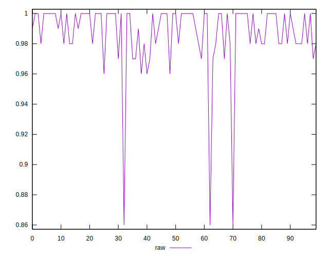
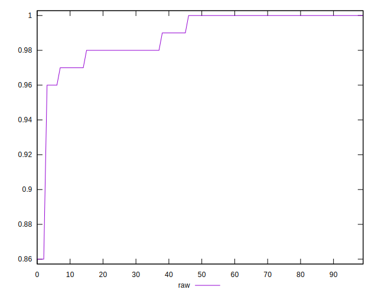
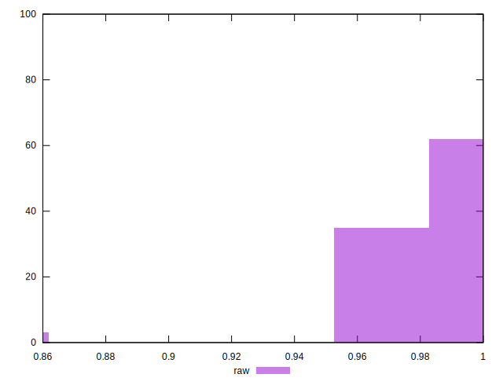

# //meta/score/samples/agenda

[→ Parent](../..)


## Raw


```yaml
p90min: 0.96
p90max: 1
p90range: 0.040000000000000036
p90mean: 0.9900000000000003
median: 1
p90stdev: 0.012290802650243567
mad: 0
stdevBySn: 0
lfitCenter: 0.9899436682716709
lfitStdev: 0.014366575450687502
mfitCenter: 0.9899436682716709
mfitStdev: 0.018005832135274683
mfitConfidence: 0.0018005832135274684
p90skewness: -0.825075900980419
p90eccentricity: 1.0000000000000013
p90discretization: 18.8
outlandishness: 0.9927404958677686

```

