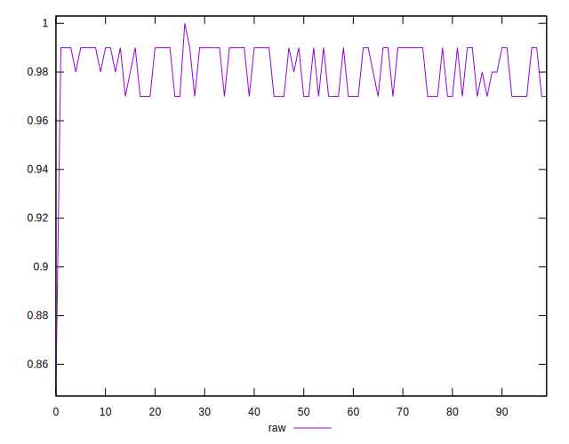

# //meta/score/samples/card

[→ Parent](../..)


## Raw


```yaml
p90min: 0.97
p90max: 0.99
p90range: 0.020000000000000018
p90mean: 0.9815957446808503
median: 0.99
p90stdev: 0.009374386957472435
mad: 0
stdevBySn: 0
lfitCenter: 0.9819011669106604
lfitStdev: 0.011333942647560465
mfitCenter: 0.9819011669106604
mfitStdev: 0.014204990566004267
mfitConfidence: 0.0014204990566004266
p90skewness: -0.32190182936971506
p90eccentricity: 1.0000000000000004
p90discretization: 31.333333333333332
outlandishness: 0.9975651557563994

```

