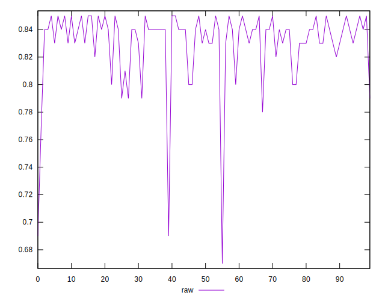
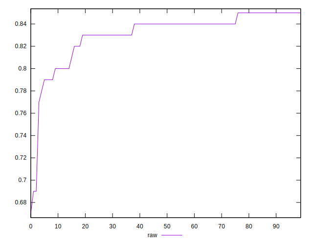
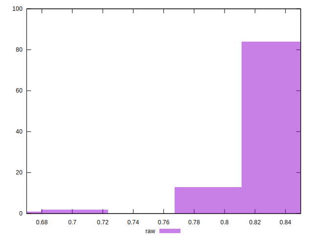

# //meta/score/samples/music

[→ Parent](../..)


## Raw


```yaml
p90min: 0.77
p90max: 0.85
p90range: 0.07999999999999996
p90mean: 0.8331914893617022
median: 0.84
p90stdev: 0.01781779925025048
mad: 0.010000000000000009
stdevBySn: 0.011926000000000011
lfitCenter: 0.8333901078299242
lfitStdev: 0.015325733740498127
mfitCenter: 0.8333901078299242
mfitStdev: 0.01920795878102733
mfitConfidence: 0.001920795878102733
p90skewness: -1.6037922716990987
p90eccentricity: 1.0000000000000002
p90discretization: 10.444444444444445
outlandishness: 0.9904417445622636

```

