# //render-blocking-resources/samples/astro

[→ Parent](../..)


## Raw


```yaml
p90min: 932
p90max: 1630
p90range: 698
p90mean: 1148.5851063829787
median: 1248.5
p90stdev: 209.17814913621476
mad: 305.5
stdevBySn: 369.706
lfitCenter: 1149.7427703226588
lfitStdev: 209.70245784135759
mfitCenter: 1149.7427703226588
mfitStdev: 262.8230553068449
mfitConfidence: 26.28230553068449
p90skewness: 0.6524377746719332
p90eccentricity: 0.9999999999999999
p90discretization: 2.764705882352941
outlandishness: 1.0125850338103137

```

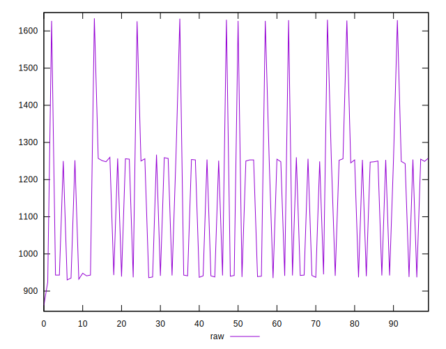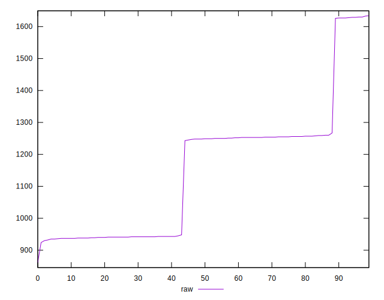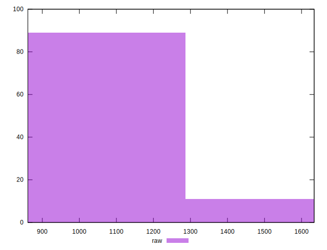
## Score


```yaml
p90min: 0.4
p90max: 0.48
p90range: 0.07999999999999996
p90mean: 0.454042553191489
median: 0.44
p90stdev: 0.025235872345842937
mad: 0.03999999999999998
stdevBySn: 0.04770399999999998
lfitCenter: 0.45363738116552915
lfitStdev: 0.026451571249391348
mfitCenter: 0.45363738116552915
mfitStdev: 0.033152128234429486
mfitConfidence: 0.0033152128234429485
p90skewness: -0.4436427581874213
p90eccentricity: 1.0000000000000022
p90discretization: 31.333333333333332
outlandishness: 0.9967318217611231

```

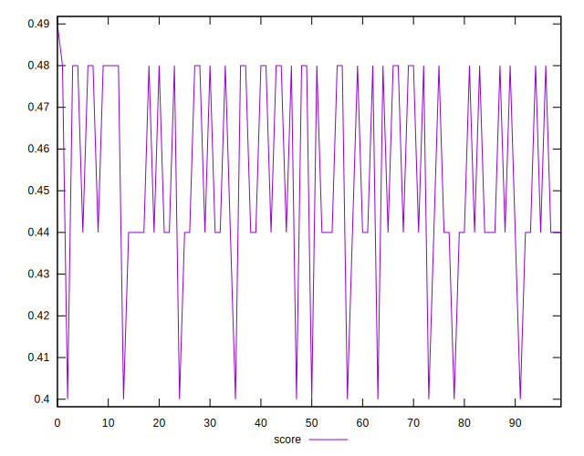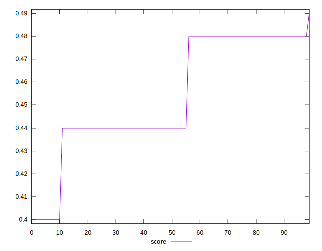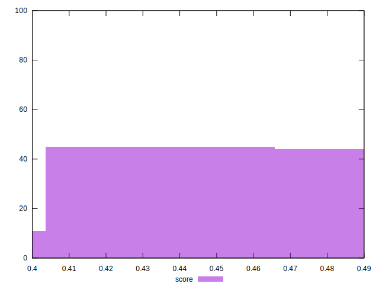
## Raw Estimate

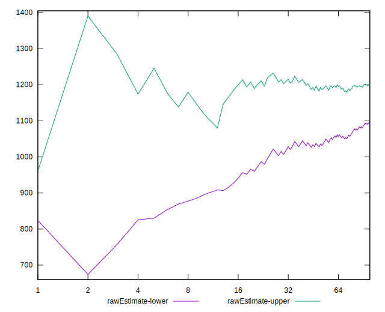
## Score Estimate

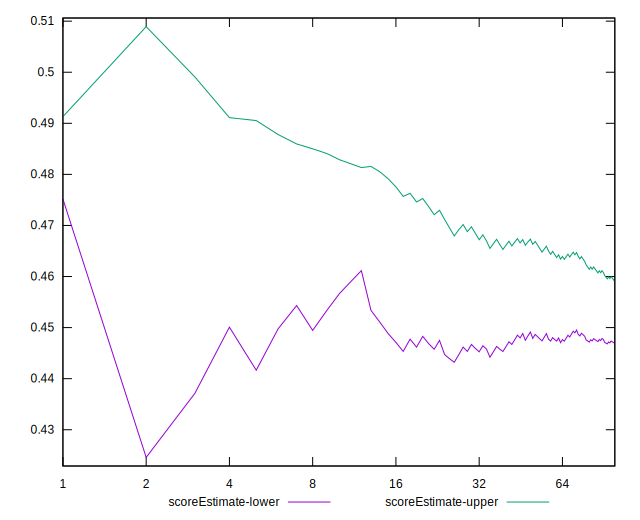
## P Score


```yaml
p90min: 0.39647058823529413
p90max: 0.47858823529411765
p90range: 0.08211764705882352
p90mean: 0.45310763454317915
median: 0.4413529411764706
p90stdev: 0.024609194016025265
mad: 0.0359411764705882
stdevBySn: 0.04349482352941173
lfitCenter: 0.4529714387855698
lfitStdev: 0.02467087739310096
mfitCenter: 0.4529714387855698
mfitStdev: 0.030920359447864185
mfitConfidence: 0.0030920359447864183
p90skewness: -0.6524377746718931
p90eccentricity: 1.0000000000000002
p90discretization: 2.764705882352941
outlandishness: 0.9962620726822871

```

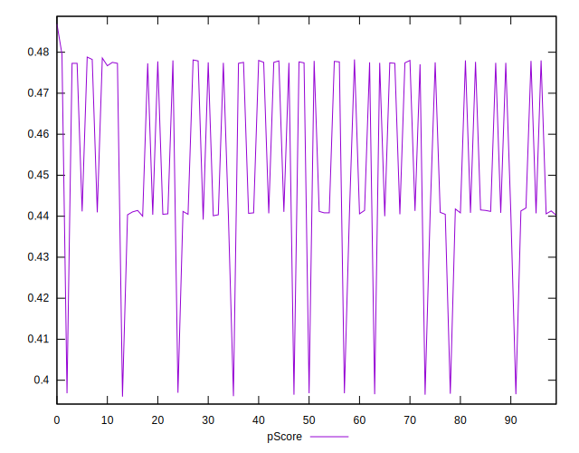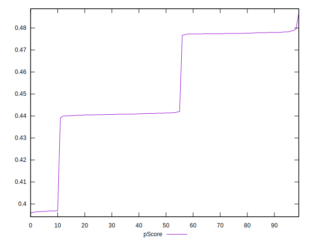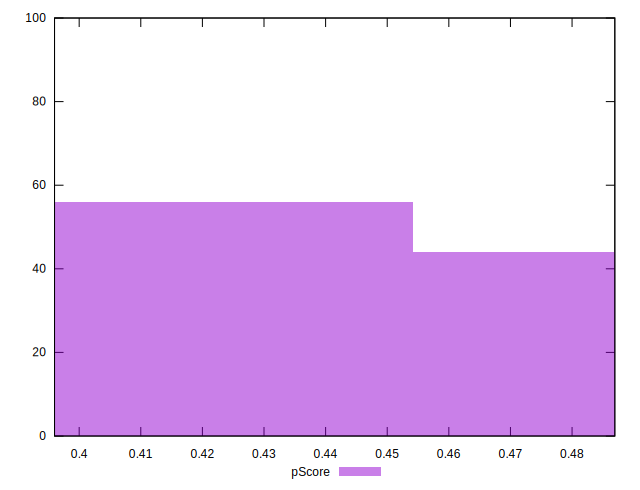
## Score Difference


```yaml
p90min: 0
p90max: 0
p90range: 0
p90mean: 0
median: 0
p90stdev: 0
mad: 0
stdevBySn: 0
lfitCenter: 0
lfitStdev: 0
mfitCenter: 0
mfitStdev: 0
mfitConfidence: 0
p90skewness: .nan
p90eccentricity: .nan
p90discretization: 94
outlandishness: .nan

```


## P Score Difference


```yaml
p90min: -0.003529411764705892
p90max: 0.0014117647058823346
p90range: 0.004941176470588227
p90mean: -0.0010413016270337876
median: -0.001823529411764696
p90stdev: 0.0016695194316578219
mad: 0.001529411764705918
stdevBySn: 0.0019642823529411844
lfitCenter: -0.0010979103603551976
lfitStdev: 0.0018050582742050144
mfitCenter: -0.0010979103603551976
mfitStdev: 0.0022623050560158908
mfitConfidence: 0.00022623050560158909
p90skewness: 0.13210464322979382
p90eccentricity: 1.0000000000000009
p90discretization: 2.8484848484848486
outlandishness: 0.9975015625000012

```

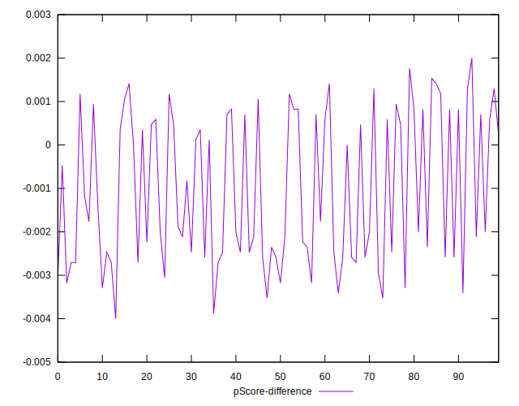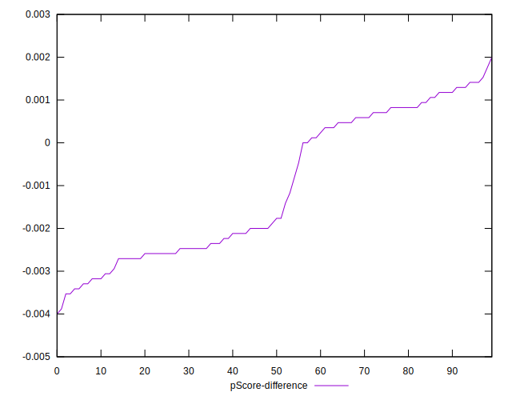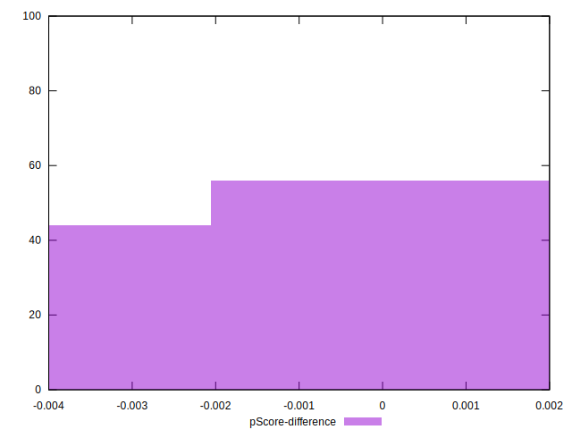