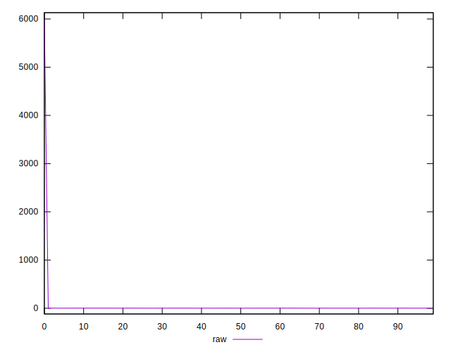

# //server-response-time/samples/card

[→ Parent](../..)


## Raw


```yaml
p90min: 1.7090000000000003
p90max: 3.5150000000000006
p90range: 1.8060000000000003
p90mean: 2.335936170212766
median: 2.2595
p90stdev: 0.4371803223197845
mad: 0.3145
stdevBySn: 0.44483980000000006
lfitCenter: 30.270235101005635
lfitStdev: 69.75887224821408
mfitCenter: 30.270235101005635
mfitStdev: 87.42978087984818
mfitConfidence: 8.742978087984818
p90skewness: 0.8053646807619301
p90eccentricity: 0.9999999999999997
p90discretization: 1.0217391304347827
outlandishness: 714.2191232272774

```


## Score


```yaml
p90min: 1
p90max: 1
p90range: 0
p90mean: 1
median: 1
p90stdev: 0
mad: 0
stdevBySn: 0
lfitCenter: 0.9953463986474514
lfitStdev: 0.01161056518501907
mfitCenter: 0.9953463986474514
mfitStdev: 0.01455168550325008
mfitConfidence: 0.001455168550325008
p90skewness: .nan
p90eccentricity: .nan
p90discretization: 94
outlandishness: 0.9801

```


## Raw Estimate


## Score Estimate


## P Score


```yaml
p90min: 1
p90max: 1
p90range: 0
p90mean: 1
median: 1
p90stdev: 0
mad: 0
stdevBySn: 0
lfitCenter: 0.9953463986474514
lfitStdev: 0.01161056518501907
mfitCenter: 0.9953463986474514
mfitStdev: 0.01455168550325008
mfitConfidence: 0.001455168550325008
p90skewness: .nan
p90eccentricity: .nan
p90discretization: 94
outlandishness: 0.9801

```


## Score Difference


```yaml
p90min: 0
p90max: 0
p90range: 0
p90mean: 0
median: 0
p90stdev: 0
mad: 0
stdevBySn: 0
lfitCenter: 0
lfitStdev: 0
mfitCenter: 0
mfitStdev: 0
mfitConfidence: 0
p90skewness: .nan
p90eccentricity: .nan
p90discretization: 94
outlandishness: .nan

```


## P Score Difference


```yaml
p90min: 0
p90max: 0
p90range: 0
p90mean: 0
median: 0
p90stdev: 0
mad: 0
stdevBySn: 0
lfitCenter: 0
lfitStdev: 0
mfitCenter: 0
mfitStdev: 0
mfitConfidence: 0
p90skewness: .nan
p90eccentricity: .nan
p90discretization: 94
outlandishness: .nan

```

