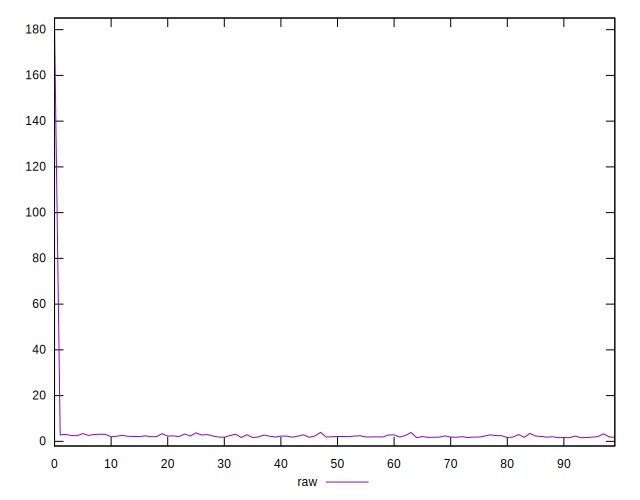
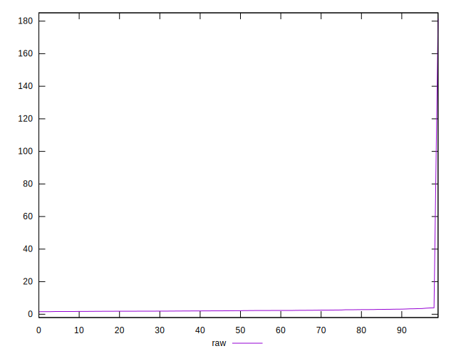
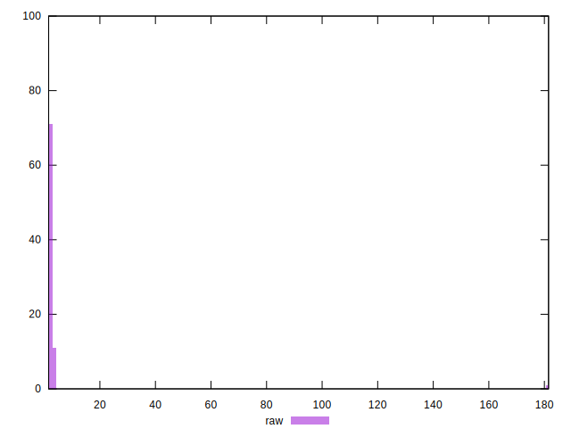
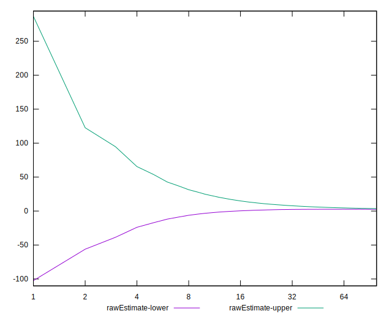

# //server-response-time/samples/music

[→ Parent](../..)


## Raw


```yaml
p90min: 1.6070000000000002
p90max: 3.7110000000000003
p90range: 2.104
p90mean: 2.2927765957446815
median: 2.1710000000000003
p90stdev: 0.4945367089241379
mad: 0.3230000000000003
stdevBySn: 0.5193772999999999
lfitCenter: 3.0933602197798855
lfitStdev: 2.1280487794090814
mfitCenter: 3.0933602197798855
mfitStdev: 2.6671136228141594
mfitConfidence: 0.26671136228141595
p90skewness: 0.8277152074313847
p90eccentricity: 0.9999999999999994
p90discretization: 1.0217391304347827
outlandishness: 3.1913401017426417

```


## Score


```yaml
p90min: 1
p90max: 1
p90range: 0
p90mean: 1
median: 1
p90stdev: 0
mad: 0
stdevBySn: 0
lfitCenter: 1
lfitStdev: 0
mfitCenter: 1
mfitStdev: 0
mfitConfidence: 0
p90skewness: .nan
p90eccentricity: .nan
p90discretization: 94
outlandishness: 1

```


## Raw Estimate


## Score Estimate


## P Score


```yaml
p90min: 1
p90max: 1
p90range: 0
p90mean: 1
median: 1
p90stdev: 0
mad: 0
stdevBySn: 0
lfitCenter: 1
lfitStdev: 0
mfitCenter: 1
mfitStdev: 0
mfitConfidence: 0
p90skewness: .nan
p90eccentricity: .nan
p90discretization: 94
outlandishness: 1

```


## Score Difference


```yaml
p90min: 0
p90max: 0
p90range: 0
p90mean: 0
median: 0
p90stdev: 0
mad: 0
stdevBySn: 0
lfitCenter: 0
lfitStdev: 0
mfitCenter: 0
mfitStdev: 0
mfitConfidence: 0
p90skewness: .nan
p90eccentricity: .nan
p90discretization: 94
outlandishness: .nan

```


## P Score Difference


```yaml
p90min: 0
p90max: 0
p90range: 0
p90mean: 0
median: 0
p90stdev: 0
mad: 0
stdevBySn: 0
lfitCenter: 0
lfitStdev: 0
mfitCenter: 0
mfitStdev: 0
mfitConfidence: 0
p90skewness: .nan
p90eccentricity: .nan
p90discretization: 94
outlandishness: .nan

```

