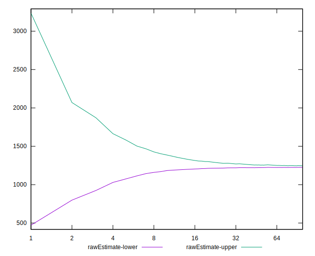

# //speed-index/samples/agenda

[→ Parent](../..)


## Raw


```yaml
p90min: 1211.5739999999998
p90max: 1297.4343000000001
p90range: 85.86030000000028
p90mean: 1232.6366670212765
median: 1215.1254000000001
p90stdev: 32.86568021999881
mad: 2.3122500000000628
stdevBySn: 3.3613431000002376
lfitCenter: 1235.2491146642806
lfitStdev: 42.2753759548767
mfitCenter: 1235.2491146642806
mfitStdev: 52.98432639788982
mfitConfidence: 5.298432639788982
p90skewness: 1.3180612937890366
p90eccentricity: 1
p90discretization: 1.010752688172043
outlandishness: 1.0289426812404663

```


## Score


```yaml
p90min: 1
p90max: 1
p90range: 0
p90mean: 1
median: 1
p90stdev: 0
mad: 0
stdevBySn: 0
lfitCenter: 0.999906927972949
lfitStdev: 0.00023221130370041715
mfitCenter: 0.999906927972949
mfitStdev: 0.0002910337100650464
mfitConfidence: 0.00002910337100650464
p90skewness: .nan
p90eccentricity: .nan
p90discretization: 94
outlandishness: 0.99960004

```


## Raw Estimate


## Score Estimate


## P Score


```yaml
p90min: 0.9998198587714717
p90max: 0.9999045229440506
p90range: 0.00008466417257890768
p90mean: 0.9998845824650614
median: 0.999901845711434
p90stdev: 0.00003232922120654417
mad: 0.0000017635098605861543
stdevBySn: 0.0000025592316687581666
lfitCenter: 0.9997833381550377
lfitStdev: 0.0002651809807738048
mfitCenter: 0.9997833381550377
mfitStdev: 0.0003323550724854292
mfitConfidence: 0.00003323550724854292
p90skewness: -1.3251266456084154
p90eccentricity: 1.0000000000000002
p90discretization: 1.010752688172043
outlandishness: 0.9995412968167711

```


## Score Difference


```yaml
p90min: 0
p90max: 0
p90range: 0
p90mean: 0
median: 0
p90stdev: 0
mad: 0
stdevBySn: 0
lfitCenter: 0
lfitStdev: 0
mfitCenter: 0
mfitStdev: 0
mfitConfidence: 0
p90skewness: .nan
p90eccentricity: .nan
p90discretization: 94
outlandishness: .nan

```


## P Score Difference


```yaml
p90min: -0.0001801412285282744
p90max: -0.00009547705594936673
p90range: 0.00008466417257890768
p90mean: -0.00011541753493864721
median: -0.00009815428856596586
p90stdev: 0.00003232922120654418
mad: 0.0000017635098605861543
stdevBySn: 0.0000025592316687581666
lfitCenter: -0.00012358981791199382
lfitStdev: 0.00005355633498768587
mfitCenter: -0.00012358981791199382
mfitStdev: 0.00006712291185041339
mfitConfidence: 0.000006712291185041338
p90skewness: -1.3251266456040314
p90eccentricity: 0.9999999999999992
p90discretization: 1.010752688172043
outlandishness: 1.5732846904022777

```

