# //speed-index/samples/card

[→ Parent](../..)


## Raw


```yaml
p90min: 1361.3310000000001
p90max: 1448.4814999999999
p90range: 87.15049999999974
p90mean: 1370.5044648936168
median: 1364.3101499999998
p90stdev: 20.480799139706477
mad: 1.6497000000000526
stdevBySn: 2.4814726350000353
lfitCenter: 1409.1711608633427
lfitStdev: 105.83453222705454
mfitCenter: 1409.1711608633427
mfitStdev: 132.6439155898123
mfitConfidence: 13.264391558981231
p90skewness: 3.178740420385679
p90eccentricity: 1.0000000000000004
p90discretization: 1
outlandishness: 1.133552976442531

```

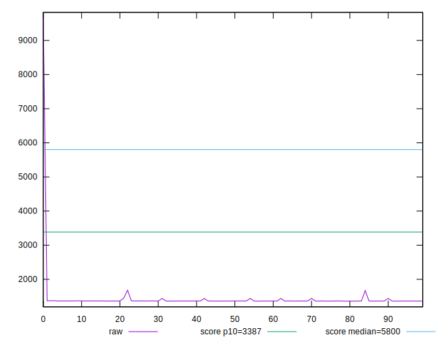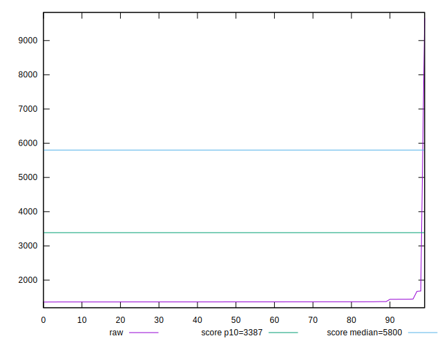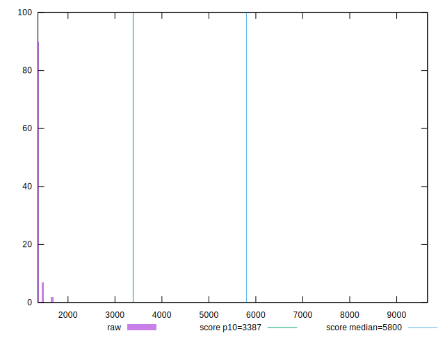
## Score


```yaml
p90min: 1
p90max: 1
p90range: 0
p90mean: 1
median: 1
p90stdev: 0
mad: 0
stdevBySn: 0
lfitCenter: 0.995858294796232
lfitStdev: 0.010333403014666707
mfitCenter: 0.995858294796232
mfitStdev: 0.01295100009789224
mfitConfidence: 0.001295100009789224
p90skewness: .nan
p90eccentricity: .nan
p90discretization: 94
outlandishness: 0.98227921

```

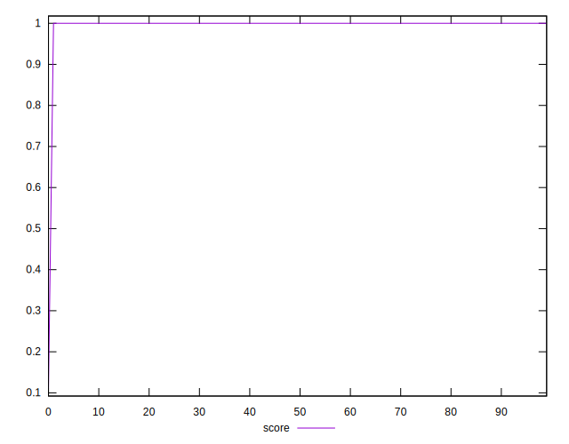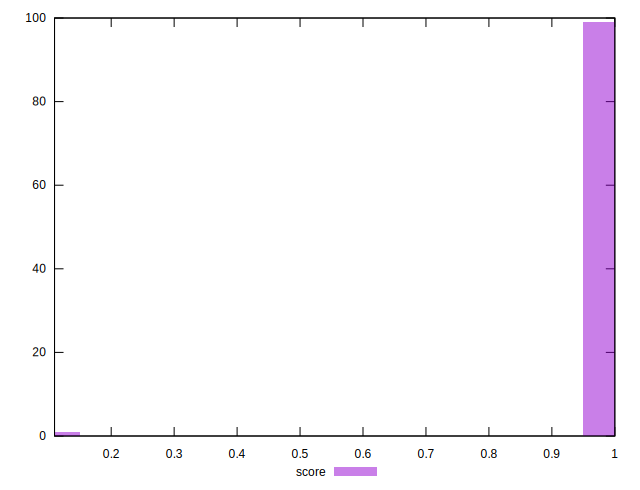
## Raw Estimate

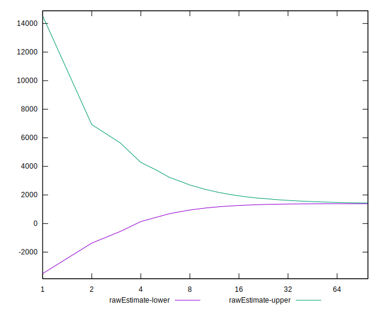
## Score Estimate

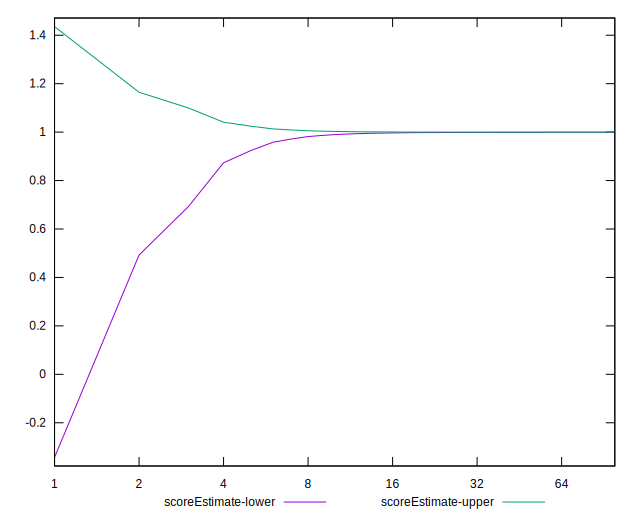
## P Score


```yaml
p90min: 0.9995255224475449
p90max: 0.9997228717575755
p90range: 0.0001973493100305701
p90mean: 0.9997037124472408
median: 0.9997174733085306
p90stdev: 0.00004591233450986535
mad: 0.000003012755596776273
stdevBySn: 0.00000453127446061456
lfitCenter: 0.9955683447386535
lfitStdev: 0.010303070959900157
mfitCenter: 0.9955683447386535
mfitStdev: 0.012912984504801241
mfitConfidence: 0.001291298450480124
p90skewness: -3.205004842556068
p90eccentricity: 0.9999999999999997
p90discretization: 1
outlandishness: 0.9822771825305272

```

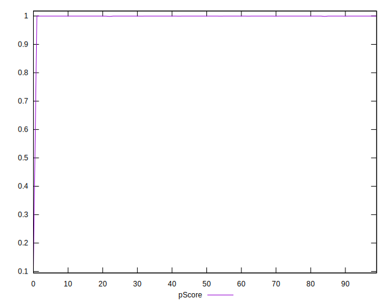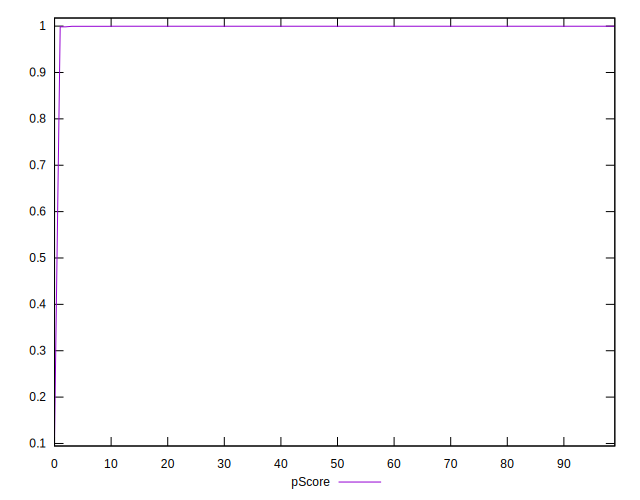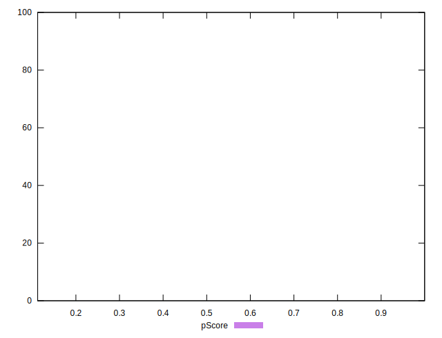
## Score Difference


```yaml
p90min: 0
p90max: 0
p90range: 0
p90mean: 0
median: 0
p90stdev: 0
mad: 0
stdevBySn: 0
lfitCenter: 0
lfitStdev: 0
mfitCenter: 0
mfitStdev: 0
mfitConfidence: 0
p90skewness: .nan
p90eccentricity: .nan
p90discretization: 94
outlandishness: .nan

```


## P Score Difference


```yaml
p90min: -0.00045747012310903834
p90max: -0.00027593839322470615
p90range: 0.0001815317298843322
p90mean: -0.00029417543404422546
median: -0.0002824834095437878
p90stdev: 0.000042072589914921
mad: 0.000003012755596776273
stdevBySn: 0.00000453127446061456
lfitCenter: -0.00028938182340717503
lfitStdev: 0.00004593149402641679
mfitCenter: -0.00028938182340717503
mfitStdev: 0.00005756659086925656
mfitConfidence: 0.0000057566590869256566
p90skewness: -3.506356885426094
p90eccentricity: 0.9999999999999999
p90discretization: 1
outlandishness: 1.0033865232356252

```

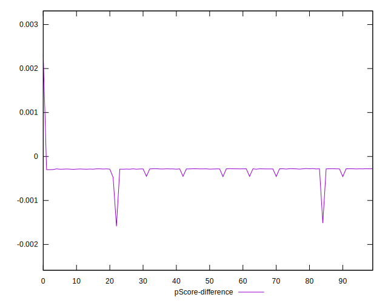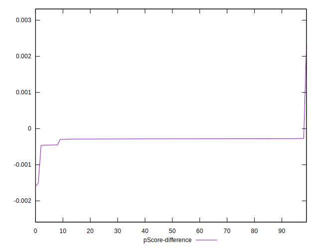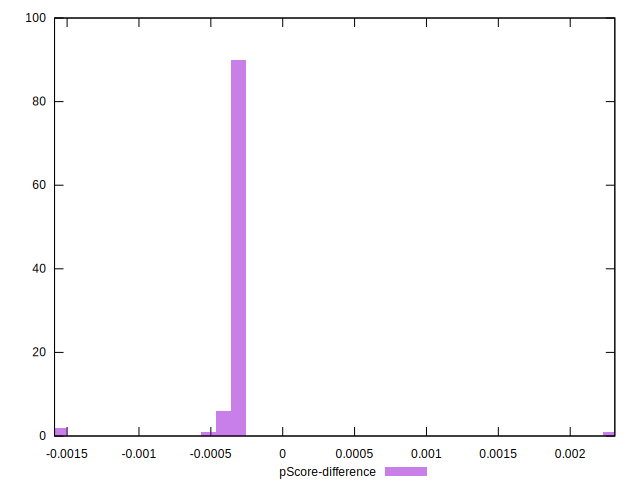