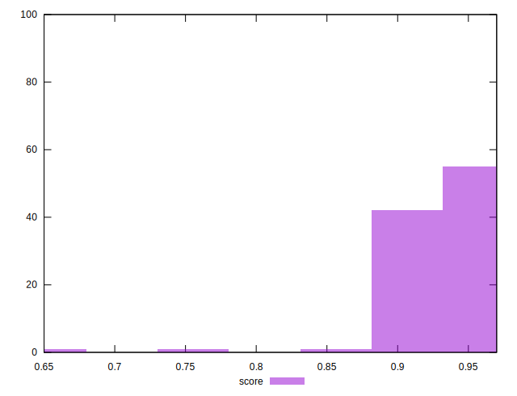

# //speed-index/samples/music

[→ Parent](../..)


## Raw


```yaml
p90min: 2774.661930902738
p90max: 3478.8587904619208
p90range: 704.1968595591829
p90mean: 3102.8471613841352
median: 3045.929864099463
p90stdev: 183.7884703668986
mad: 129.75216292677146
stdevBySn: 195.68809599140502
lfitCenter: 3100.5165425373402
lfitStdev: 191.10660446789407
mfitCenter: 3100.5165425373402
mfitStdev: 239.51660935498498
mfitConfidence: 23.9516609354985
p90skewness: 0.5463392578952345
p90eccentricity: 1
p90discretization: 1
outlandishness: 1.0158631093610613

```


## Score


```yaml
p90min: 0.89
p90max: 0.96
p90range: 0.06999999999999995
p90mean: 0.9314893617021283
median: 0.94
p90stdev: 0.02047091589218506
mad: 0.010000000000000009
stdevBySn: 0.02385199999999989
lfitCenter: 0.9311487262622407
lfitStdev: 0.02179604867725514
mfitCenter: 0.9311487262622407
mfitStdev: 0.0273172959723085
mfitConfidence: 0.00273172959723085
p90skewness: -0.7072536146178299
p90eccentricity: 1.0000000000000007
p90discretization: 13.428571428571429
outlandishness: 0.9910252525188756

```


## Raw Estimate


## Score Estimate


## P Score


```yaml
p90min: 0.8883495316333808
p90max: 0.9605112478053037
p90range: 0.07216171617192291
p90mean: 0.9305464835207196
median: 0.937536418073011
p90stdev: 0.019302960049797487
mad: 0.012434623753508067
stdevBySn: 0.01897214334425771
lfitCenter: 0.930374072734685
lfitStdev: 0.020647679218862888
mfitCenter: 0.930374072734685
mfitStdev: 0.025878028293795895
mfitConfidence: 0.0025878028293795895
p90skewness: -0.7370237001408358
p90eccentricity: 0.9999999999999997
p90discretization: 1
outlandishness: 0.9911229795350344

```


## Score Difference


```yaml
p90min: 0
p90max: 1.1102230246251565e-16
p90range: 1.1102230246251565e-16
p90mean: 5.31489745831192e-17
median: 0
p90stdev: 5.546086938105614e-17
mad: 0
stdevBySn: 0
lfitCenter: 5.1576207973387414e-17
lfitStdev: 6.922332257683898e-17
mfitCenter: 5.1576207973387414e-17
mfitStdev: 8.67585689048037e-17
mfitConfidence: 8.67585689048037e-18
p90skewness: 0.08518354199999159
p90eccentricity: 0.9999999999999997
p90discretization: 47
outlandishness: 1.0053404444444443

```


## P Score Difference


```yaml
p90min: -0.004899493986883607
p90max: 0.004666037765529096
p90range: 0.009565531752412704
p90mean: -0.0009488885251462255
median: -0.0016176134695947697
p90stdev: 0.002920612664639925
mad: 0.002410623830207126
stdevBySn: 0.0034823801652694325
lfitCenter: -0.0010919090686296595
lfitStdev: 0.0027042368222823412
mfitCenter: -0.0010919090686296595
mfitStdev: 0.003389258243426018
mfitConfidence: 0.0003389258243426018
p90skewness: 0.40236404587788815
p90eccentricity: 1.0000000000000007
p90discretization: 1
outlandishness: 0.8855988822132392

```

