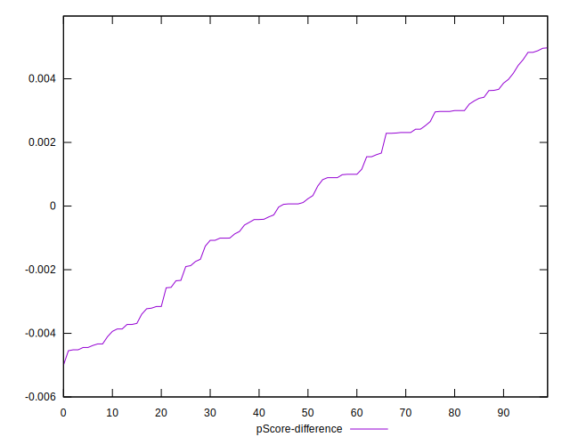

# //total-blocking-time/samples/astro

[→ Parent](../..)


## Raw


```yaml
p90min: 325.5
p90max: 404.5
p90range: 79
p90mean: 370.5026436170213
median: 372.75
p90stdev: 18.026275185309423
mad: 10.75
stdevBySn: 18.782853700000015
lfitCenter: 372.4967641598364
lfitStdev: 15.350638820512199
mfitCenter: 372.4967641598364
mfitStdev: 19.23917266993135
mfitConfidence: 1.923917266993135
p90skewness: -0.7263570629947669
p90eccentricity: 0.9999999999999994
p90discretization: 1.323943661971831
outlandishness: 1.0125118485558504

```


## Score


```yaml
p90min: 0.75
p90max: 0.86
p90range: 0.10999999999999999
p90mean: 0.7984042553191494
median: 0.8
p90stdev: 0.02384806479901914
mad: 0.019999999999999907
stdevBySn: 0.023852000000000022
lfitCenter: 0.7958638877622389
lfitStdev: 0.020740347952241077
mfitCenter: 0.7958638877622389
mfitStdev: 0.025994171327542767
mfitConfidence: 0.002599417132754277
p90skewness: 0.6598862073209175
p90eccentricity: 0.9999999999999996
p90discretization: 7.833333333333333
outlandishness: 0.9927380820514509

```


## Raw Estimate


## Score Estimate


## P Score


```yaml
p90min: 0.7533862856126018
p90max: 0.8560623322095601
p90range: 0.10267604659695828
p90mean: 0.7986270204091803
median: 0.7959496123212761
p90stdev: 0.023462759688592686
mad: 0.014194142667633136
stdevBySn: 0.024875257210457823
lfitCenter: 0.7961579455149522
lfitStdev: 0.020009226236339675
mfitCenter: 0.7961579455149522
mfitStdev: 0.02507784614398313
mfitConfidence: 0.002507784614398313
p90skewness: 0.6678549652926057
p90eccentricity: 1.0000000000000002
p90discretization: 1.323943661971831
outlandishness: 0.9926676656846672

```


## Score Difference


```yaml
p90min: 0
p90max: 1.1102230246251565e-16
p90range: 1.1102230246251565e-16
p90mean: 1.1810883240693154e-18
median: 0
p90stdev: 1.139000331521095e-17
mad: 0
stdevBySn: 0
lfitCenter: 2.1510305028010703e-18
lfitStdev: 5.2873683940481196e-18
mfitCenter: 2.1510305028010703e-18
mfitStdev: 6.626733564123762e-18
mfitConfidence: 6.626733564123762e-19
p90skewness: 9.539955591519908
p90eccentricity: 0.9999999999999996
p90discretization: 47
outlandishness: 14.137600000000003

```


## P Score Difference


```yaml
p90min: -0.0045159560841776525
p90max: 0.004829364667598979
p90range: 0.009345320751776631
p90mean: 0.00019811133195933673
median: 0.0001712789876398002
p90stdev: 0.002676449434808807
mad: 0.0024192802959695503
stdevBySn: 0.003260591458709819
lfitCenter: 0.00025437287670091114
lfitStdev: 0.0023089474366449363
mfitCenter: 0.00025437287670091114
mfitStdev: 0.002893836467577385
mfitConfidence: 0.0002893836467577385
p90skewness: -0.1842933202970193
p90eccentricity: 0.9999999999999996
p90discretization: 1.3055555555555556
outlandishness: 0.9562916801264402

```

