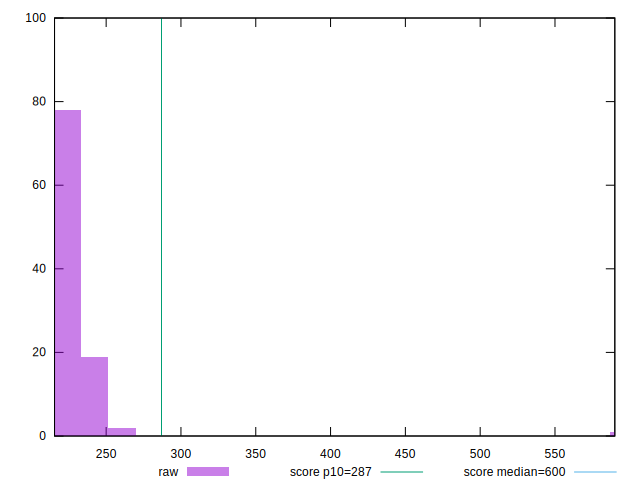

# //total-blocking-time/samples/music

[→ Parent](../..)


## Raw


```yaml
p90min: 217.5
p90max: 249.76249999999982
p90range: 32.26249999999982
p90mean: 227.12292659574473
median: 226.25
p90stdev: 7.572723513994136
mad: 5.25
stdevBySn: 7.900975000000001
lfitCenter: 228.33505405092376
lfitStdev: 8.853200514050426
mfitCenter: 228.33505405092376
mfitStdev: 11.095841375913361
mfitConfidence: 1.109584137591336
p90skewness: 0.925557469336966
p90eccentricity: 1.0000000000000007
p90discretization: 1.9583333333333333
outlandishness: 1.0343890412251533

```


## Score


```yaml
p90min: 0.94
p90max: 0.96
p90range: 0.020000000000000018
p90mean: 0.9540425531914895
median: 0.955
p90stdev: 0.006575122187388279
mad: 0.0050000000000000044
stdevBySn: 0.008944500000000008
lfitCenter: 0.9522518521209278
lfitStdev: 0.009710863284623892
mfitCenter: 0.9522518521209278
mfitStdev: 0.012170762252403896
mfitConfidence: 0.0012170762252403896
p90skewness: -0.6547409383804267
p90eccentricity: 0.9999999999999994
p90discretization: 31.333333333333332
outlandishness: 0.9900826948637279

```


## Raw Estimate


## Score Estimate


## P Score


```yaml
p90min: 0.9361280763130343
p90max: 0.9610852382356216
p90range: 0.024957161922587345
p90mean: 0.9541343849746786
median: 0.954950522708629
p90stdev: 0.0057247079423720405
mad: 0.0037391297567515025
stdevBySn: 0.00564752122526018
lfitCenter: 0.9524598356120955
lfitStdev: 0.008154860961010965
mfitCenter: 0.9524598356120955
mfitStdev: 0.010220602540561714
mfitConfidence: 0.0010220602540561715
p90skewness: -1.0512195606798198
p90eccentricity: 0.9999999999999999
p90discretization: 1.9583333333333333
outlandishness: 0.9902666841036889

```


## Score Difference


```yaml
p90min: 0
p90max: 1.1102230246251565e-16
p90range: 1.1102230246251565e-16
p90mean: 5.196788625904988e-17
median: 0
p90stdev: 5.539795288958161e-17
mad: 0
stdevBySn: 0
lfitCenter: 4.9676344103855176e-17
lfitStdev: 6.880425346057829e-17
mfitCenter: 4.9676344103855176e-17
mfitStdev: 8.623334365635336e-17
mfitConfidence: 8.623334365635336e-18
p90skewness: 0.12792042981336607
p90eccentricity: 1.0000000000000002
p90discretization: 47
outlandishness: 1.008198553719008

```


## P Score Difference


```yaml
p90min: -0.0040390618670475
p90max: 0.004533976504898729
p90range: 0.008573038371946229
p90mean: 0.00018840471840093348
median: 0.00006811423369479375
p90stdev: 0.0024266430552098393
mad: 0.002077218665938907
stdevBySn: 0.0028569755895895676
lfitCenter: 0.0001445194082638095
lfitStdev: 0.002150584617117292
mfitCenter: 0.0001445194082638095
mfitStdev: 0.0026953581068385277
mfitConfidence: 0.0002695358106838528
p90skewness: 0.10019664603691947
p90eccentricity: 1.0000000000000002
p90discretization: 1.9183673469387754
outlandishness: 0.9085654757311118

```

