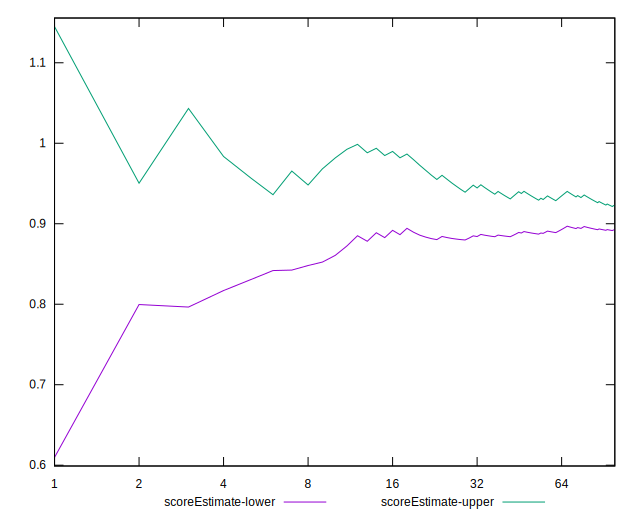

# //unminified-javascript/samples/astro

[→ Parent](../..)


## Raw


```yaml
p90min: 0
p90max: 150
p90range: 150
p90mean: 100.53191489361703
median: 150
p90stdev: 70.5203610446309
mad: 0
stdevBySn: 0
lfitCenter: 111.62925541233078
lfitStdev: 72.87970507135118
mfitCenter: 111.62925541233078
mfitStdev: 91.34116478121996
mfitConfidence: 9.134116478121996
p90skewness: -0.7241005155222724
p90eccentricity: 1.0000000000000007
p90discretization: 47
outlandishness: 0.9993651801461324

```


## Score


```yaml
p90min: 0.88
p90max: 1
p90range: 0.12
p90mean: 0.919574468085106
median: 0.88
p90stdev: 0.05641628883570471
mad: 0
stdevBySn: 0
lfitCenter: 0.9106500596566103
lfitStdev: 0.05833414615475268
mfitCenter: 0.9106500596566103
mfitStdev: 0.07311101013754756
mfitConfidence: 0.007311101013754756
p90skewness: 0.7241005155222816
p90eccentricity: 0.9999999999999991
p90discretization: 47
outlandishness: 0.9998380445033218

```


## Raw Estimate


## Score Estimate


## P Score


```yaml
p90min: 0.875
p90max: 1
p90range: 0.125
p90mean: 0.9162234042553191
median: 0.875
p90stdev: 0.05876696753719243
mad: 0
stdevBySn: 0
lfitCenter: 0.9069756204897247
lfitStdev: 0.06073308755945954
mfitCenter: 0.9069756204897247
mfitStdev: 0.07611763731768358
mfitConfidence: 0.007611763731768357
p90skewness: 0.7241005155222742
p90eccentricity: 1.0000000000000007
p90discretization: 47
outlandishness: 1.000058055994995

```


## Score Difference


```yaml
p90min: 0
p90max: 0
p90range: 0
p90mean: 0
median: 0
p90stdev: 0
mad: 0
stdevBySn: 0
lfitCenter: 0
lfitStdev: 0
mfitCenter: 0
mfitStdev: 0
mfitConfidence: 0
p90skewness: .nan
p90eccentricity: .nan
p90discretization: 94
outlandishness: .nan

```


## P Score Difference


```yaml
p90min: -0.0050000000000000044
p90max: 0
p90range: 0.0050000000000000044
p90mean: -0.003297872340425535
median: -0.0050000000000000044
p90stdev: 0.002369261430991501
mad: 0
stdevBySn: 0
lfitCenter: -0.0036368512438380352
lfitStdev: 0.002485356653290258
mfitCenter: -0.0036368512438380352
mfitStdev: 0.003114932632974196
mfitConfidence: 0.0003114932632974196
p90skewness: 0.6735198826004047
p90eccentricity: 0.9999999999999997
p90discretization: 47
outlandishness: 0.971178459937565

```

