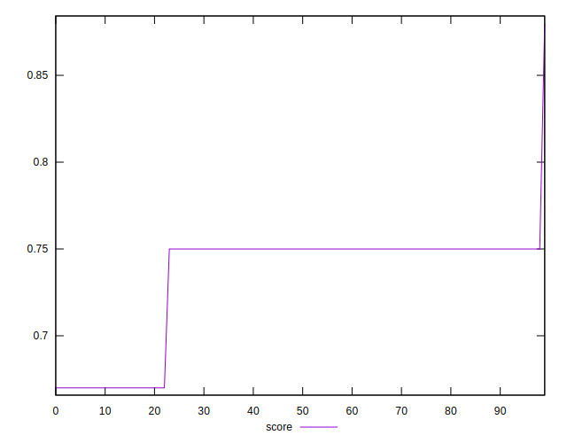
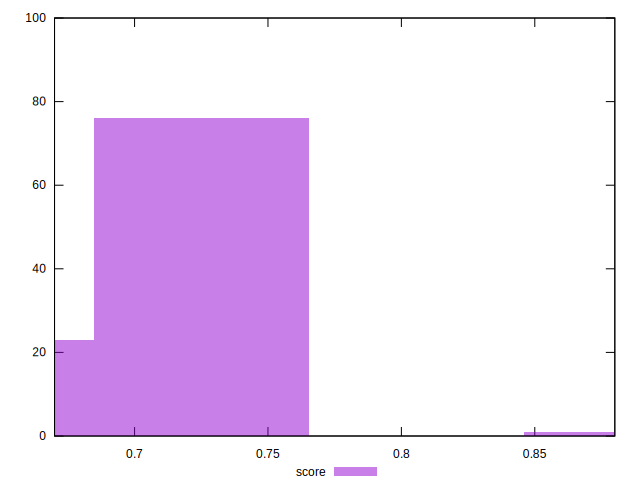
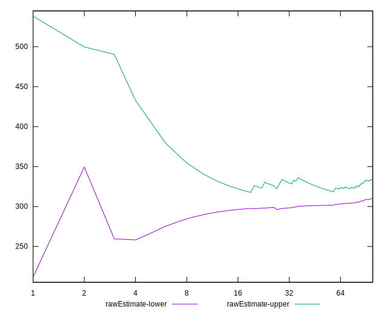
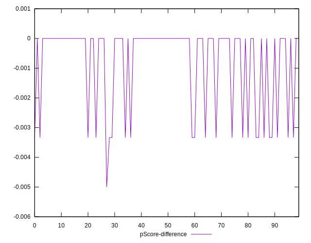

# //unused-css-rules/samples/astro

[→ Parent](../..)


## Raw


```yaml
p90min: 300
p90max: 450
p90range: 150
p90mean: 331.9148936170213
median: 300
p90stdev: 61.389523601078764
mad: 0
stdevBySn: 0
lfitCenter: 321.3955804812334
lfitStdev: 47.4811755249157
mfitCenter: 321.3955804812334
mfitStdev: 59.508828601615875
mfitConfidence: 5.950882860161587
p90skewness: 1.4036631612570978
p90eccentricity: 1.000000000000001
p90discretization: 47
outlandishness: 1.006549149408284

```


## Score


```yaml
p90min: 0.67
p90max: 0.75
p90range: 0.07999999999999996
p90mean: 0.7329787234042556
median: 0.75
p90stdev: 0.032741079253908636
mad: 0
stdevBySn: 0
lfitCenter: 0.7388217038109701
lfitStdev: 0.025409199861094224
mfitCenter: 0.7388217038109701
mfitStdev: 0.03184570943582894
mfitConfidence: 0.0031845709435828944
p90skewness: -1.4036631612571198
p90eccentricity: 1.0000000000000007
p90discretization: 47
outlandishness: 0.9997852074713359

```


## Raw Estimate


## Score Estimate


## P Score


```yaml
p90min: 0.6666666666666666
p90max: 0.75
p90range: 0.08333333333333337
p90mean: 0.7322695035460991
median: 0.75
p90stdev: 0.03410529088948818
mad: 0
stdevBySn: 0
lfitCenter: 0.7383074664556714
lfitStdev: 0.02645001938701364
mfitCenter: 0.7383074664556714
mfitStdev: 0.03315018326337038
mfitConfidence: 0.003315018326337038
p90skewness: -1.4036631612570956
p90eccentricity: 1.000000000000001
p90discretization: 47
outlandishness: 0.9994915900603282

```


## Score Difference


```yaml
p90min: 0
p90max: 0
p90range: 0
p90mean: 0
median: 0
p90stdev: 0
mad: 0
stdevBySn: 0
lfitCenter: 0
lfitStdev: 0
mfitCenter: 0
mfitStdev: 0
mfitConfidence: 0
p90skewness: .nan
p90eccentricity: .nan
p90discretization: 94
outlandishness: .nan

```


## P Score Difference


```yaml
p90min: -0.0033333333333334103
p90max: 0
p90range: 0.0033333333333334103
p90mean: -0.000744680851063847
median: 0
p90stdev: 0.0013884235425852716
mad: 0
stdevBySn: 0
lfitCenter: -0.0005282603636528665
lfitStdev: 0.0011173842408537574
mfitCenter: -0.0005282603636528665
mfitStdev: 0.0014004334672847378
mfitConfidence: 0.00014004334672847377
p90skewness: -1.3281045550208743
p90eccentricity: 1.0000000000000016
p90discretization: 47
outlandishness: 1.2026777777777744

```

