# //unused-javascript/samples/astro

[→ Parent](../..)


## Raw


```yaml
p90min: 3750
p90max: 4060
p90range: 310
p90mean: 3892.7659574468084
median: 3900
p90stdev: 98.67639196112857
mad: 0
stdevBySn: 0
lfitCenter: 3893.9912630697395
lfitStdev: 64.1063512820555
mfitCenter: 3893.9912630697395
mfitStdev: 80.34539643436075
mfitConfidence: 8.034539643436075
p90skewness: 0.0704314197025991
p90eccentricity: 0.9999999999999994
p90discretization: 15.666666666666666
outlandishness: 1.000325780792187

```

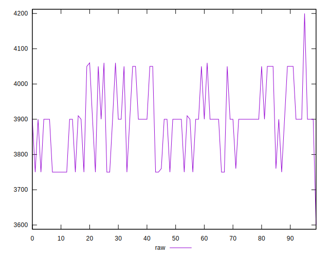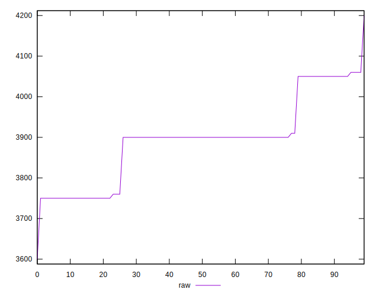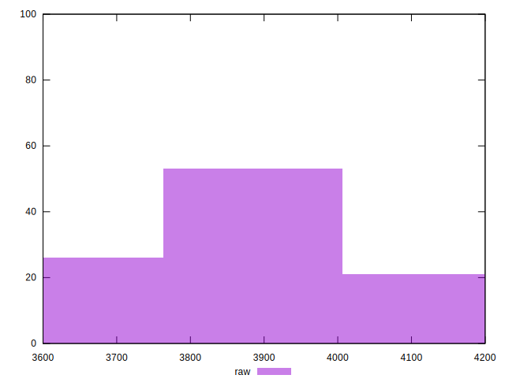
## Score


```yaml
p90min: 0.11
p90max: 0.15
p90range: 0.039999999999999994
p90mean: 0.13106382978723422
median: 0.13
p90stdev: 0.013165726386727652
mad: 0
stdevBySn: 0
lfitCenter: 0.1308402782041669
lfitStdev: 0.008505234558968839
mfitCenter: 0.1308402782041669
mfitStdev: 0.010659730724666283
mfitConfidence: 0.0010659730724666282
p90skewness: -0.05647133619563643
p90eccentricity: 0.9999999999999982
p90discretization: 31.333333333333332
outlandishness: 0.9975015624999999

```

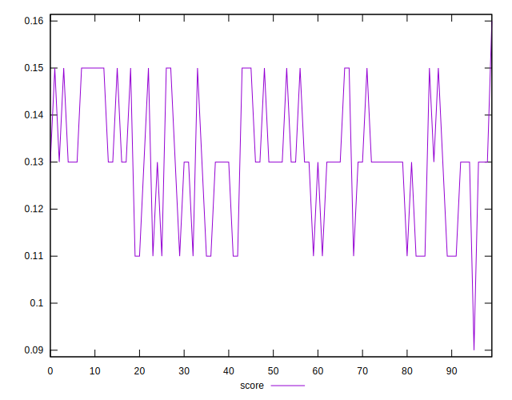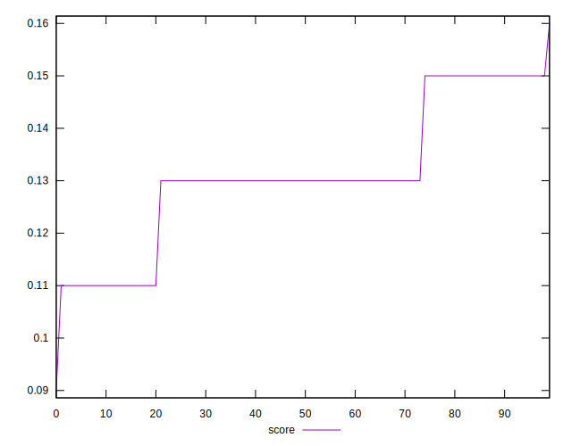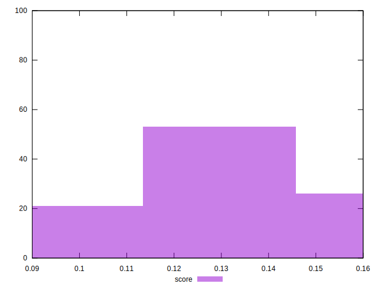
## Raw Estimate

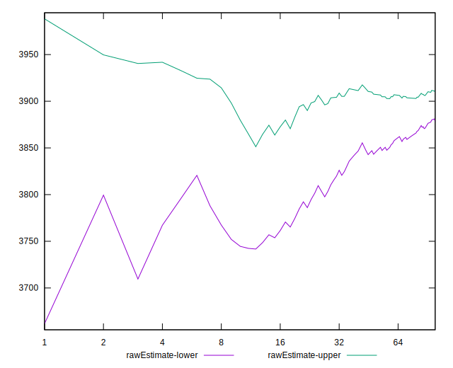
## Score Estimate

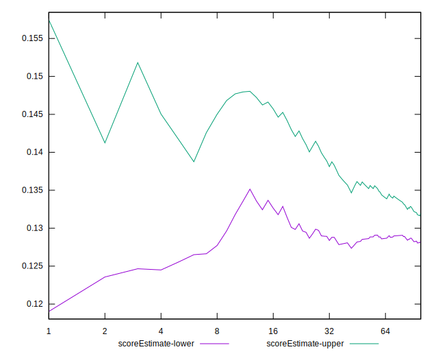
## P Score


```yaml
p90min: 0.11058823529411765
p90max: 0.14705882352941174
p90range: 0.03647058823529409
p90mean: 0.13026282853566937
median: 0.12941176470588234
p90stdev: 0.011608987289544528
mad: 0
stdevBySn: 0
lfitCenter: 0.13011867493297188
lfitStdev: 0.0075419236802418774
mfitCenter: 0.13011867493297188
mfitStdev: 0.009452399580513098
mfitConfidence: 0.0009452399580513098
p90skewness: -0.07043141970255078
p90eccentricity: 1.0000000000000007
p90discretization: 15.666666666666666
outlandishness: 0.9988550550454602

```

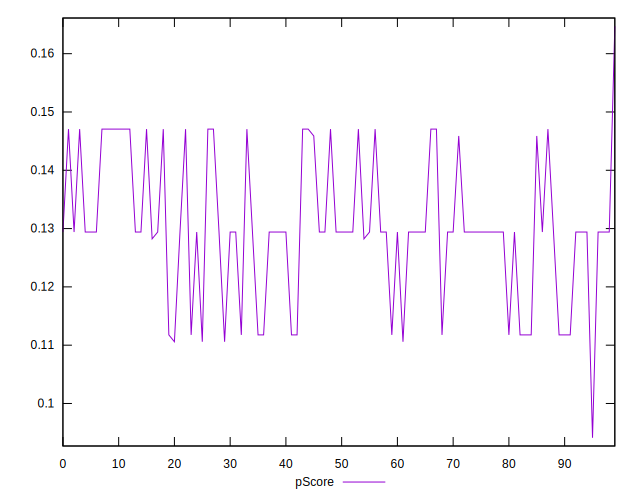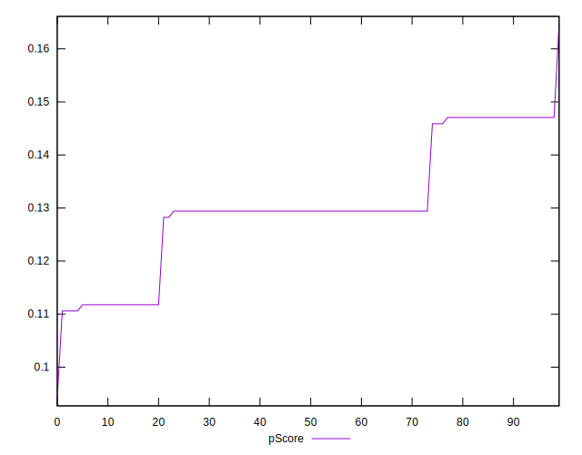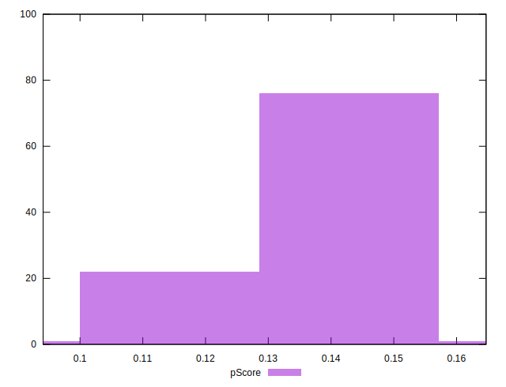
## Score Difference


```yaml
p90min: 0
p90max: 0
p90range: 0
p90mean: 0
median: 0
p90stdev: 0
mad: 0
stdevBySn: 0
lfitCenter: 0
lfitStdev: 0
mfitCenter: 0
mfitStdev: 0
mfitConfidence: 0
p90skewness: .nan
p90eccentricity: .nan
p90discretization: 94
outlandishness: .nan

```


## P Score Difference


```yaml
p90min: -0.0029411764705882526
p90max: 0.0017647058823529321
p90range: 0.004705882352941185
p90mean: -0.0007384230287859987
median: -0.0005882352941176672
p90stdev: 0.0014983270511116115
mad: 0
stdevBySn: 0
lfitCenter: -0.0007028432090162997
lfitStdev: 0.0010203152899306933
mfitCenter: -0.0007028432090162997
mfitStdev: 0.0012787755786760598
mfitConfidence: 0.000127877557867606
p90skewness: 0.023625482784669034
p90eccentricity: 0.9999999999999988
p90discretization: 18.8
outlandishness: 0.9290999425452457

```

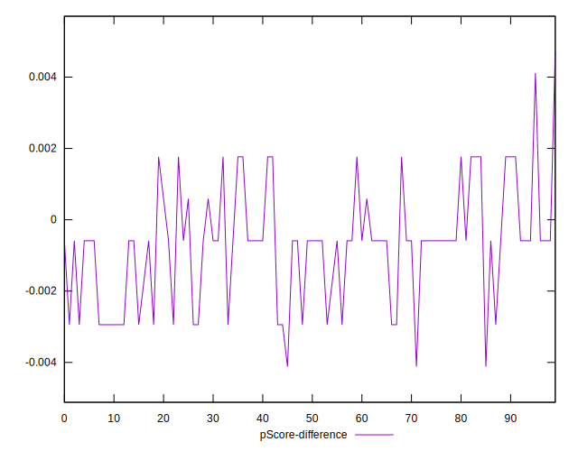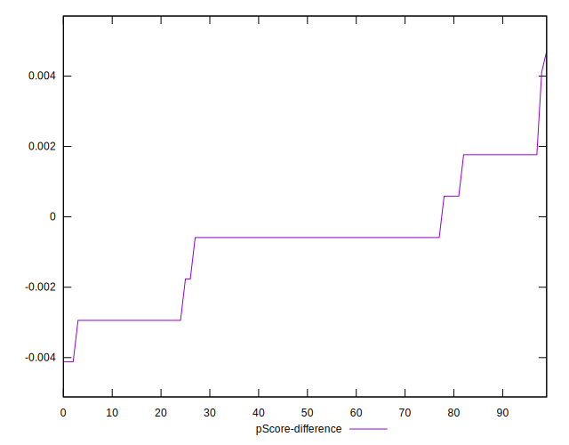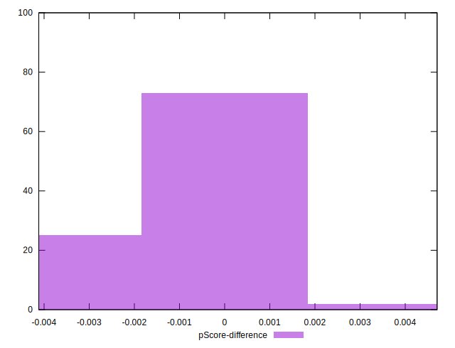