# //unused-javascript/samples/music

[→ Parent](../..)


## Raw


```yaml
p90min: 3630
p90max: 3850
p90range: 220
p90mean: 3753.723404255319
median: 3790
p90stdev: 71.69652418283891
mad: 30
stdevBySn: 47.70400000000001
lfitCenter: 3762.03917213315
lfitStdev: 71.55623474485894
mfitCenter: 3762.03917213315
mfitStdev: 89.68244070904059
mfitConfidence: 8.96824407090406
p90skewness: -0.5442650492210216
p90eccentricity: 1.000000000000001
p90discretization: 5.222222222222222
outlandishness: 1.0013199761784288

```

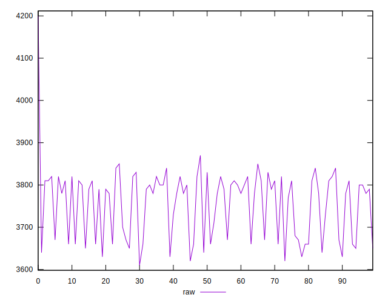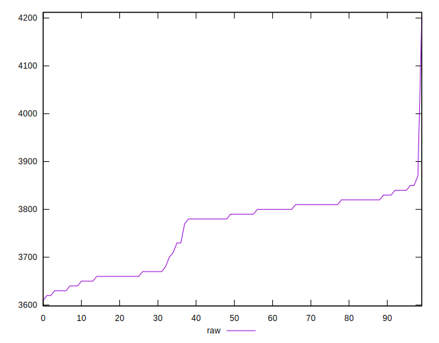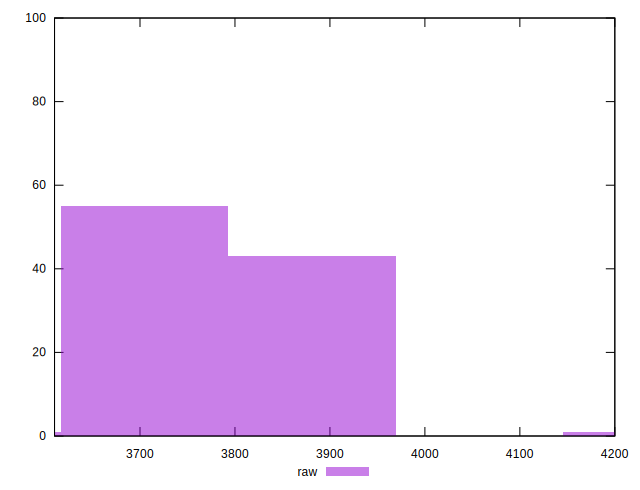
## Score


```yaml
p90min: 0.14
p90max: 0.16
p90range: 0.01999999999999999
p90mean: 0.146808510638298
median: 0.14
p90stdev: 0.00924981494437623
mad: 0
stdevBySn: 0
lfitCenter: 0.14518599247007455
lfitStdev: 0.009828307691429896
mfitCenter: 0.14518599247007455
mfitStdev: 0.012317956987950608
mfitConfidence: 0.0012317956987950608
p90skewness: 0.6729051988718893
p90eccentricity: 0.9999999999999992
p90discretization: 31.333333333333332
outlandishness: 0.9944425255198492

```

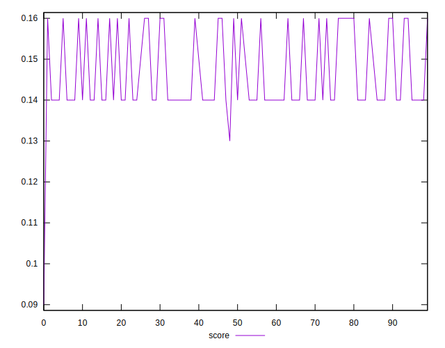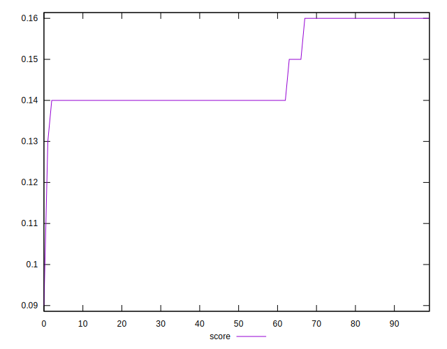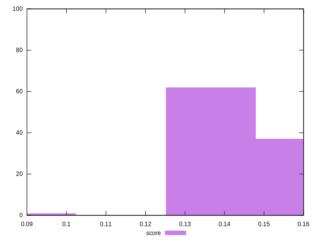
## Raw Estimate

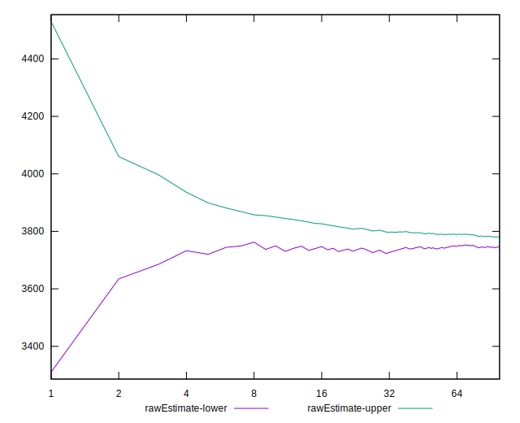
## Score Estimate

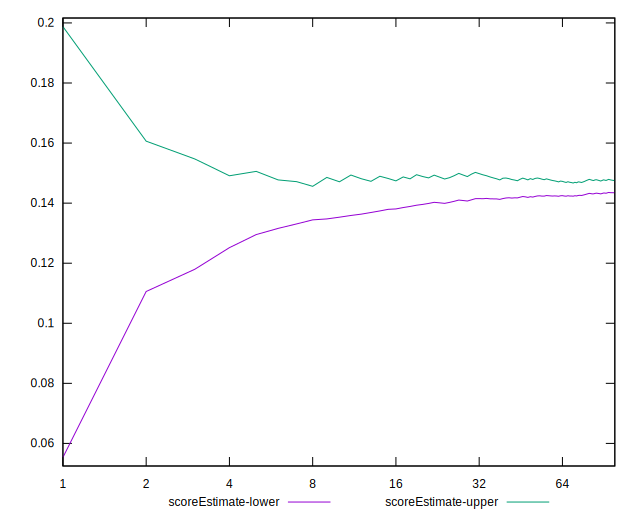
## P Score


```yaml
p90min: 0.1352941176470588
p90max: 0.1611764705882353
p90range: 0.025882352941176523
p90mean: 0.14662077596996245
median: 0.14235294117647057
p90stdev: 0.008434885197981051
mad: 0.003529411764705892
stdevBySn: 0.005612235294117641
lfitCenter: 0.14564245033727688
lfitStdev: 0.008418380558218905
mfitCenter: 0.14564245033727688
mfitStdev: 0.010550875377534446
mfitConfidence: 0.0010550875377534445
p90skewness: 0.5442650492210204
p90eccentricity: 1.0000000000000002
p90discretization: 5.222222222222222
outlandishness: 0.9960295571421773

```

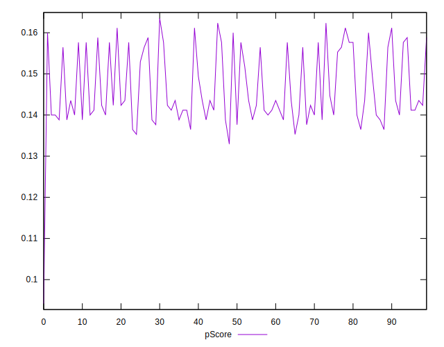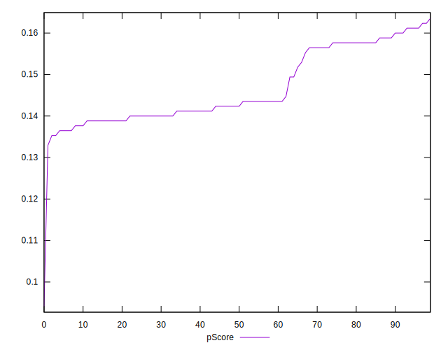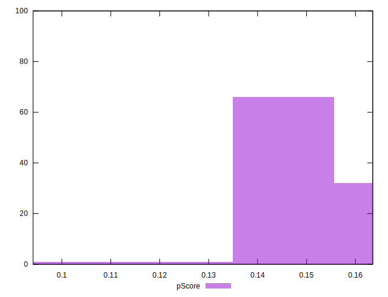
## Score Difference


```yaml
p90min: 0
p90max: 0
p90range: 0
p90mean: 0
median: 0
p90stdev: 0
mad: 0
stdevBySn: 0
lfitCenter: 0
lfitStdev: 0
mfitCenter: 0
mfitStdev: 0
mfitConfidence: 0
p90skewness: .nan
p90eccentricity: .nan
p90discretization: 94
outlandishness: .nan

```


## P Score Difference


```yaml
p90min: -0.0035294117647059198
p90max: 0.0035294117647058365
p90range: 0.007058823529411756
p90mean: -0.00005632040050064395
median: 0
p90stdev: 0.002201090580111373
mad: 0.0023529411764705577
stdevBySn: 0.002806117647058804
lfitCenter: -0.00009170954960094009
lfitStdev: 0.0019065857651077418
mfitCenter: -0.00009170954960094009
mfitStdev: 0.00238955089581849
mfitConfidence: 0.000238955089581849
p90skewness: 0.09688159627162657
p90eccentricity: 0.9999999999999997
p90discretization: 5.529411764705882
outlandishness: 1.5708444444442549

```

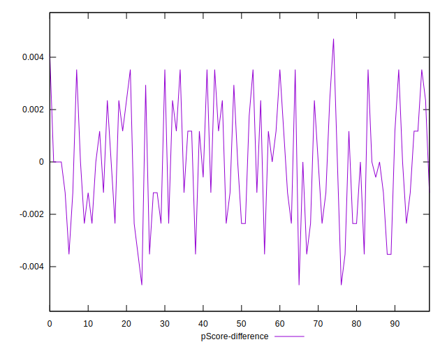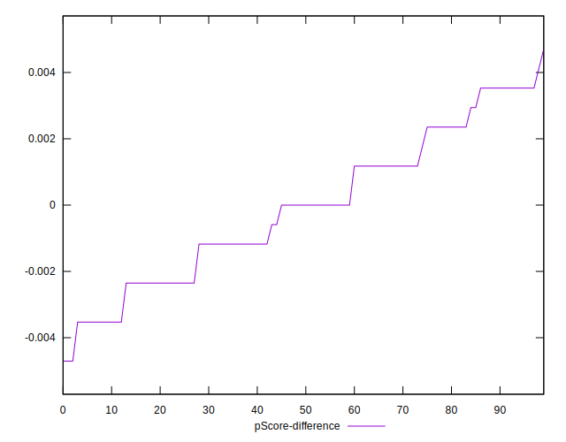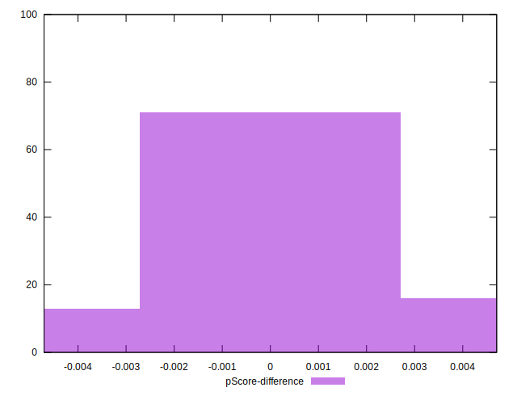