# //uses-http2/samples/agenda

[→ Parent](../..)


## Raw


```yaml
p90min: 770
p90max: 1070
p90range: 300
p90mean: 915.7446808510638
median: 920
p90stdev: 110.43905955757664
mad: 150
stdevBySn: 178.89000000000001
lfitCenter: 915.7653692494264
lfitStdev: 82.29623713717733
mfitCenter: 915.7653692494264
mfitStdev: 103.14303755568015
mfitConfidence: 10.314303755568016
p90skewness: 0.03572462764367787
p90eccentricity: 1.000000000000001
p90discretization: 18.8
outlandishness: 0.9999024187375194

```

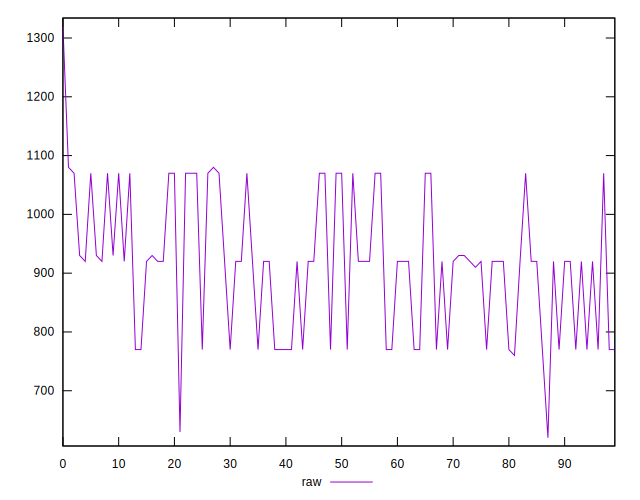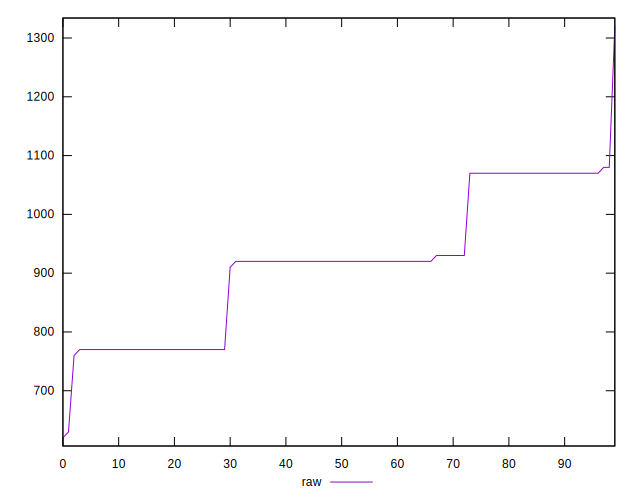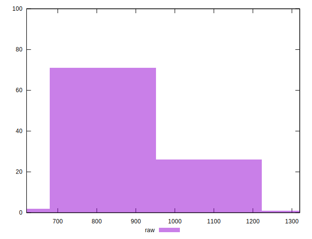
## Score


```yaml
p90min: 0.46
p90max: 0.5
p90range: 0.03999999999999998
p90mean: 0.48063829787234014
median: 0.48
p90stdev: 0.014717807323847884
mad: 0.019999999999999962
stdevBySn: 0.023851999999999957
lfitCenter: 0.4811356647072353
lfitStdev: 0.011825607768977606
mfitCenter: 0.4811356647072353
mfitStdev: 0.014821201414121368
mfitConfidence: 0.0014821201414121367
p90skewness: -0.05010330516474893
p90eccentricity: 0.9999999999999997
p90discretization: 31.333333333333332
outlandishness: 1.0044227634442802

```

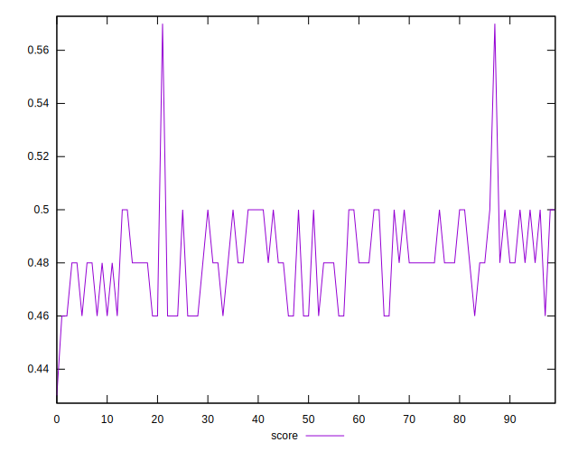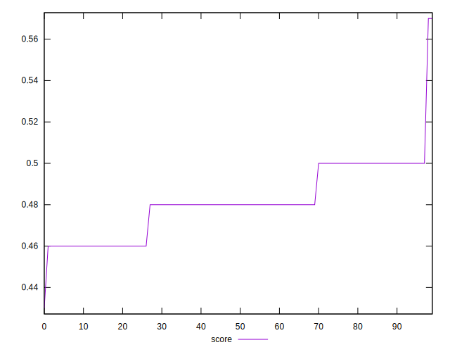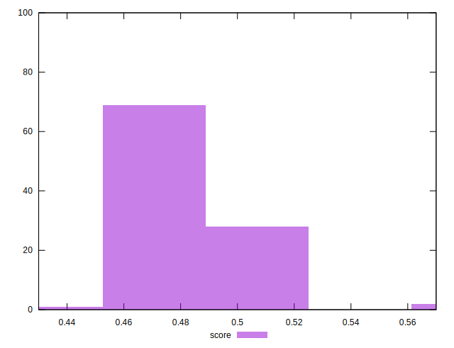
## Raw Estimate

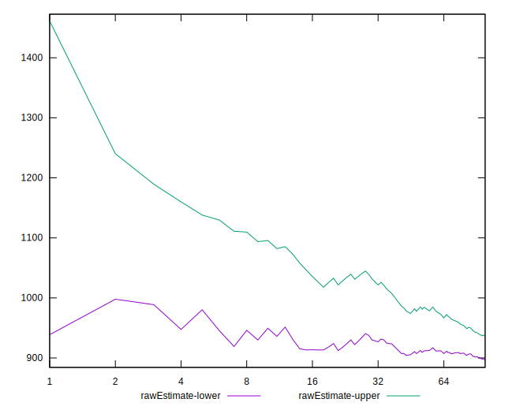
## Score Estimate

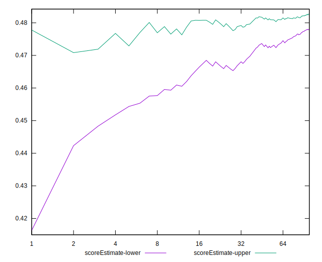
## P Score


```yaml
p90min: 0.4623529411764706
p90max: 0.4976470588235294
p90range: 0.03529411764705881
p90mean: 0.4805006257822273
median: 0.48
p90stdev: 0.012992830536185484
mad: 0.017647058823529405
stdevBySn: 0.02104588235294117
lfitCenter: 0.48101416467426267
lfitStdev: 0.010683028574784325
mfitCenter: 0.48101416467426267
mfitStdev: 0.013389190755595427
mfitConfidence: 0.0013389190755595426
p90skewness: -0.035724627643555634
p90eccentricity: 1.0000000000000013
p90discretization: 18.8
outlandishness: 1.0045839148612186

```

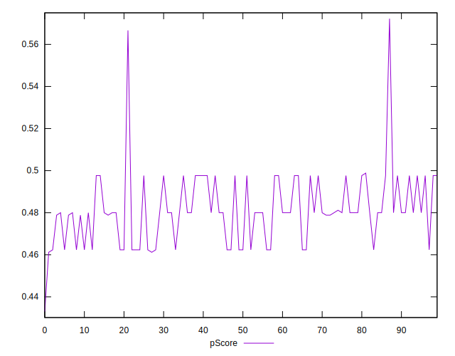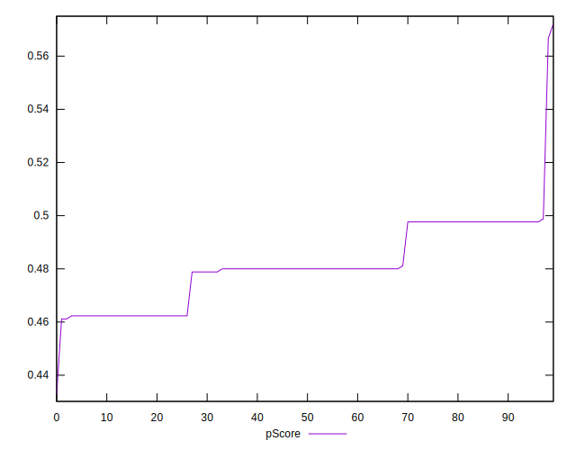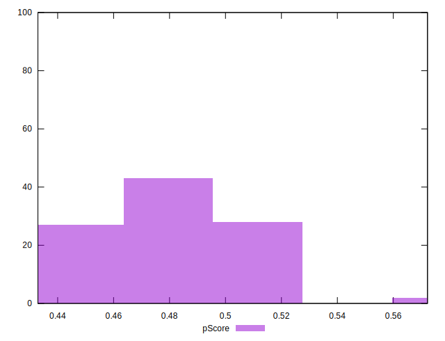
## Score Difference


```yaml
p90min: 0
p90max: 0
p90range: 0
p90mean: 0
median: 0
p90stdev: 0
mad: 0
stdevBySn: 0
lfitCenter: 1.0470608452365924e-18
lfitStdev: 2.5998395675404994e-18
mfitCenter: 1.0470608452365924e-18
mfitStdev: 3.2584156880294808e-18
mfitConfidence: 3.258415688029481e-19
p90skewness: .nan
p90eccentricity: .nan
p90discretization: 94
outlandishness: .inf

```

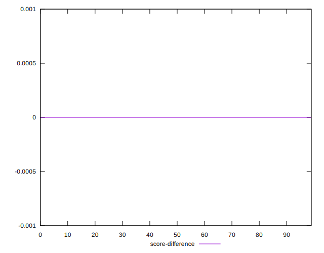
## P Score Difference


```yaml
p90min: -0.002352941176470613
p90max: 0.0023529411764705577
p90range: 0.004705882352941171
p90mean: -0.00010151578361842429
median: 0
p90stdev: 0.0017197785662914297
mad: 0.0023529411764705577
stdevBySn: 0.0028061176470587875
lfitCenter: -0.00010624595272543558
lfitStdev: 0.0013157710505546931
mfitCenter: -0.00010624595272543558
mfitStdev: 0.0016490744607900335
mfitConfidence: 0.00016490744607900335
p90skewness: 0.10488499259195633
p90eccentricity: 0.9999999999999999
p90discretization: 13.428571428571429
outlandishness: 0.9577169450178349

```

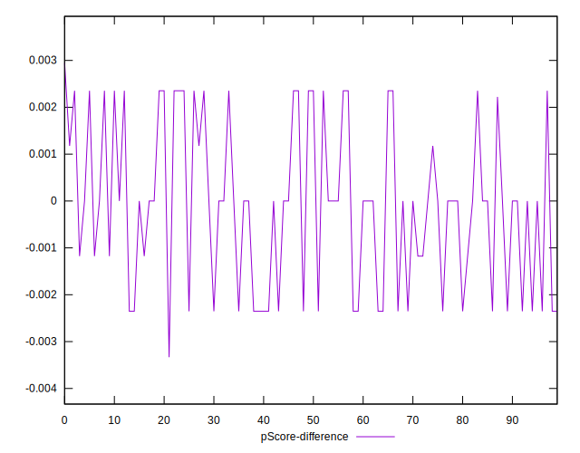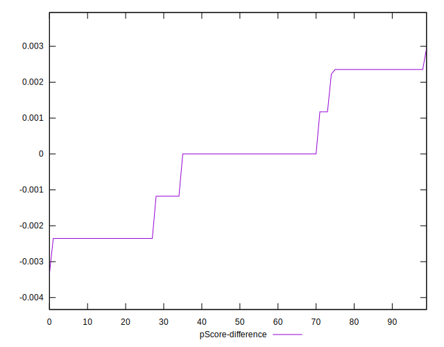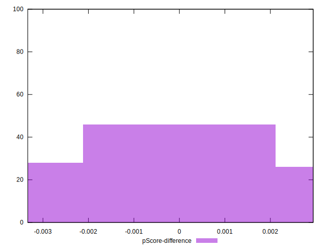