# //uses-http2/samples/card

[→ Parent](../..)


## Raw


```yaml
p90min: 770
p90max: 930
p90range: 160
p90mean: 877.0212765957447
median: 920
p90stdev: 67.50618233680117
mad: 0
stdevBySn: 0
lfitCenter: 890.3840677891448
lfitStdev: 64.50090715293155
mfitCenter: 890.3840677891448
mfitStdev: 80.83989888578812
mfitConfidence: 8.083989888578811
p90skewness: -0.9395592647511448
p90eccentricity: 0.9999999999999997
p90discretization: 18.8
outlandishness: 1.0084067258713556

```

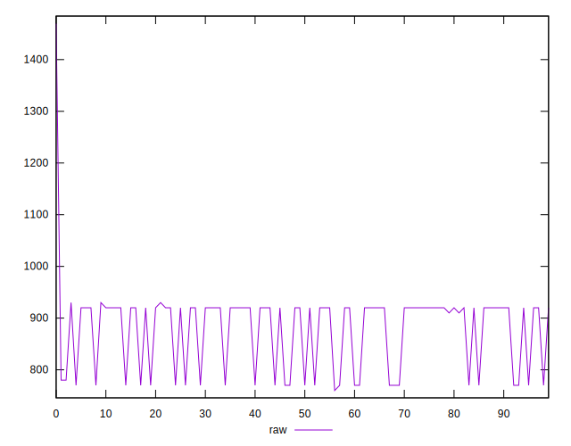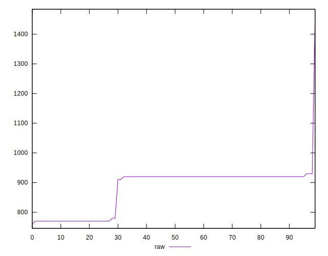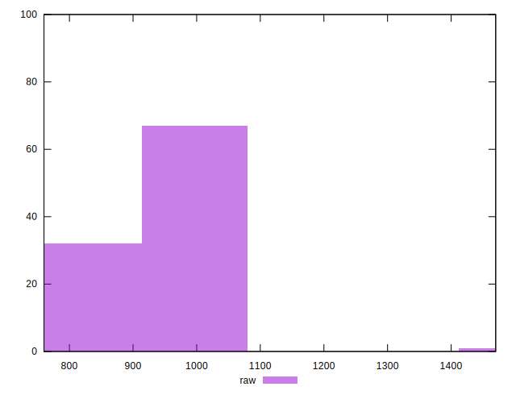
## Score


```yaml
p90min: 0.48
p90max: 0.5
p90range: 0.020000000000000018
p90mean: 0.48574468085106326
median: 0.48
p90stdev: 0.009049434177930539
mad: 0
stdevBySn: 0
lfitCenter: 0.4840226147188501
lfitStdev: 0.008614279753196907
mfitCenter: 0.4840226147188501
mfitStdev: 0.010796398608336156
mfitConfidence: 0.0010796398608336156
p90skewness: 0.9404608211449816
p90eccentricity: 0.9999999999999984
p90discretization: 47
outlandishness: 0.9985813182391932

```

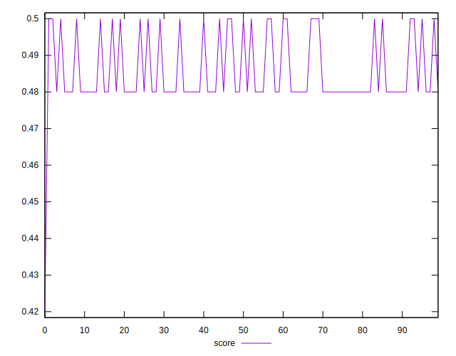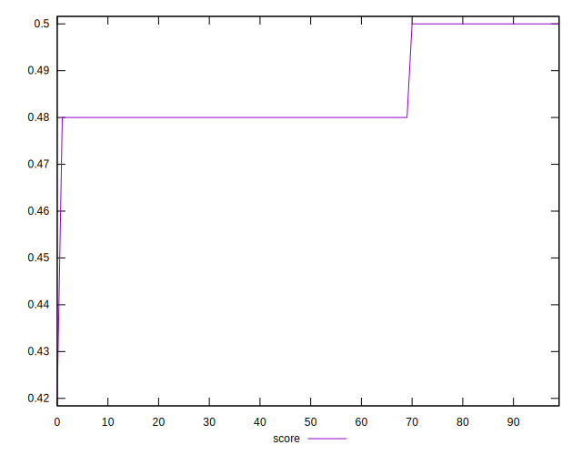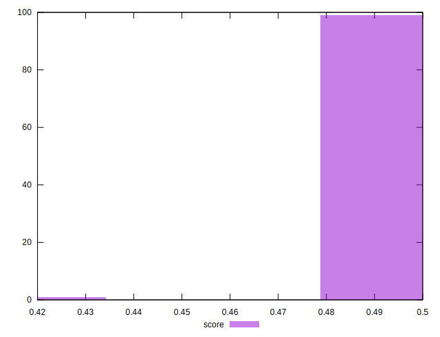
## Raw Estimate

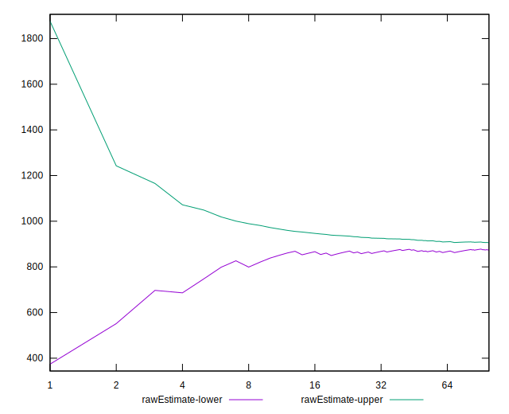
## Score Estimate

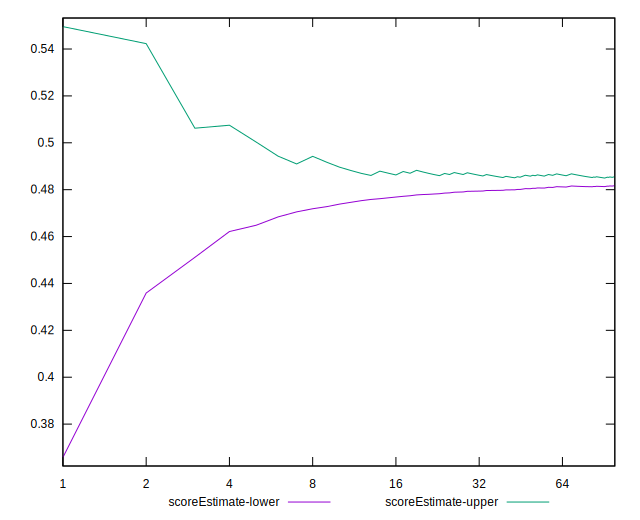
## P Score


```yaml
p90min: 0.4788235294117647
p90max: 0.4976470588235294
p90range: 0.018823529411764683
p90mean: 0.4850563204005002
median: 0.48
p90stdev: 0.007941903804329551
mad: 0
stdevBySn: 0
lfitCenter: 0.48348422731892426
lfitStdev: 0.0075883420179920415
mfitCenter: 0.48348422731892426
mfitStdev: 0.009510576339504605
mfitConfidence: 0.0009510576339504604
p90skewness: 0.939559264751304
p90eccentricity: 1.0000000000000016
p90discretization: 18.8
outlandishness: 0.9982162982239762

```

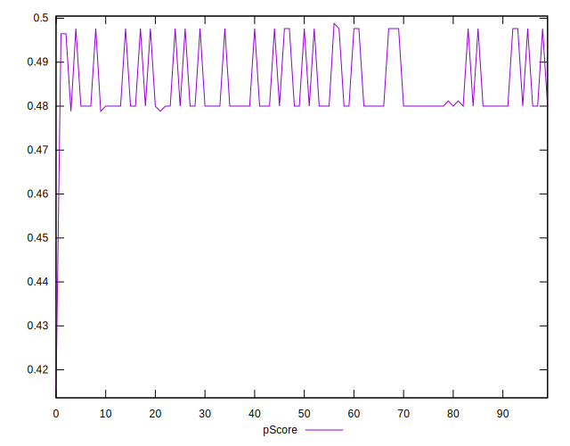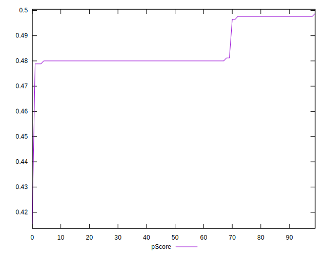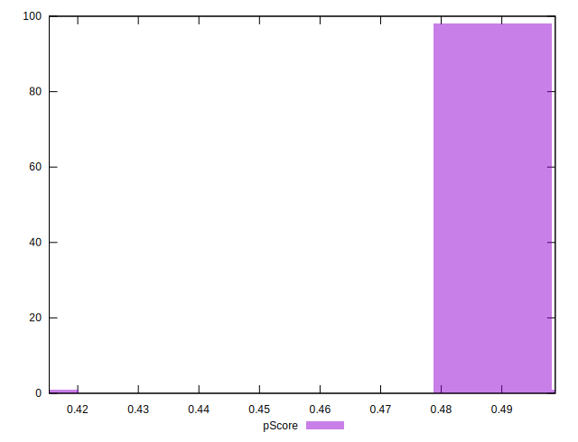
## Score Difference


```yaml
p90min: 0
p90max: 0
p90range: 0
p90mean: 0
median: 0
p90stdev: 0
mad: 0
stdevBySn: 0
lfitCenter: 0
lfitStdev: 0
mfitCenter: 0
mfitStdev: 0
mfitConfidence: 0
p90skewness: .nan
p90eccentricity: .nan
p90discretization: 94
outlandishness: .nan

```


## P Score Difference


```yaml
p90min: -0.002352941176470613
p90max: 0
p90range: 0.002352941176470613
p90mean: -0.0007259073842302944
median: 0
p90stdev: 0.0010593293601751717
mad: 0
stdevBySn: 0
lfitCenter: -0.0005707168240229703
lfitStdev: 0.0010857814663368436
mfitCenter: -0.0005707168240229703
mfitStdev: 0.00136082526316444
mfitConfidence: 0.000136082526316444
p90skewness: -0.8283342187836131
p90eccentricity: 0.9999999999999984
p90discretization: 31.333333333333332
outlandishness: 1.144162187871577

```

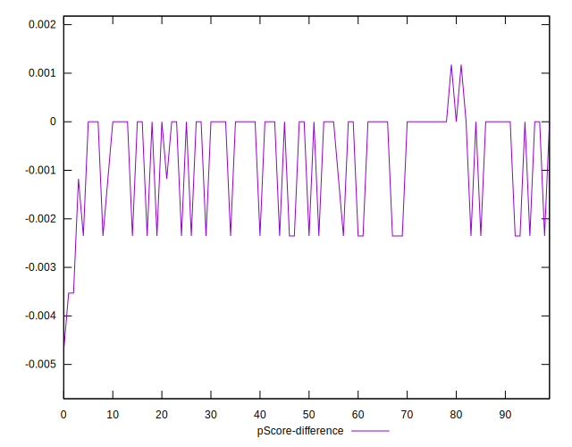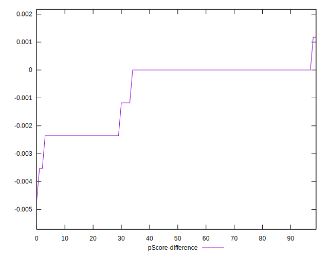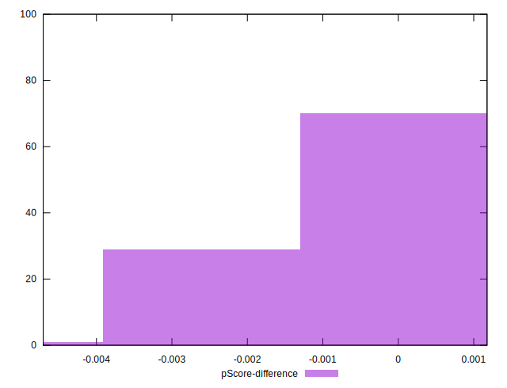