# //uses-http2/samples/music

[→ Parent](../..)


## Raw


```yaml
p90min: 460
p90max: 840
p90range: 380
p90mean: 676.2765957446809
median: 620
p90stdev: 85.75055415183752
mad: 130
stdevBySn: 166.96400000000003
lfitCenter: 671.7294936277563
lfitStdev: 100.10213080667681
mfitCenter: 671.7294936277563
mfitStdev: 125.45941584165611
mfitConfidence: 12.545941584165611
p90skewness: -0.18335142374854727
p90eccentricity: 1.0000000000000002
p90discretization: 7.833333333333333
outlandishness: 0.9876864031180868

```

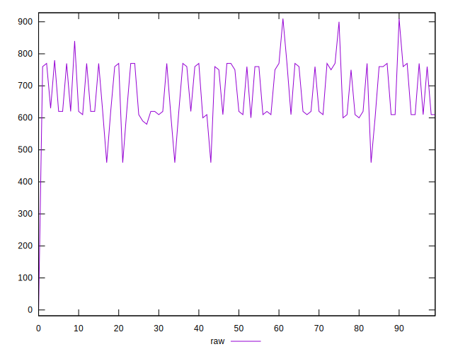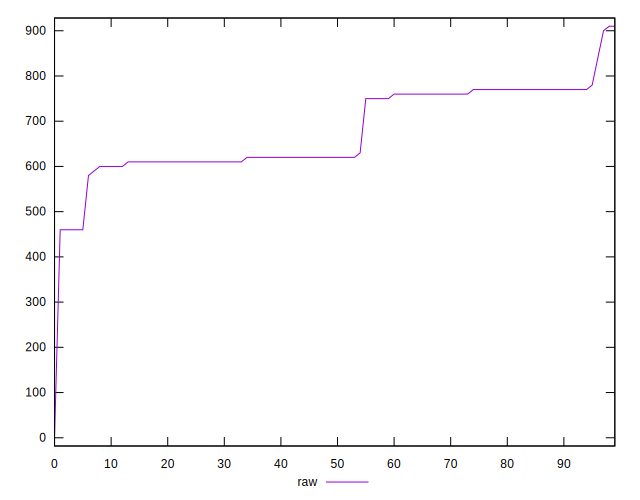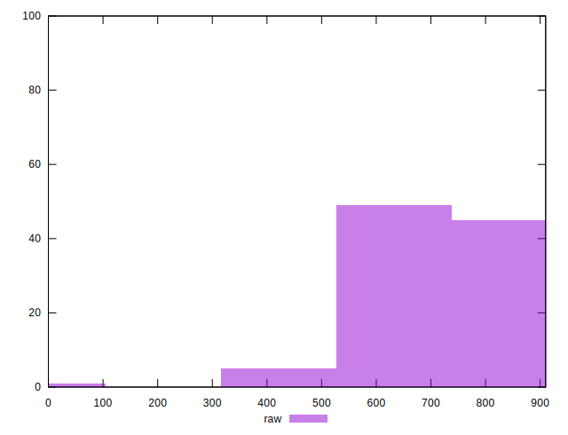
## Score


```yaml
p90min: 0.49
p90max: 0.66
p90range: 0.17000000000000004
p90mean: 0.5446808510638294
median: 0.57
p90stdev: 0.043115434558264956
mad: 0.06999999999999995
stdevBySn: 0.08348199999999995
lfitCenter: 0.5473397038857886
lfitStdev: 0.050022559225881266
mfitCenter: 0.5473397038857886
mfitStdev: 0.06269398072558424
mfitConfidence: 0.006269398072558424
p90skewness: 0.3255315455778957
p90eccentricity: 1.0000000000000002
p90discretization: 15.666666666666666
outlandishness: 1.0181440634765626

```

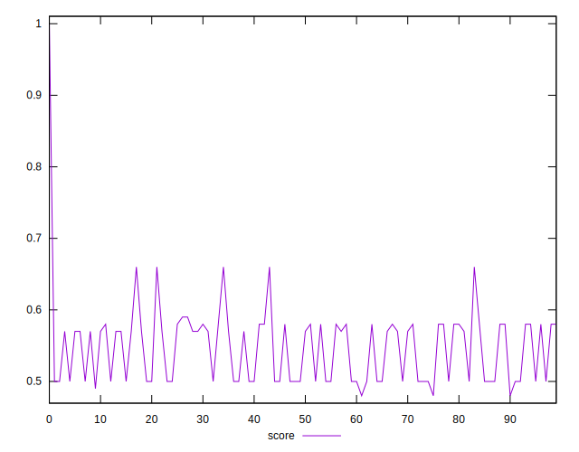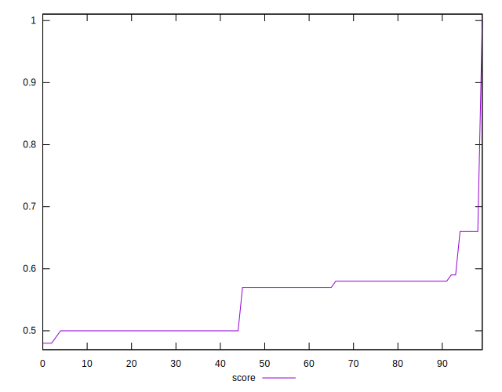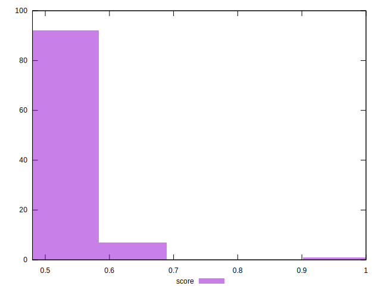
## Raw Estimate

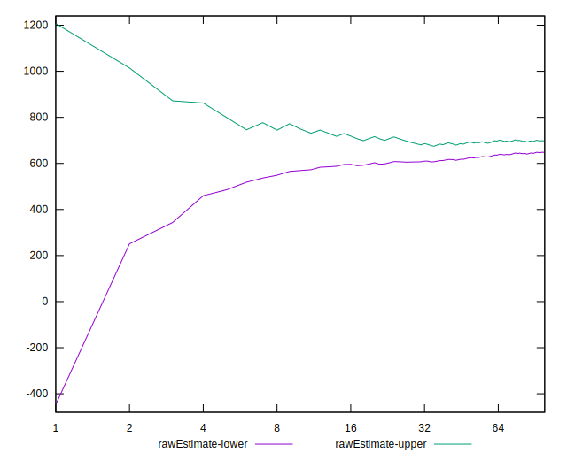
## Score Estimate

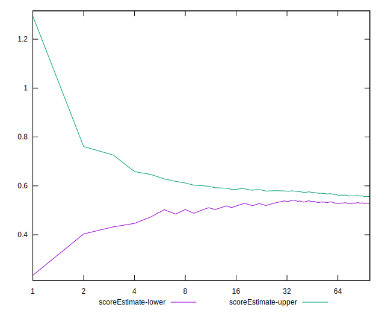
## P Score


```yaml
p90min: 0.4894117647058824
p90max: 0.6611111111111111
p90range: 0.17169934640522871
p90mean: 0.5441252955082745
median: 0.5722222222222222
p90stdev: 0.044056822212798816
mad: 0.07222222222222219
stdevBySn: 0.08893833986928104
lfitCenter: 0.547154553363791
lfitStdev: 0.051196139733927705
mfitCenter: 0.547154553363791
mfitStdev: 0.0641648457690768
mfitConfidence: 0.00641648457690768
p90skewness: 0.306694902037496
p90eccentricity: 0.9999999999999999
p90discretization: 7.833333333333333
outlandishness: 1.018543289299721

```

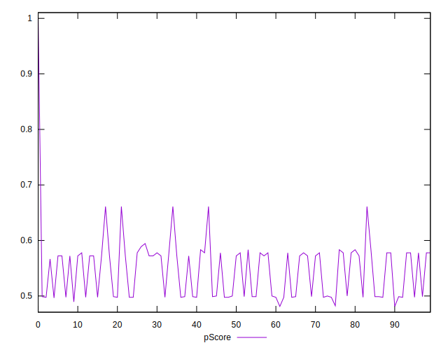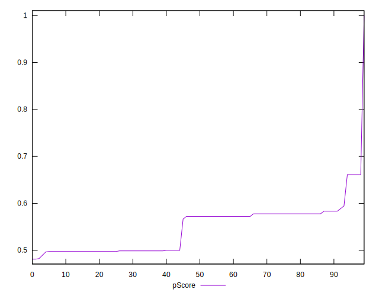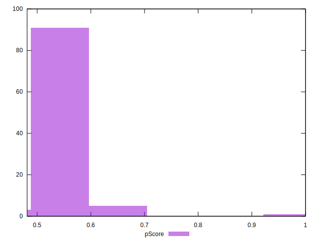
## Score Difference


```yaml
p90min: 0
p90max: 1.1102230246251565e-16
p90range: 1.1102230246251565e-16
p90mean: 2.1259589833247678e-17
median: 0
p90stdev: 4.3684304421816303e-17
mad: 0
stdevBySn: 0
lfitCenter: 1.446906979386851e-17
lfitStdev: 3.154184804611801e-17
mfitCenter: 1.446906979386851e-17
mfitStdev: 3.953184411303561e-17
mfitConfidence: 3.953184411303561e-18
p90skewness: 1.568140404264034
p90eccentricity: 1.0000000000000022
p90discretization: 47
outlandishness: 1.2026777777777777

```

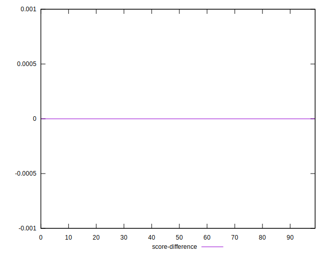
## P Score Difference


```yaml
p90min: -0.002352941176470613
p90max: 0.0033333333333334103
p90range: 0.0056862745098040235
p90mean: -0.000502016409400641
median: -0.0011764705882352788
p90stdev: 0.0019522880115497023
mad: 0.0011764705882353343
stdevBySn: 0.00140305882352946
lfitCenter: -0.0006800226108228584
lfitStdev: 0.0019208962032866293
mfitCenter: -0.0006800226108228584
mfitStdev: 0.0024074863703173167
mfitConfidence: 0.00024074863703173167
p90skewness: 0.5573563070607566
p90eccentricity: 1.0000000000000007
p90discretization: 8.545454545454545
outlandishness: 0.8140438156551835

```

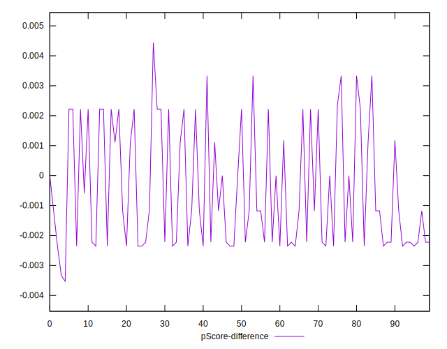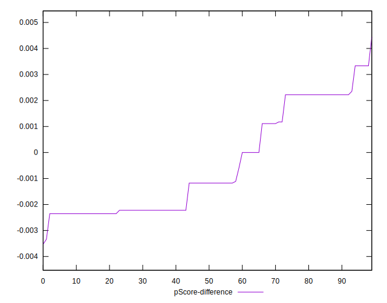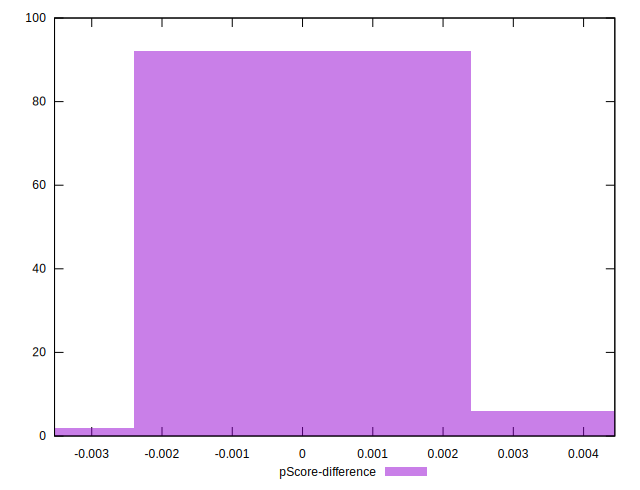