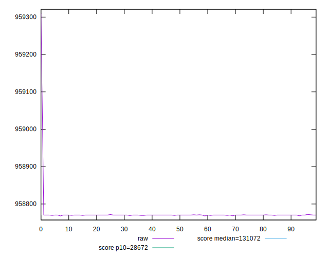
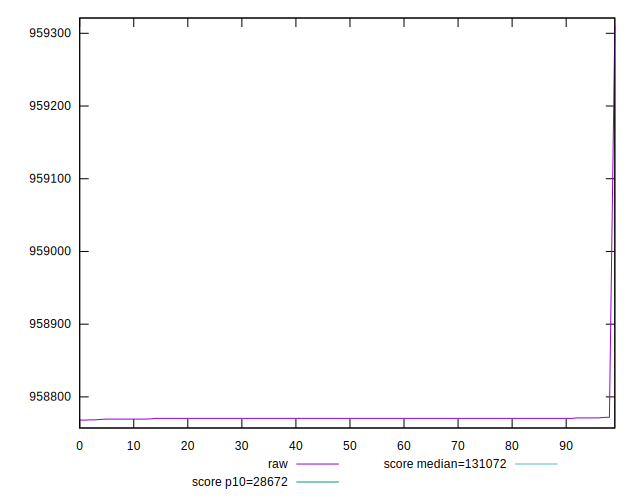
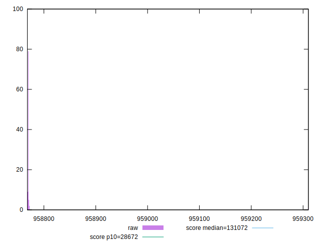
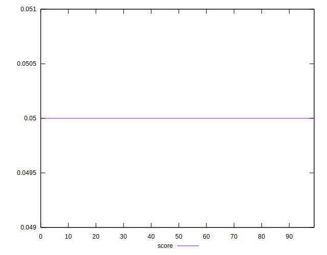
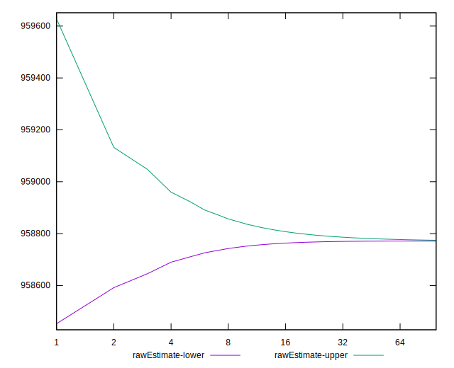
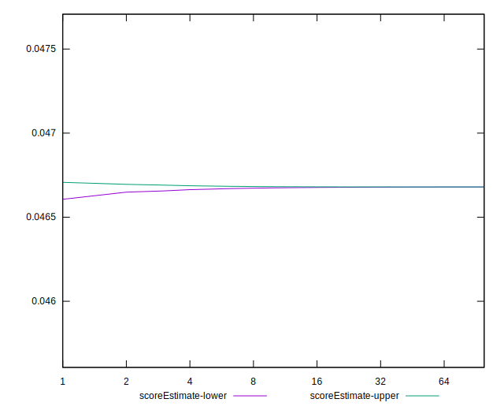
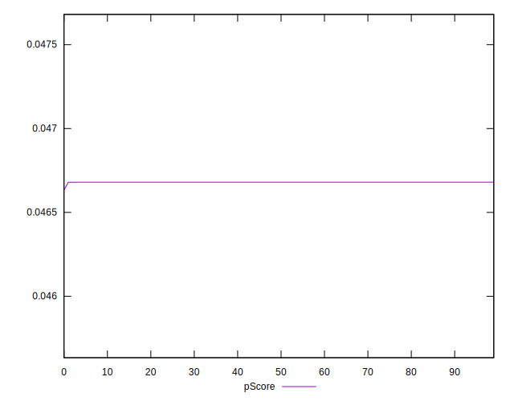
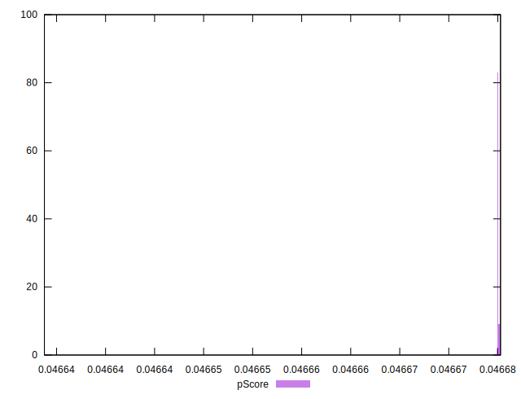
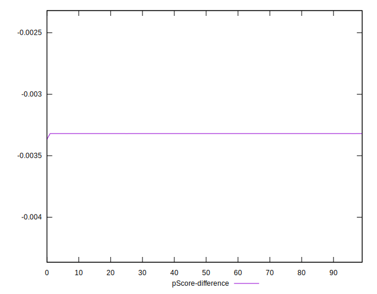
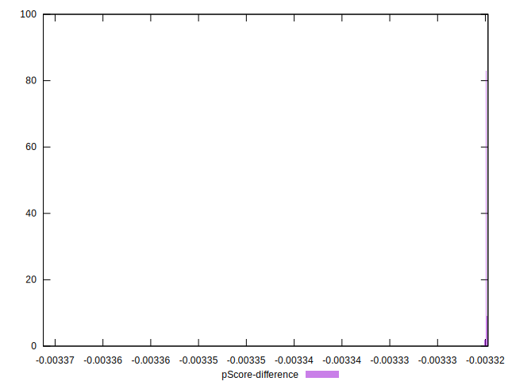

# //uses-long-cache-ttl/samples/astro

[→ Parent](../..)


## Raw


```yaml
p90min: 958768.46165
p90max: 958771.1416499999
p90range: 2.6799999999348074
p90mean: 958770.3676074459
median: 958770.46165
p90stdev: 0.4108613659327014
mad: 0
stdevBySn: 0
lfitCenter: 958772.9030951046
lfitStdev: 6.267369180695572
mfitCenter: 958772.9030951046
mfitStdev: 7.8549824058452415
mfitConfidence: 0.7854982405845241
p90skewness: -1.9938337659666048
p90eccentricity: 0.9999999999999989
p90discretization: 13.428571428571429
outlandishness: 1.0000111887895722

```


## Score


```yaml
p90min: 0.05
p90max: 0.05
p90range: 0
p90mean: 0.049999999999999906
median: 0.05
p90stdev: 9.71445146547012e-17
mad: 0
stdevBySn: 0
lfitCenter: 0.049999999999999906
lfitStdev: 0
mfitCenter: 0.049999999999999906
mfitStdev: 0
mfitConfidence: 0
p90skewness: 1
p90eccentricity: 1
p90discretization: 94
outlandishness: 1

```


## Raw Estimate


## Score Estimate


## P Score


```yaml
p90min: 0.04668001060042437
p90max: 0.04668024069442667
p90range: 2.3009400229589971e-7
p90mean: 0.04668007705645802
median: 0.046680068982337564
p90stdev: 3.5274887643039035e-8
mad: 0
stdevBySn: 0
lfitCenter: 0.04667985951655494
lfitStdev: 5.377246881854123e-7
mfitCenter: 0.04667985951655494
mfitStdev: 6.739379543644914e-7
mfitConfidence: 6.739379543644913e-8
p90skewness: 1.9938394289116395
p90eccentricity: 1.0000000000000004
p90discretization: 13.428571428571429
outlandishness: 0.9999802832384938

```


## Score Difference


```yaml
p90min: 0
p90max: 0
p90range: 0
p90mean: 0
median: 0
p90stdev: 0
mad: 0
stdevBySn: 0
lfitCenter: 0
lfitStdev: 0
mfitCenter: 0
mfitStdev: 0
mfitConfidence: 0
p90skewness: .nan
p90eccentricity: .nan
p90discretization: 94
outlandishness: .nan

```


## P Score Difference


```yaml
p90min: -0.003319989399575632
p90max: -0.003319759305573336
p90range: 2.3009400229589971e-7
p90mean: -0.0033199229435419146
median: -0.003319931017662439
p90stdev: 3.527488764303905e-8
mad: 0
stdevBySn: 0
lfitCenter: -0.003320140483445075
lfitStdev: 5.377246882026438e-7
mfitCenter: -0.003320140483445075
mfitStdev: 6.739379543860878e-7
mfitConfidence: 6.739379543860879e-8
p90skewness: 1.993839422457118
p90eccentricity: 0.9999999999999992
p90discretization: 13.428571428571429
outlandishness: 1.000277249890594

```

