# //uses-long-cache-ttl/samples/music

[→ Parent](../..)


## Raw


```yaml
p90min: 723485.6212791667
p90max: 723489.6212791667
p90range: 4
p90mean: 723488.4178749104
median: 723488.0212791666
p90stdev: 0.8276634031793679
mad: 0
stdevBySn: 0
lfitCenter: 723490.9125893224
lfitStdev: 6.524381621243612
mfitCenter: 723490.9125893224
mfitStdev: 8.177099731374188
mfitConfidence: 0.8177099731374188
p90skewness: 0.040552254245998155
p90eccentricity: 0.9999999999999991
p90discretization: 10.444444444444445
outlandishness: 1.000015365380342

```

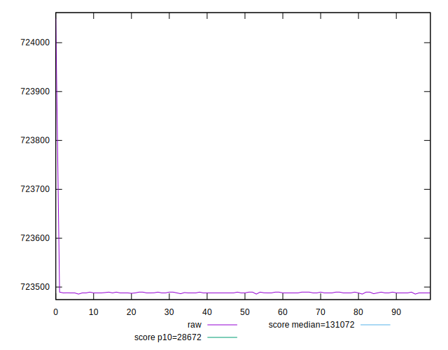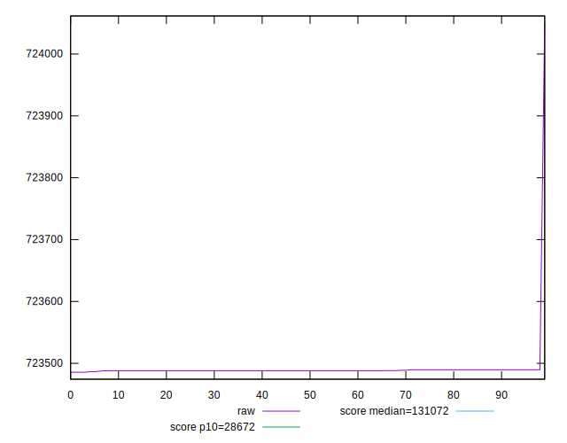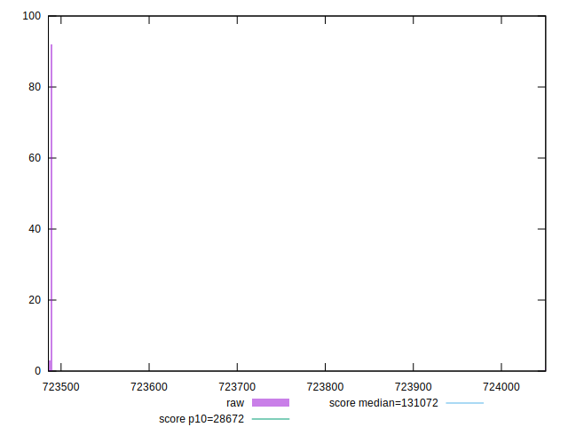
## Score


```yaml
p90min: 0.07
p90max: 0.07
p90range: 0
p90mean: 0.07000000000000008
median: 0.07
p90stdev: 6.938893903907228e-17
mad: 0
stdevBySn: 0
lfitCenter: 0.07000000000000009
lfitStdev: 0
mfitCenter: 0.07000000000000009
mfitStdev: 0
mfitConfidence: 0
p90skewness: -1
p90eccentricity: 1
p90discretization: 94
outlandishness: 1.0000000000000004

```

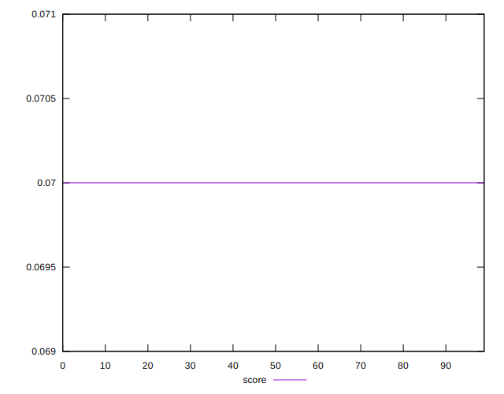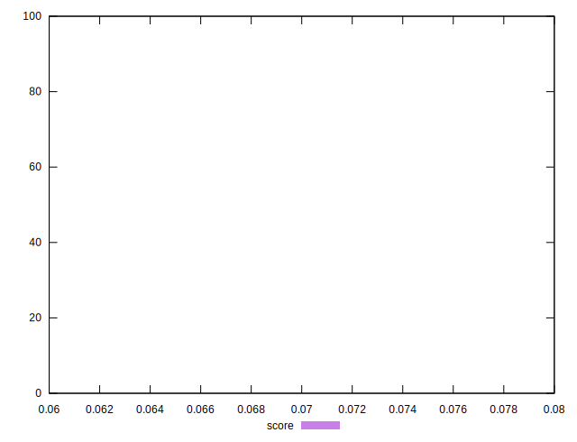
## Raw Estimate

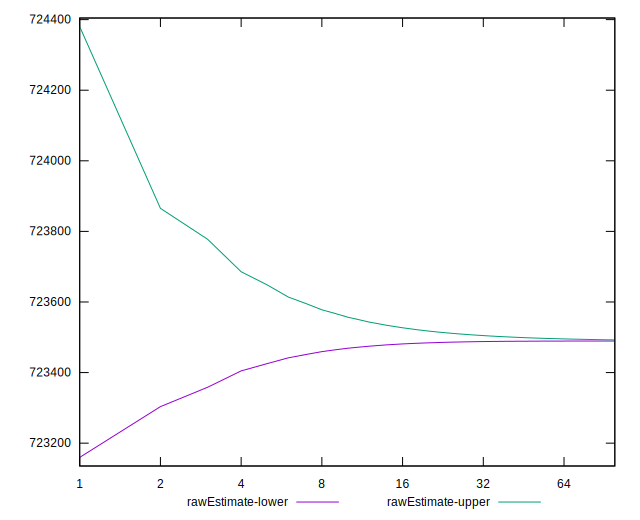
## Score Estimate

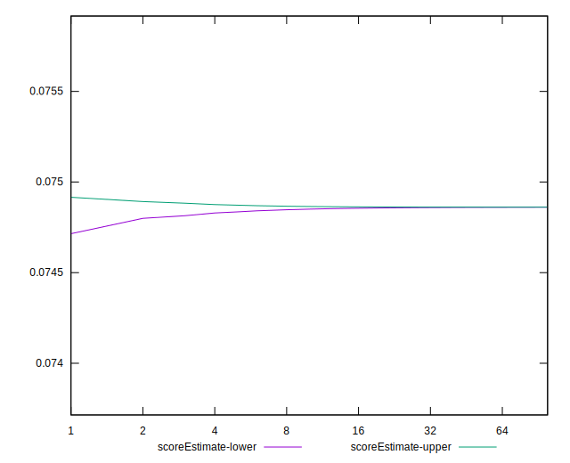
## P Score


```yaml
p90min: 0.07486154800963557
p90max: 0.07486220701290947
p90range: 6.590032738951201e-7
p90mean: 0.07486174627079567
median: 0.07486181160997685
p90stdev: 1.3635788358424757e-7
mad: 0
stdevBySn: 0
lfitCenter: 0.07486133563563933
lfitStdev: 0.0000010739711995254645
mfitCenter: 0.07486133563563933
mfitStdev: 0.0000013460232887893764
mfitConfidence: 1.3460232887893764e-7
p90skewness: -0.04054304712050547
p90eccentricity: 1.0000000000000004
p90discretization: 13.428571428571429
outlandishness: 0.9999755567035964

```

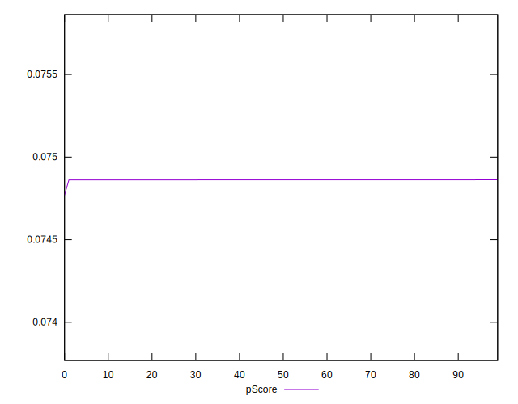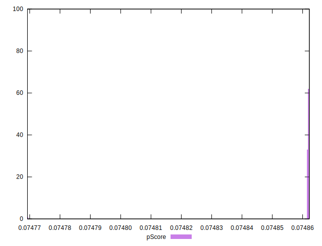
## Score Difference


```yaml
p90min: 0
p90max: 0
p90range: 0
p90mean: 0
median: 0
p90stdev: 0
mad: 0
stdevBySn: 0
lfitCenter: 0
lfitStdev: 0
mfitCenter: 0
mfitStdev: 0
mfitConfidence: 0
p90skewness: .nan
p90eccentricity: .nan
p90discretization: 94
outlandishness: .nan

```


## P Score Difference


```yaml
p90min: 0.0048615480096355634
p90max: 0.0048622070129094586
p90range: 6.590032738951201e-7
p90mean: 0.0048617462707957
median: 0.0048618116099768405
p90stdev: 1.3635788358424755e-7
mad: 0
stdevBySn: 0
lfitCenter: 0.004861335635639343
lfitStdev: 0.00000107397119950608
mfitCenter: 0.004861335635639343
mfitStdev: 0.0000013460232887650816
mfitConfidence: 1.3460232887650816e-7
p90skewness: -0.04054304761665752
p90eccentricity: 1.0000000000000004
p90discretization: 13.428571428571429
outlandishness: 0.9996236523360632

```

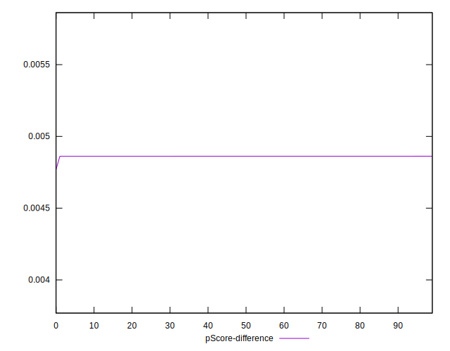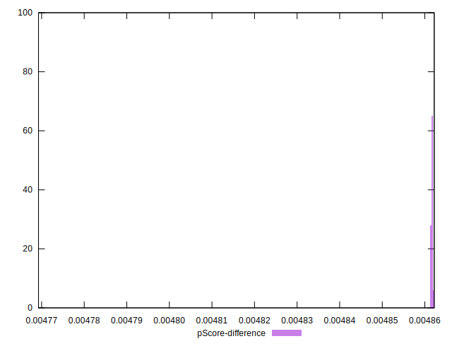