# //uses-rel-preconnect/samples/astro

[→ Parent](../..)


## Raw


```yaml
p90min: 0
p90max: 300.866
p90range: 300.866
p90mean: 256.1202872657777
median: 300.046
p90stdev: 104.49209287444526
mad: 0.25199999999998113
stdevBySn: 0.40130984995651386
lfitCenter: 270.755389939507
lfitStdev: 65.38590454575123
mfitCenter: 270.755389939507
mfitStdev: 81.9490786308125
mfitConfidence: 8.19490786308125
p90skewness: -2.00560587703952
p90eccentricity: 1.0000000000000004
p90discretization: 1.46875
outlandishness: 0.9511258126640574

```

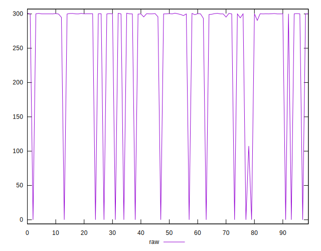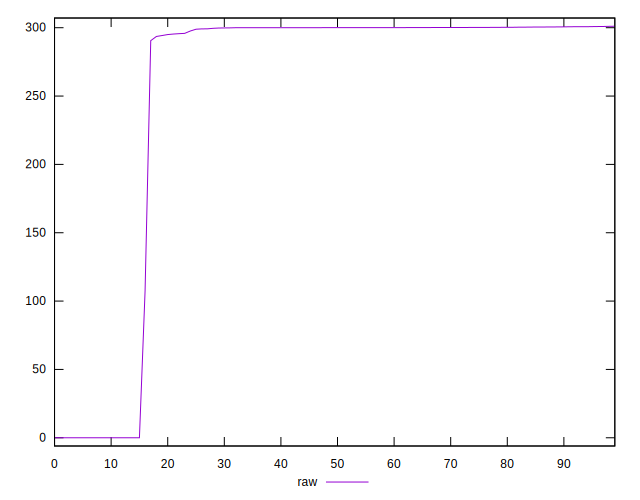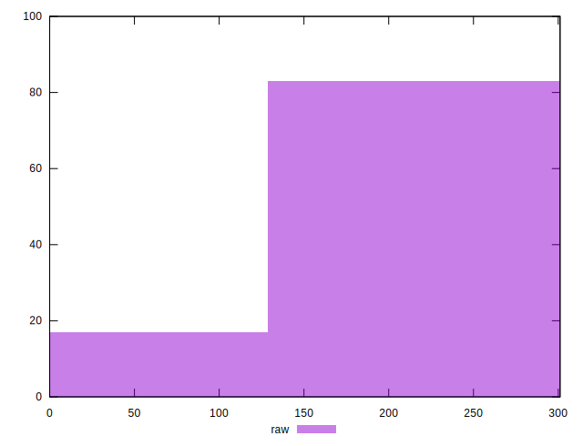
## Score


```yaml
p90min: 0.75
p90max: 1
p90range: 0.25
p90mean: 0.7864893617021276
median: 0.75
p90stdev: 0.0871011572193749
mad: 0
stdevBySn: 0
lfitCenter: 0.7743032494867045
lfitStdev: 0.05449659496724768
mfitCenter: 0.7743032494867045
mfitStdev: 0.06830135297673598
mfitConfidence: 0.006830135297673598
p90skewness: 2.0057781859689015
p90eccentricity: 1.0000000000000022
p90discretization: 23.5
outlandishness: 1.0135502605813271

```

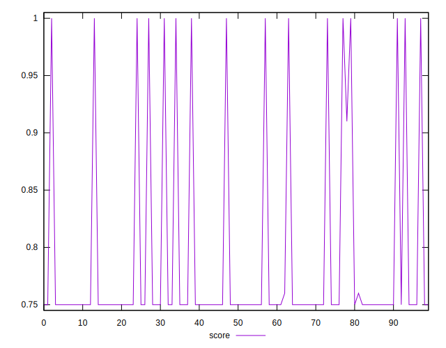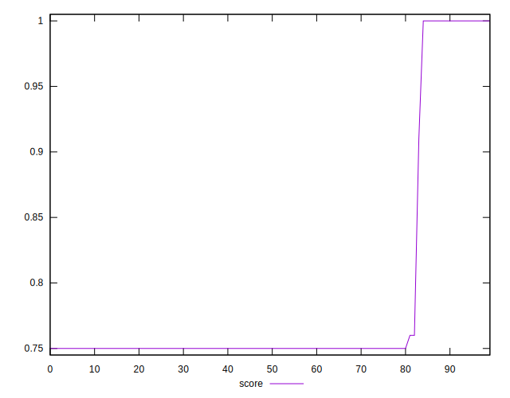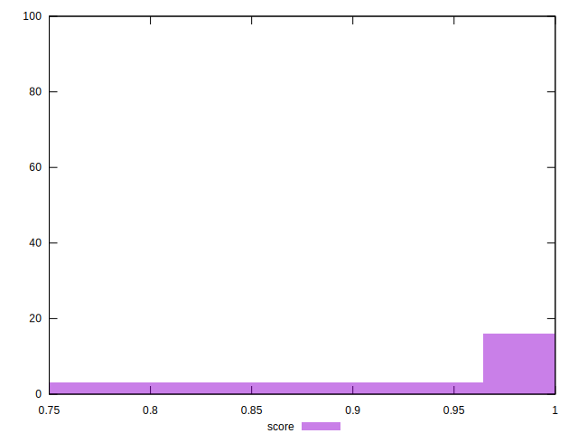
## Raw Estimate

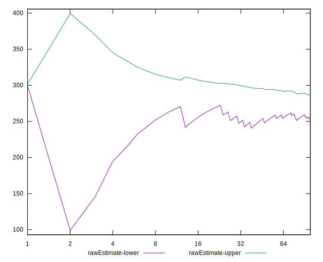
## Score Estimate

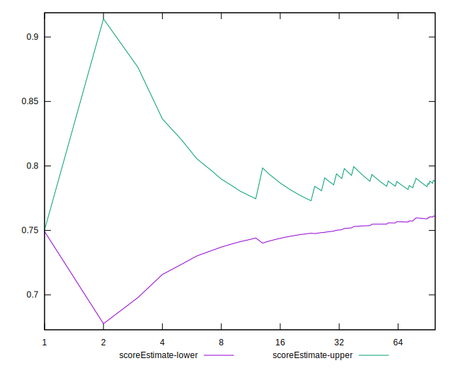
## P Score


```yaml
p90min: 0.7495188888888888
p90max: 1
p90range: 0.25048111111111115
p90mean: 0.7866069414629159
median: 0.7499744444444445
p90stdev: 0.08705956265693619
mad: 0.00015111111111115738
stdevBySn: 0.00023388211111105447
lfitCenter: 0.7744035379515399
lfitStdev: 0.05448003969093269
mfitCenter: 0.7744035379515399
mfitStdev: 0.06828060401486236
mfitConfidence: 0.006828060401486235
p90skewness: 2.0056483208680476
p90eccentricity: 0.9999999999999999
p90discretization: 1.46875
outlandishness: 1.013487537111658

```

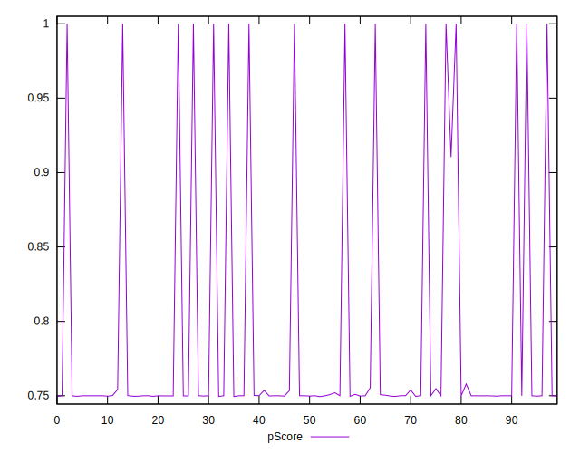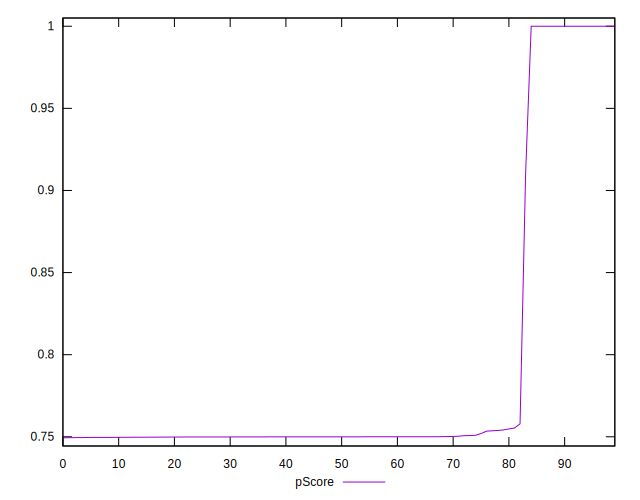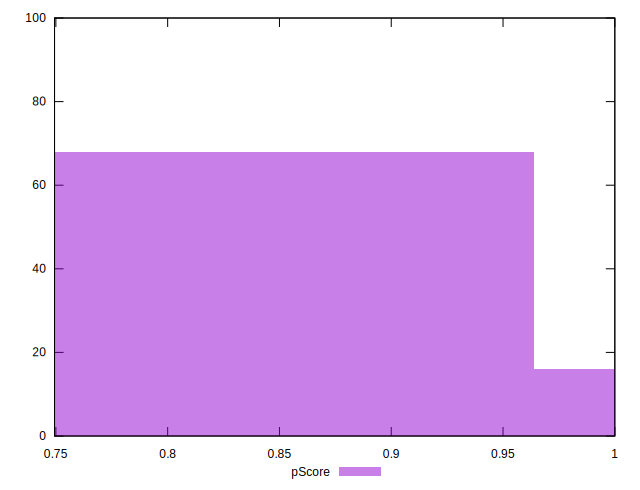
## Score Difference


```yaml
p90min: 0
p90max: 0
p90range: 0
p90mean: 0
median: 0
p90stdev: 0
mad: 0
stdevBySn: 0
lfitCenter: 0
lfitStdev: 0
mfitCenter: 0
mfitStdev: 0
mfitConfidence: 0
p90skewness: .nan
p90eccentricity: .nan
p90discretization: 94
outlandishness: .nan

```


## P Score Difference


```yaml
p90min: -0.0005644444444444785
p90max: 0.003629999955495178
p90range: 0.004194444399939656
p90mean: 0.000042278361489587285
median: -0.0000288888888888561
p90stdev: 0.0005991245477162184
mad: 0.00003388888888888886
stdevBySn: 0.00007751900000001133
lfitCenter: 0.00002709248800788744
lfitStdev: 0.00031685868768859183
mfitCenter: 0.00002709248800788744
mfitStdev: 0.00039712347321095153
mfitConfidence: 0.00003971234732109515
p90skewness: 4.597383546560542
p90eccentricity: 1.0000000000000007
p90discretization: 1.5666666666666667
outlandishness: 4.92960327589086

```

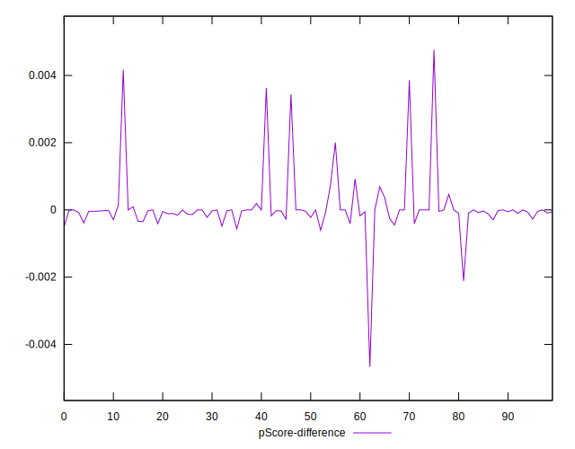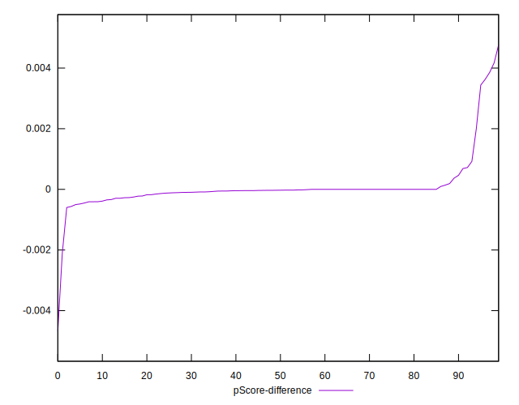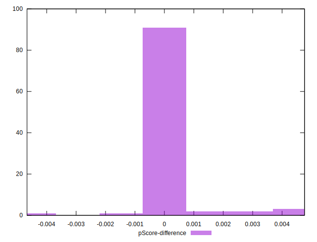