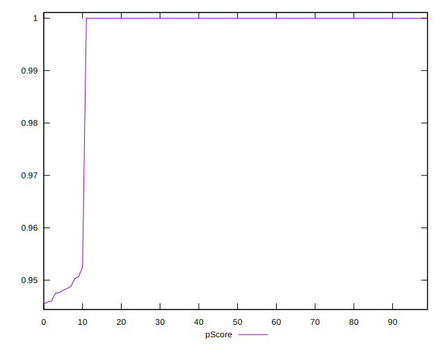

# //uses-rel-preconnect/samples/music

[→ Parent](../..)


## Raw


```yaml
p90min: 0
p90max: 62.99499988555908
p90range: 62.99499988555908
p90mean: 5.183617023711509
median: 0
p90stdev: 17.00543141012583
mad: 0
stdevBySn: 0
lfitCenter: 3.6324414121582134
lfitStdev: 8.570232529866471
mfitCenter: 3.6324414121582134
mfitStdev: 10.74119360057108
mfitConfidence: 1.074119360057108
p90skewness: 2.979813015835445
p90eccentricity: 0.9999999999999988
p90discretization: 10.444444444444445
outlandishness: 1.7330849806403652

```


## Score


```yaml
p90min: 0.95
p90max: 1
p90range: 0.050000000000000044
p90mean: 0.9957446808510639
median: 1
p90stdev: 0.01395199686021703
mad: 0
stdevBySn: 0
lfitCenter: 0.9970623985035411
lfitStdev: 0.006930855875739799
mfitCenter: 0.9970623985035411
mfitStdev: 0.008686539661501657
mfitConfidence: 0.0008686539661501658
p90skewness: -2.973722121485848
p90eccentricity: 0.9999999999999989
p90discretization: 47
outlandishness: 0.9975015625000001

```


## Raw Estimate


## Score Estimate


## P Score


```yaml
p90min: 0.9475041667620341
p90max: 1
p90range: 0.052495833237965916
p90mean: 0.9956803191469071
median: 1
p90stdev: 0.01417119284177151
mad: 0
stdevBySn: 0
lfitCenter: 0.9969729654898684
lfitStdev: 0.007141860441555171
mfitCenter: 0.9969729654898684
mfitStdev: 0.008950994667142288
mfitConfidence: 0.0008950994667142288
p90skewness: -2.979813015835465
p90eccentricity: 1.0000000000000027
p90discretization: 10.444444444444445
outlandishness: 0.9972559518528261

```


## Score Difference


```yaml
p90min: 0
p90max: 1.1102230246251565e-16
p90range: 1.1102230246251565e-16
p90mean: 9.448706592554524e-18
median: 0
p90stdev: 3.0979656307421685e-17
mad: 0
stdevBySn: 0
lfitCenter: 6.522785637084289e-18
lfitStdev: 1.5389591547209988e-17
mfitCenter: 6.522785637084289e-18
mfitStdev: 1.92879926730378e-17
mfitConfidence: 1.92879926730378e-18
p90skewness: 2.9737221214857823
p90eccentricity: 0.9999999999999972
p90discretization: 47
outlandishness: 1.67055625

```


## P Score Difference


```yaml
p90min: -0.002495833237965872
p90max: 0
p90range: 0.002495833237965872
p90mean: -0.00010181738129744093
median: 0
p90stdev: 0.0004437026376820358
mad: 0
stdevBySn: 0
lfitCenter: -0.0000941412520756682
lfitStdev: 0.00026780377381473814
mfitCenter: -0.0000941412520756682
mfitStdev: 0.0003356422560861914
mfitConfidence: 0.00003356422560861914
p90skewness: -4.368607648490486
p90eccentricity: 1.0000000000000027
p90discretization: 15.666666666666666
outlandishness: 3.3629648695057233

```

