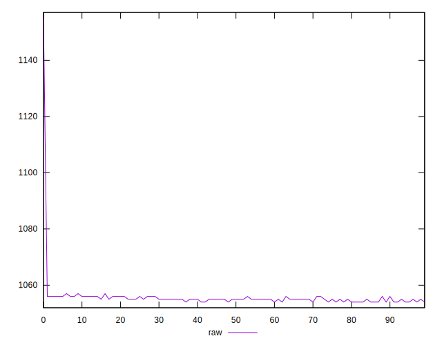
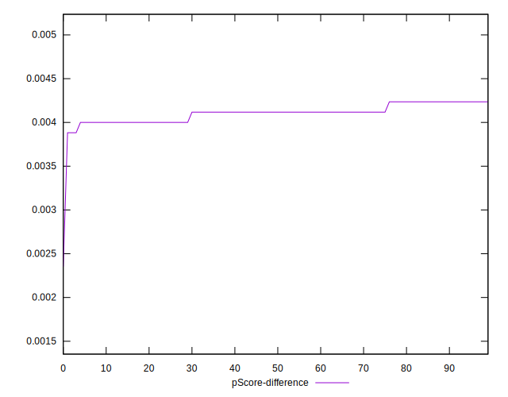

# //uses-rel-preload/samples/agenda

[→ Parent](../..)


## Raw


```yaml
p90min: 1054
p90max: 1057
p90range: 3
p90mean: 1055.0744680851064
median: 1055
p90stdev: 0.7328080893316827
mad: 1
stdevBySn: 1.1926
lfitCenter: 1055.5343679244722
lfitStdev: 1.4427681445303946
mfitCenter: 1055.5343679244722
mfitStdev: 1.8082417142279261
mfitConfidence: 0.1808241714227926
p90skewness: 0.045524858653465936
p90eccentricity: 0.9999999999999997
p90discretization: 23.5
outlandishness: 1.0019069953888118

```


## Score


```yaml
p90min: 0.46
p90max: 0.46
p90range: 0
p90mean: 0.4600000000000007
median: 0.46
p90stdev: 6.661338147750939e-16
mad: 0
stdevBySn: 0
lfitCenter: 0.4599534639864745
lfitStdev: 0.00011610565185020858
mfitCenter: 0.4599534639864745
mfitStdev: 0.0001455168550325232
mfitConfidence: 0.00001455168550325232
p90skewness: -1
p90eccentricity: 1
p90discretization: 94
outlandishness: 0.9995652646502833

```


## Raw Estimate


## Score Estimate


## P Score


```yaml
p90min: 0.46388235294117647
p90max: 0.4642352941176471
p90range: 0.0003529411764706114
p90mean: 0.46410888610763495
median: 0.4641176470588235
p90stdev: 0.00008621271639198028
mad: 0.00011764705882355564
stdevBySn: 0.00014030588235297247
lfitCenter: 0.46405478024417995
lfitStdev: 0.00016973742876813424
mfitCenter: 0.46405478024417995
mfitStdev: 0.00021273431932074765
mfitConfidence: 0.000021273431932074764
p90skewness: -0.04552485864306228
p90eccentricity: 0.9999999999999983
p90discretization: 23.5
outlandishness: 0.9994902799784225

```


## Score Difference


```yaml
p90min: 0
p90max: 0
p90range: 0
p90mean: 0
median: 0
p90stdev: 0
mad: 0
stdevBySn: 0
lfitCenter: 0
lfitStdev: 0
mfitCenter: 0
mfitStdev: 0
mfitConfidence: 0
p90skewness: .nan
p90eccentricity: .nan
p90discretization: 94
outlandishness: .nan

```


## P Score Difference


```yaml
p90min: 0.003882352941176448
p90max: 0.004235294117647059
p90range: 0.0003529411764706114
p90mean: 0.004108886107634516
median: 0.004117647058823504
p90stdev: 0.00008621271639198025
mad: 0.00011764705882355564
stdevBySn: 0.00014030588235297247
lfitCenter: 0.0041013162577052155
lfitStdev: 0.00007817904415479222
mfitCenter: 0.0041013162577052155
mfitStdev: 0.00009798290137960838
mfitConfidence: 0.000009798290137960837
p90skewness: -0.04552485865359521
p90eccentricity: 0.9999999999999996
p90discretization: 23.5
outlandishness: 0.9911133434136613

```

