# //uses-rel-preload/samples/card

[→ Parent](../..)


## Raw


```yaml
p90min: 1054
p90max: 1057
p90range: 3
p90mean: 1054.872340425532
median: 1055
p90stdev: 0.8152018749220432
mad: 1
stdevBySn: 1.1926
lfitCenter: 1055.31755983506
lfitStdev: 1.4825860061461043
mfitCenter: 1055.31755983506
mfitStdev: 1.858146003158783
mfitConfidence: 0.18581460031587832
p90skewness: 0.5914588776421051
p90eccentricity: 1.0000000000000016
p90discretization: 23.5
outlandishness: 1.001911398784071

```

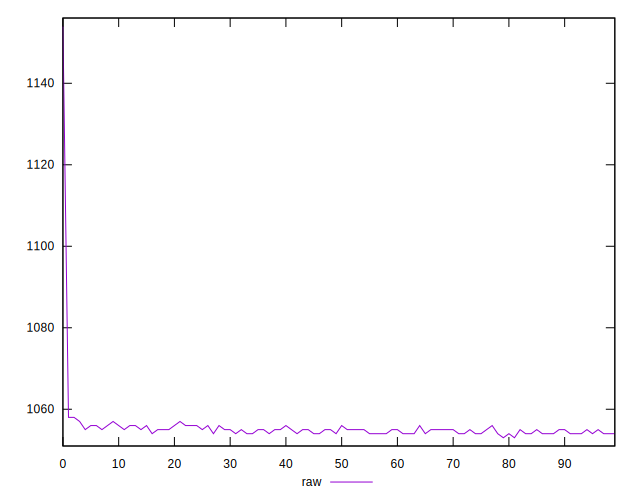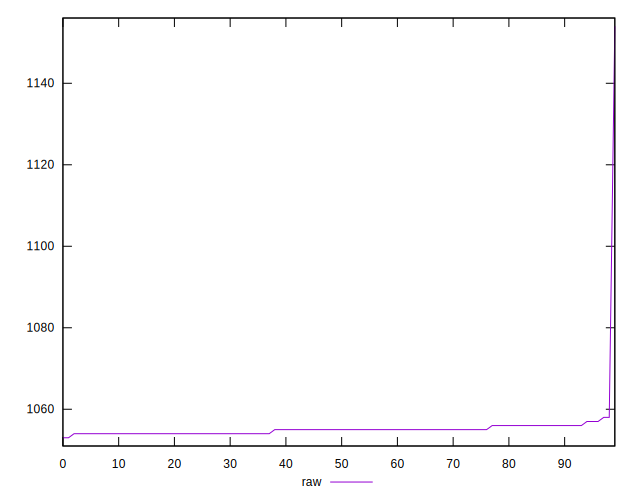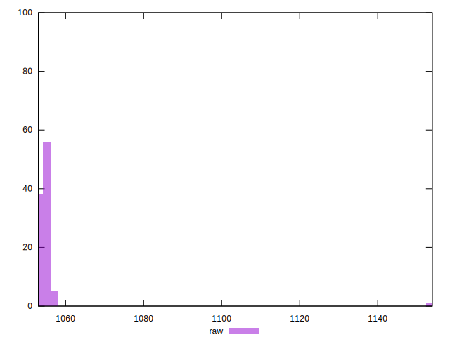
## Score


```yaml
p90min: 0.46
p90max: 0.46
p90range: 0
p90mean: 0.4600000000000007
median: 0.46
p90stdev: 6.661338147750939e-16
mad: 0
stdevBySn: 0
lfitCenter: 0.4599534639864745
lfitStdev: 0.00011610565185020858
mfitCenter: 0.4599534639864745
mfitStdev: 0.0001455168550325232
mfitConfidence: 0.00001455168550325232
p90skewness: -1
p90eccentricity: 1
p90discretization: 94
outlandishness: 0.9995652646502833

```

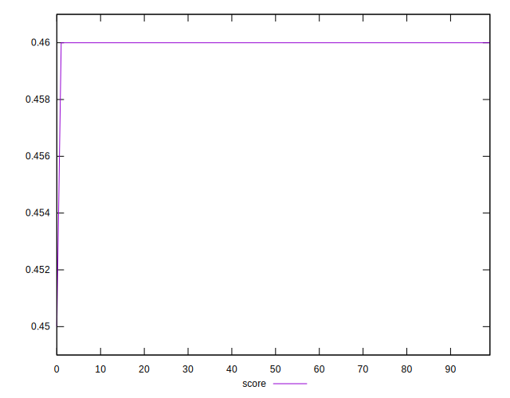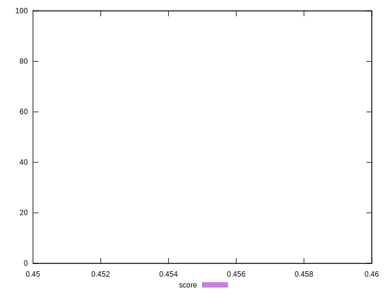
## Raw Estimate

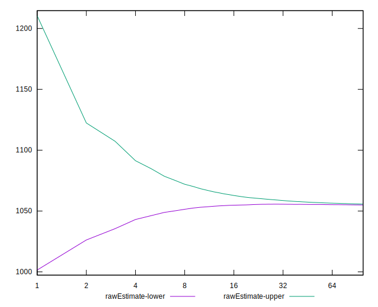
## Score Estimate

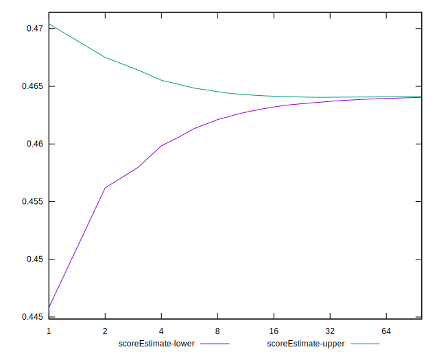
## P Score


```yaml
p90min: 0.46388235294117647
p90max: 0.4642352941176471
p90range: 0.0003529411764706114
p90mean: 0.4641326658322905
median: 0.4641176470588235
p90stdev: 0.00009590610293202186
mad: 0.00011764705882355564
stdevBySn: 0.00014030588235297247
lfitCenter: 0.4640802870782289
lfitStdev: 0.00017442188307543896
mfitCenter: 0.4640802870782289
mfitStdev: 0.0002186054121356089
mfitConfidence: 0.00002186054121356089
p90skewness: -0.5914588776278344
p90eccentricity: 0.9999999999999989
p90discretization: 23.5
outlandishness: 0.99948922773921

```

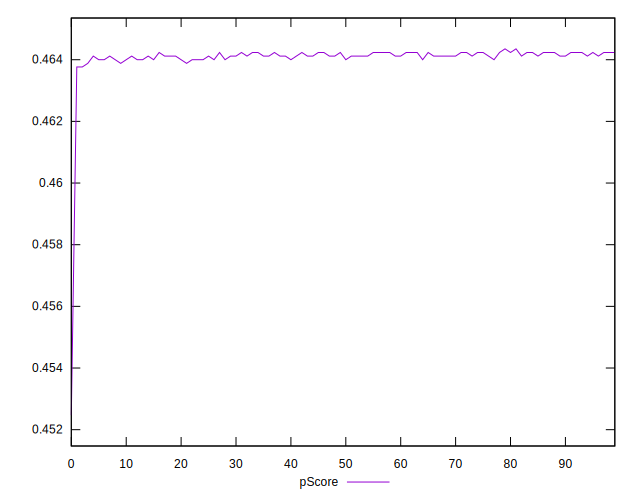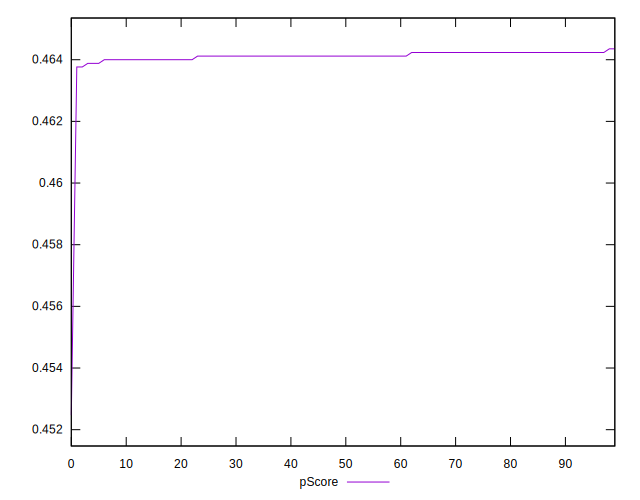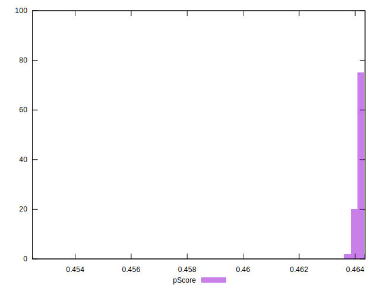
## Score Difference


```yaml
p90min: 0
p90max: 0
p90range: 0
p90mean: 0
median: 0
p90stdev: 0
mad: 0
stdevBySn: 0
lfitCenter: 0
lfitStdev: 0
mfitCenter: 0
mfitStdev: 0
mfitConfidence: 0
p90skewness: .nan
p90eccentricity: .nan
p90discretization: 94
outlandishness: .nan

```


## P Score Difference


```yaml
p90min: 0.003882352941176448
p90max: 0.004235294117647059
p90range: 0.0003529411764706114
p90mean: 0.004132665832290342
median: 0.004117647058823504
p90stdev: 0.0000959061029320219
mad: 0.00011764705882355564
stdevBySn: 0.00014030588235297247
lfitCenter: 0.0041268230917537235
lfitStdev: 0.00008740871981227618
mfitCenter: 0.0041268230917537235
mfitStdev: 0.00010955058437560965
mfitConfidence: 0.000010955058437560966
p90skewness: -0.5914588776421889
p90eccentricity: 0.999999999999998
p90discretization: 23.5
outlandishness: 0.9910437658875321

```

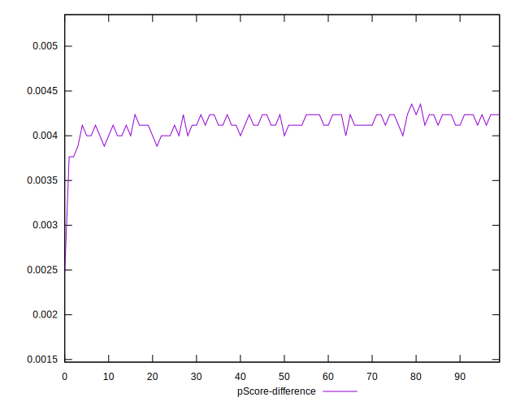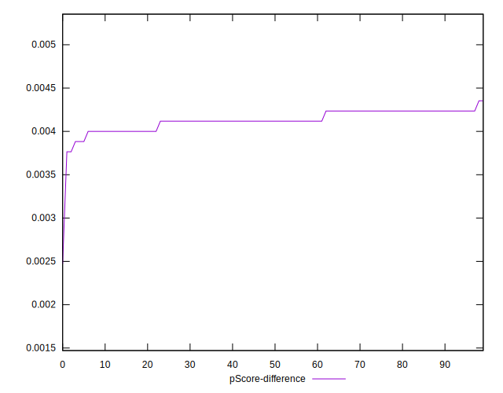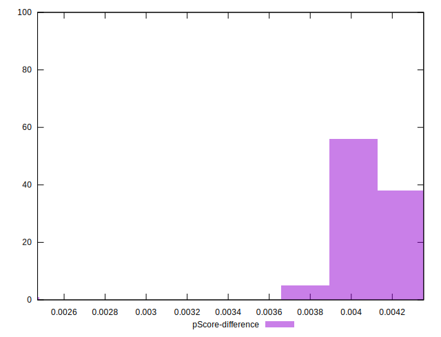