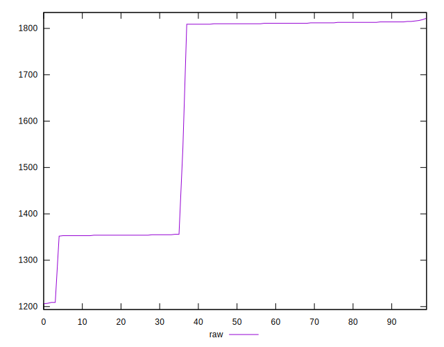
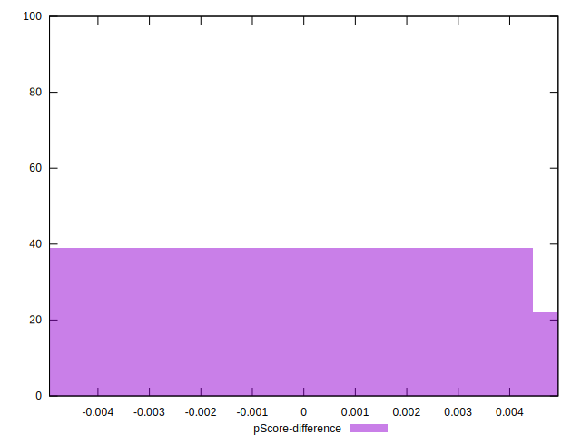

# //uses-rel-preload/samples/music

[→ Parent](../..)


## Raw


```yaml
p90min: 1209
p90max: 1816
p90range: 607
p90mean: 1646.5425531914893
median: 1810
p90stdev: 220.63311536005017
mad: 3.5
stdevBySn: 5.06855
lfitCenter: 1674.5813392456414
lfitStdev: 240.3704432304719
mfitCenter: 1674.5813392456414
mfitStdev: 301.2596749966836
mfitConfidence: 30.12596749966836
p90skewness: -0.6103366922564356
p90eccentricity: 1.0000000000000002
p90discretization: 6.266666666666667
outlandishness: 0.9903152764834067

```


## Score


```yaml
p90min: 0.37
p90max: 0.45
p90range: 0.08000000000000002
p90mean: 0.3958510638297873
median: 0.38
p90stdev: 0.026150528836769917
mad: 0.010000000000000009
stdevBySn: 0.011926000000000011
lfitCenter: 0.3934694728150409
lfitStdev: 0.027615118852350035
mfitCenter: 0.3934694728150409
mfitStdev: 0.03461041889612457
mfitConfidence: 0.003461041889612457
p90skewness: 0.5459932798989096
p90eccentricity: 0.9999999999999987
p90discretization: 18.8
outlandishness: 1.0042937688219884

```


## Raw Estimate


## Score Estimate


## P Score


```yaml
p90min: 0.37458823529411767
p90max: 0.446
p90range: 0.07141176470588234
p90mean: 0.3945244055068838
median: 0.37529411764705883
p90stdev: 0.025956837101182375
mad: 0.0004117647058823892
stdevBySn: 0.0005963000000000336
lfitCenter: 0.3912257247946307
lfitStdev: 0.02827887567417331
mfitCenter: 0.3912257247946307
mfitStdev: 0.03544231470549237
mfitConfidence: 0.003544231470549237
p90skewness: 0.6103366922564335
p90eccentricity: 1.0000000000000002
p90discretization: 6.266666666666667
outlandishness: 1.0047724343916395

```


## Score Difference


```yaml
p90min: 0
p90max: 0
p90range: 0
p90mean: 0
median: 0
p90stdev: 0
mad: 0
stdevBySn: 0
lfitCenter: 2.583267684513104e-19
lfitStdev: 6.445158398659724e-19
mfitCenter: 2.583267684513104e-19
mfitStdev: 8.077808146406197e-19
mfitConfidence: 8.077808146406197e-20
p90skewness: .nan
p90eccentricity: .nan
p90discretization: 94
outlandishness: .inf

```


## P Score Difference


```yaml
p90min: -0.004941176470588227
p90max: 0.004941176470588227
p90range: 0.009882352941176453
p90mean: -0.0013141426783479426
median: -0.0011764705882352788
p90stdev: 0.0036204218546485043
mad: 0.003529411764705892
stdevBySn: 0.00434948235294122
lfitCenter: -0.0015485515965587518
lfitStdev: 0.002987831239032643
mfitCenter: -0.0015485515965587518
mfitStdev: 0.0037446911355605663
mfitConfidence: 0.00037446911355605664
p90skewness: 0.7149327747055414
p90eccentricity: 1.0000000000000004
p90discretization: 4.7
outlandishness: 0.8836000000000002

```

