# //uses-text-compression/samples/card

[→ Parent](../..)


## Raw


```yaml
p90min: 150
p90max: 300
p90range: 150
p90mean: 196.27659574468086
median: 150
p90stdev: 69.28178727476305
mad: 0
stdevBySn: 0
lfitCenter: 185.5689677282866
lfitStdev: 68.0164173789267
mfitCenter: 185.5689677282866
mfitStdev: 85.2459375563386
mfitConfidence: 8.52459375563386
p90skewness: 0.8291761914687791
p90eccentricity: 0.9999999999999997
p90discretization: 47
outlandishness: 1.0176380725758478

```

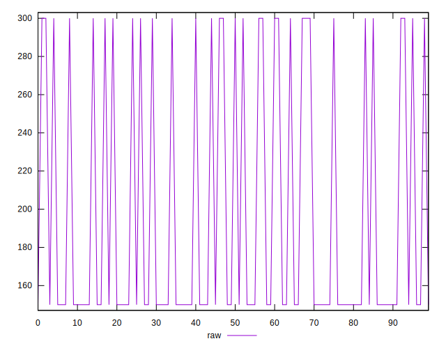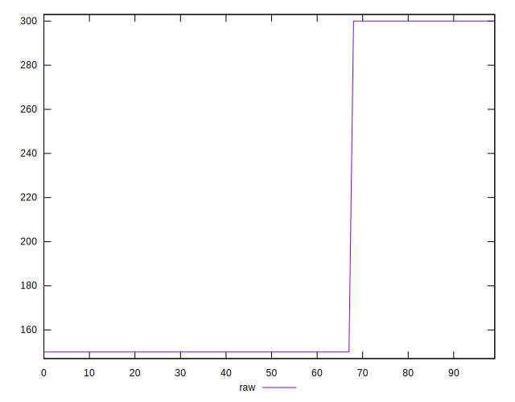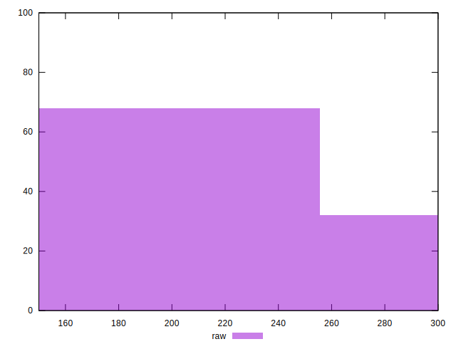
## Score


```yaml
p90min: 0.75
p90max: 0.88
p90range: 0.13
p90mean: 0.8398936170212765
median: 0.88
p90stdev: 0.06004421563812798
mad: 0
stdevBySn: 0
lfitCenter: 0.8491735613021516
lfitStdev: 0.05894756172840313
mfitCenter: 0.8491735613021516
mfitStdev: 0.07387981254882678
mfitConfidence: 0.0073879812548826775
p90skewness: -0.8291761914687826
p90eccentricity: 0.9999999999999996
p90discretization: 47
outlandishness: 0.9964464810517709

```

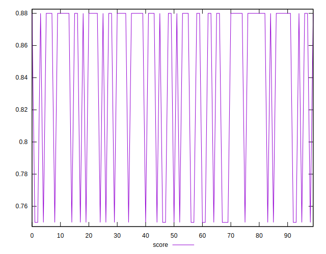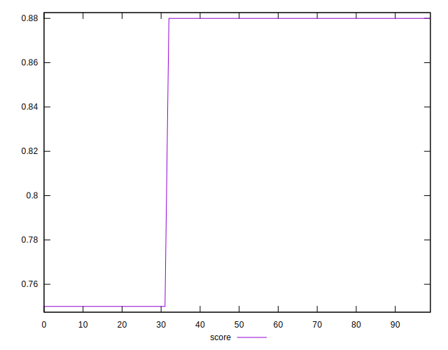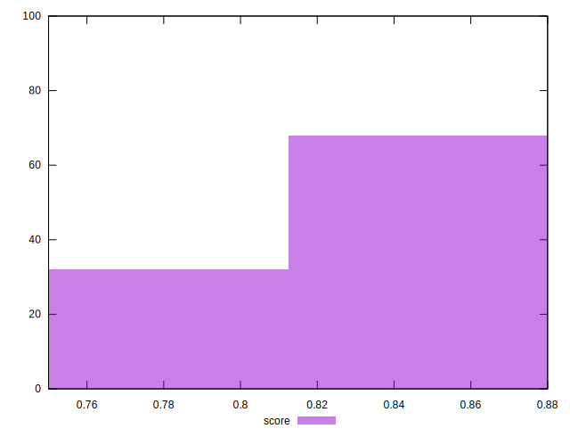
## Raw Estimate

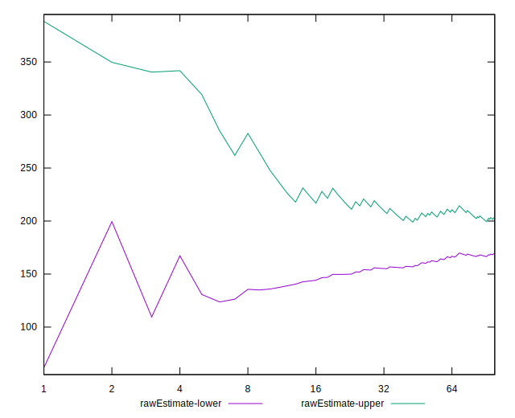
## Score Estimate

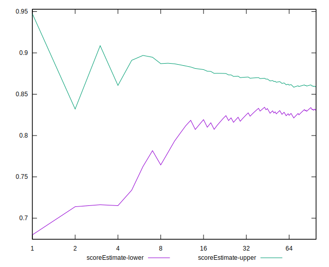
## P Score


```yaml
p90min: 0.75
p90max: 0.875
p90range: 0.125
p90mean: 0.836436170212766
median: 0.875
p90stdev: 0.05773482272896915
mad: 0
stdevBySn: 0
lfitCenter: 0.8453591935597617
lfitStdev: 0.056680347815771866
mfitCenter: 0.8453591935597617
mfitStdev: 0.07103828129694835
mfitConfidence: 0.007103828129694835
p90skewness: -0.829176191468783
p90eccentricity: 1.000000000000001
p90discretization: 47
outlandishness: 0.9965689258696646

```

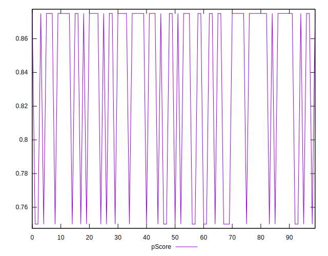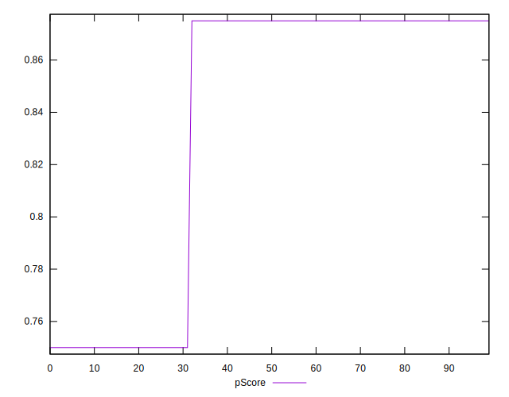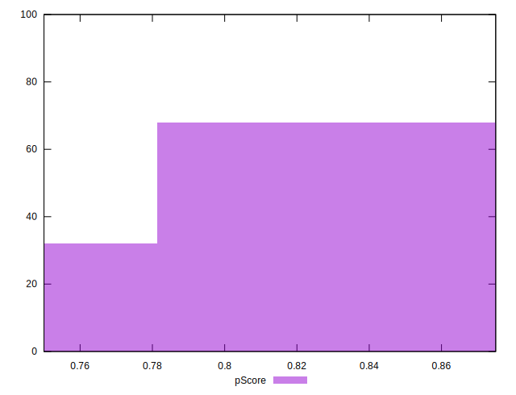
## Score Difference


```yaml
p90min: 0
p90max: 0
p90range: 0
p90mean: 0
median: 0
p90stdev: 0
mad: 0
stdevBySn: 0
lfitCenter: 0
lfitStdev: 0
mfitCenter: 0
mfitStdev: 0
mfitConfidence: 0
p90skewness: .nan
p90eccentricity: .nan
p90discretization: 94
outlandishness: .nan

```


## P Score Difference


```yaml
p90min: -0.0050000000000000044
p90max: 0
p90range: 0.0050000000000000044
p90mean: -0.0034574468085106416
median: -0.0050000000000000044
p90stdev: 0.002309392909158768
mad: 0
stdevBySn: 0
lfitCenter: -0.003814367742390452
lfitStdev: 0.0022672139126308907
mfitCenter: -0.003814367742390452
mfitStdev: 0.0028415312518779543
mfitConfidence: 0.00028415312518779545
p90skewness: 0.8291761914687822
p90eccentricity: 1.0000000000000007
p90discretization: 47
outlandishness: 0.9670453017751478

```

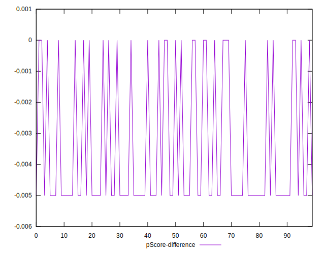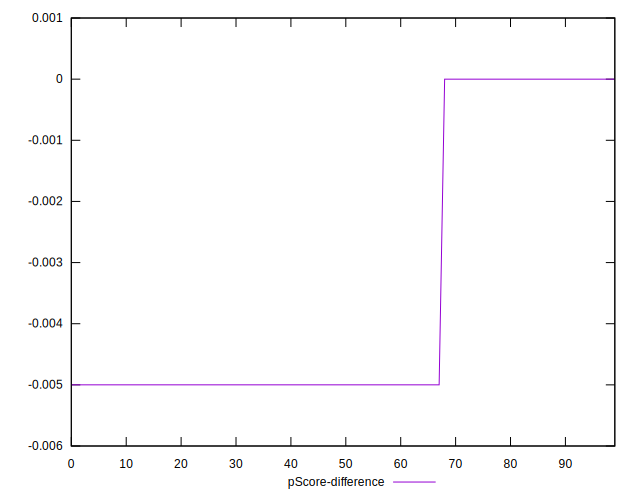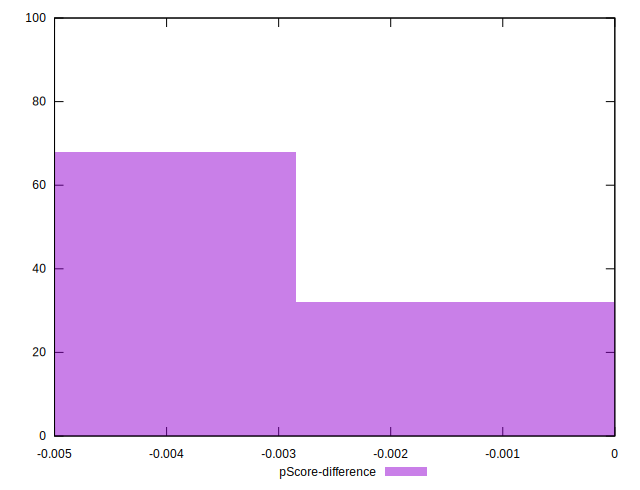