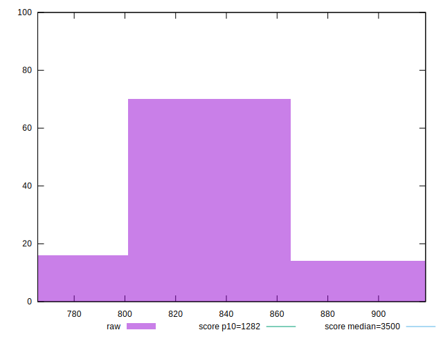
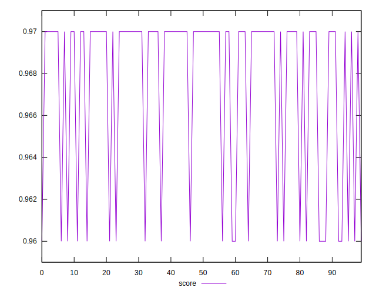

# //bootup-time/samples/astro-cached

[→ Parent](../..)


## Raw


```yaml
p90min: 772.7080000000004
p90max: 878.8840000000002
p90range: 106.17599999999982
p90mean: 825.5105106382983
median: 821.5260000000003
p90stdev: 26.05408698929269
mad: 12.479999999999961
stdevBySn: 25.15789700000007
lfitCenter: 824.8456919863806
lfitStdev: 19.70317844926363
mfitCenter: 824.8456919863806
mfitStdev: 24.694272125360627
mfitConfidence: 2.4694272125360626
p90skewness: 0.18099869475935154
p90eccentricity: 0.9999999999999997
p90discretization: 1
outlandishness: 1.0009951454159858

```


## Score


```yaml
p90min: 0.96
p90max: 0.97
p90range: 0.010000000000000009
p90mean: 0.9675531914893605
median: 0.97
p90stdev: 0.0042989781598248445
mad: 0
stdevBySn: 0
lfitCenter: 0.9682533349445128
lfitStdev: 0.0036135081342625885
mfitCenter: 0.9682533349445128
mfitStdev: 0.004528860834532991
mfitConfidence: 0.0004528860834532991
p90skewness: -1.1878131939448007
p90eccentricity: 0.9999999999999988
p90discretization: 47
outlandishness: 0.9996833675638703

```


## Raw Estimate


## Score Estimate


## P Score


```yaml
p90min: 0.9610730874572266
p90max: 0.9730454318785896
p90range: 0.011972344421362968
p90mean: 0.9672889986979974
median: 0.9677995436205662
p90stdev: 0.0029497265600442624
mad: 0.0013871977761055199
stdevBySn: 0.0028056796821374894
lfitCenter: 0.967377438469108
lfitStdev: 0.0022439261854305765
mfitCenter: 0.967377438469108
mfitStdev: 0.0028123444141224846
mfitConfidence: 0.00028123444141224844
p90skewness: -0.27680552949111487
p90eccentricity: 1.0000000000000002
p90discretization: 1.010752688172043
outlandishness: 0.9998635777070057

```


## Score Difference


```yaml
p90min: 0
p90max: 0
p90range: 0
p90mean: 0
median: 0
p90stdev: 0
mad: 0
stdevBySn: 0
lfitCenter: 0
lfitStdev: 0
mfitCenter: 0
mfitStdev: 0
mfitConfidence: 0
p90skewness: .nan
p90eccentricity: .nan
p90discretization: 94
outlandishness: .nan

```


## P Score Difference


```yaml
p90min: -0.0035513730851186587
p90max: 0.004210006471757732
p90range: 0.007761379556876391
p90mean: -0.0002102010991731729
median: -0.0009091622611618888
p90stdev: 0.0023341375112160044
mad: 0.001956397286021483
stdevBySn: 0.002582165683878788
lfitCenter: -0.0003420718035216564
lfitStdev: 0.002225476759030334
mfitCenter: -0.0003420718035216564
mfitStdev: 0.0027892214871664315
mfitConfidence: 0.00027892214871664314
p90skewness: 0.3693060734227462
p90eccentricity: 1.0000000000000004
p90discretization: 1.010752688172043
outlandishness: 0.7089168821113055

```

