# //bootup-time/samples/astro-inner-cached

[→ Parent](../..)


## Raw


```yaml
p90min: 461.3160000000002
p90max: 577.3520000000002
p90range: 116.036
p90mean: 497.56591489361745
median: 488.12
p90stdev: 28.26919738742023
mad: 23.35799999999975
stdevBySn: 32.56752079999984
lfitCenter: 502.51579971670236
lfitStdev: 36.196450604853986
mfitCenter: 502.51579971670236
mfitStdev: 45.36552330935441
mfitConfidence: 4.536552330935441
p90skewness: 0.6070160445032035
p90eccentricity: 1.0000000000000002
p90discretization: 1
outlandishness: 1.0540697858079495

```

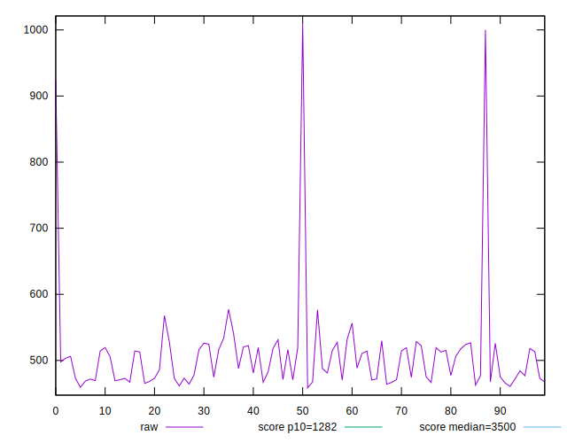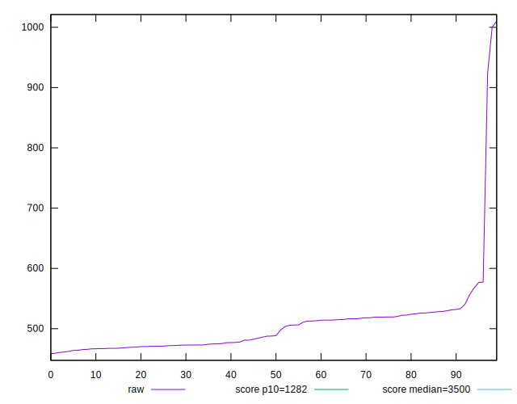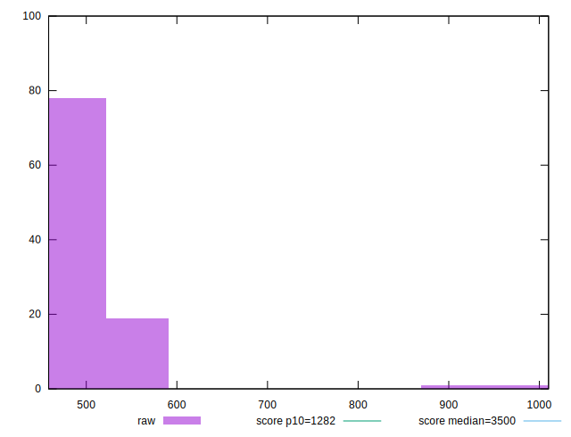
## Score


```yaml
p90min: 0.99
p90max: 1
p90range: 0.010000000000000009
p90mean: 0.9904255319148925
median: 0.99
p90stdev: 0.00201847510223514
mad: 0
stdevBySn: 0
lfitCenter: 0.9897823531918958
lfitStdev: 0.0014233310179403585
mfitCenter: 0.9897823531918958
mfitStdev: 0.00178388088865933
mfitConfidence: 0.000178388088865933
p90skewness: 4.532597979576357
p90eccentricity: 0.9999999999999978
p90discretization: 47
outlandishness: 0.998131915141544

```

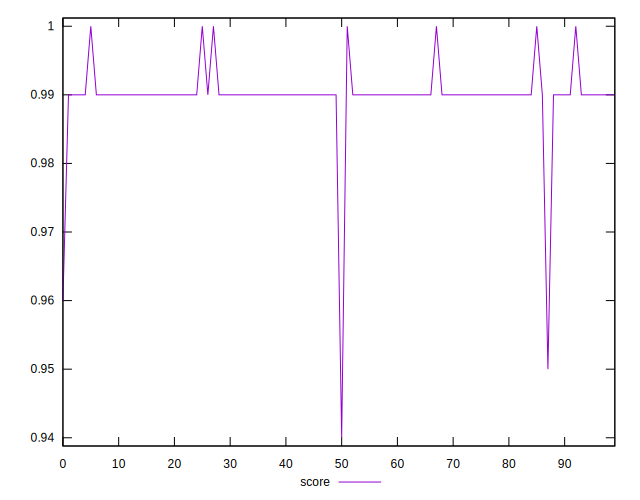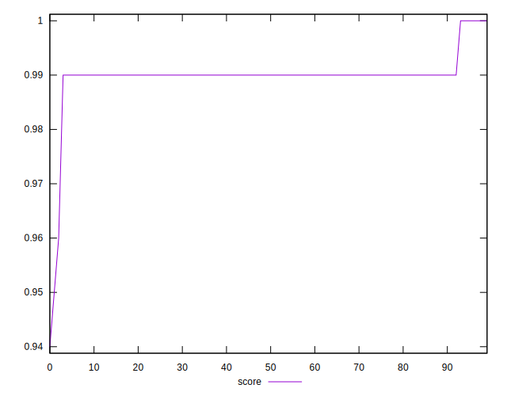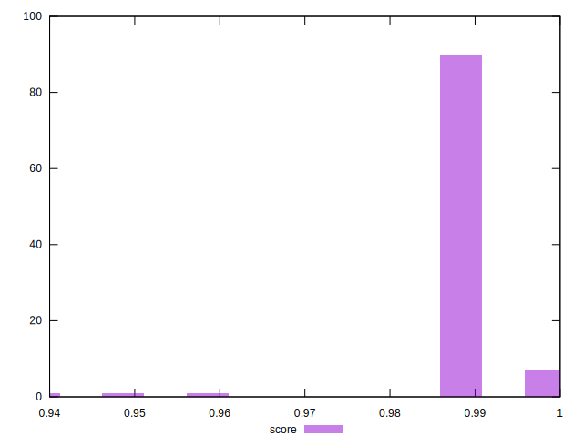
## Raw Estimate

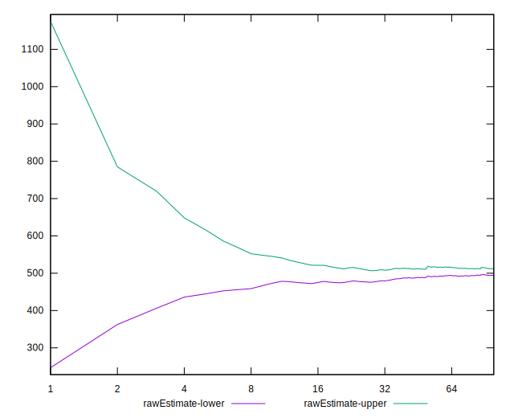
## Score Estimate

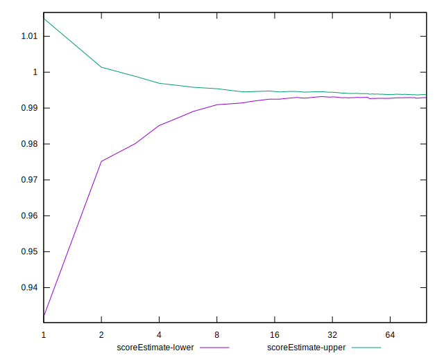
## P Score


```yaml
p90min: 0.9892605360650426
p90max: 0.9951416640993402
p90range: 0.0058811280342976335
p90mean: 0.9935180379105166
median: 0.9940261687054596
p90stdev: 0.0013589599091131496
mad: 0.00100747410122487
stdevBySn: 0.0013896022827038727
lfitCenter: 0.9929757331186628
lfitStdev: 0.002169412693128298
mfitCenter: 0.9929757331186628
mfitStdev: 0.002718955600705318
mfitConfidence: 0.0002718955600705318
p90skewness: -0.8566151347003224
p90eccentricity: 1.0000000000000002
p90discretization: 1.010752688172043
outlandishness: 0.9973548834913669

```

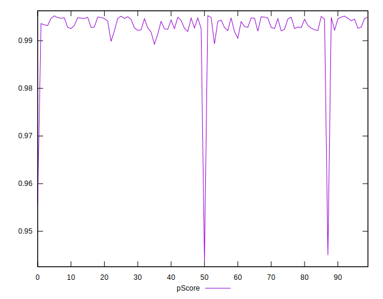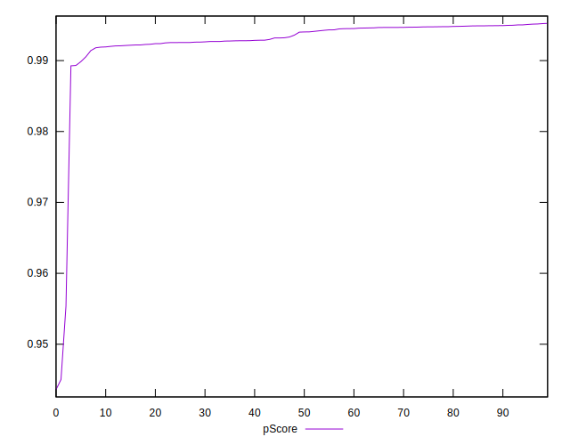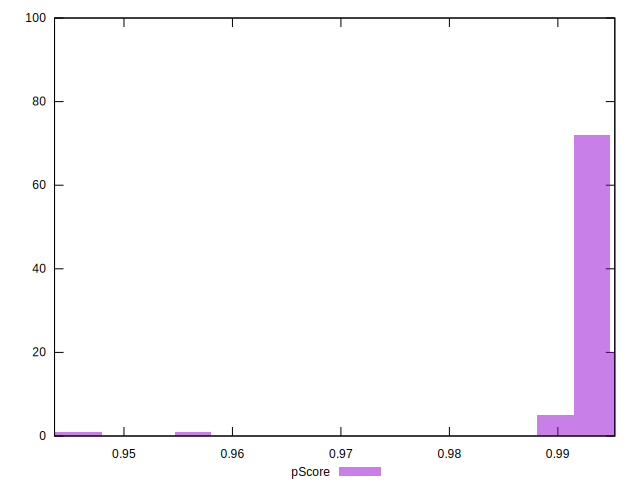
## Score Difference


```yaml
p90min: 0
p90max: 0
p90range: 0
p90mean: 0
median: 0
p90stdev: 0
mad: 0
stdevBySn: 0
lfitCenter: 1.0470608452365924e-18
lfitStdev: 2.5998395675404994e-18
mfitCenter: 1.0470608452365924e-18
mfitStdev: 3.2584156880294808e-18
mfitConfidence: 3.258415688029481e-19
p90skewness: .nan
p90eccentricity: .nan
p90discretization: 94
outlandishness: .inf

```

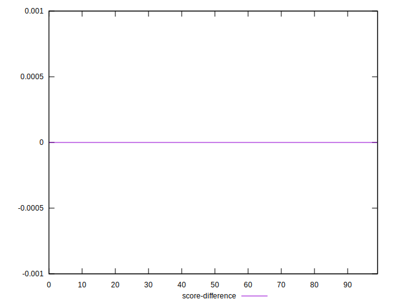
## P Score Difference


```yaml
p90min: -0.004904158699411076
p90max: 0.0049283107448012675
p90range: 0.009832469444212344
p90mean: 0.0028760749082363977
median: 0.0030852131511427405
p90stdev: 0.002381921789515073
mad: 0.001330622485683719
stdevBySn: 0.002025351392083561
lfitCenter: 0.003012811368278289
lfitStdev: 0.0016209495923497222
mfitCenter: 0.003012811368278289
mfitStdev: 0.0020315590420119448
mfitConfidence: 0.00020315590420119447
p90skewness: -2.0617871941823167
p90eccentricity: 1
p90discretization: 1.010752688172043
outlandishness: 0.8833855787496199

```

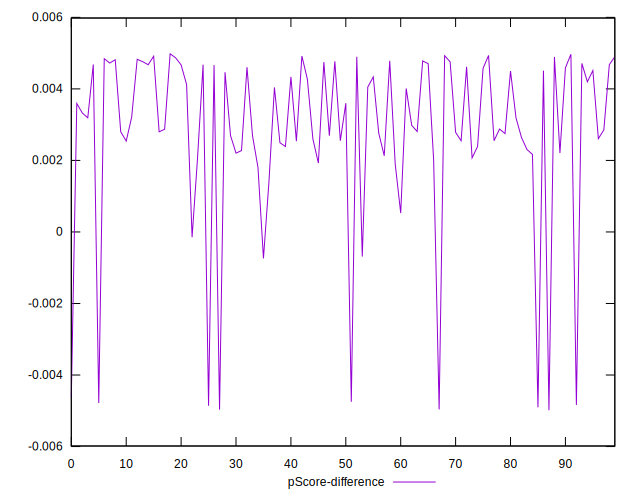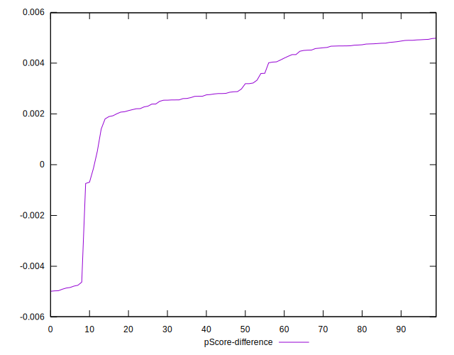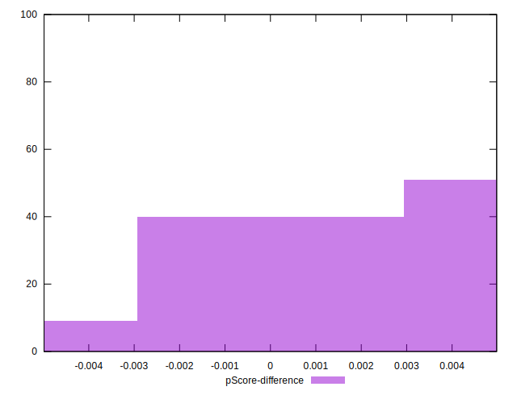