# //bootup-time/samples/astro-inner

[→ Parent](../..)


## Raw


```yaml
p90min: 471.27600000000035
p90max: 586.9560000000004
p90range: 115.68
p90mean: 541.6904255319151
median: 537.5120000000002
p90stdev: 31.019983989559687
mad: 29.044000000000153
stdevBySn: 46.08921959999996
lfitCenter: 542.3088291772829
lfitStdev: 30.72710496833072
mfitCenter: 542.3088291772829
mfitStdev: 38.51071509433736
mfitConfidence: 3.8510715094337358
p90skewness: -0.4955351712141495
p90eccentricity: 0.9999999999999996
p90discretization: 1
outlandishness: 0.9964543114888558

```

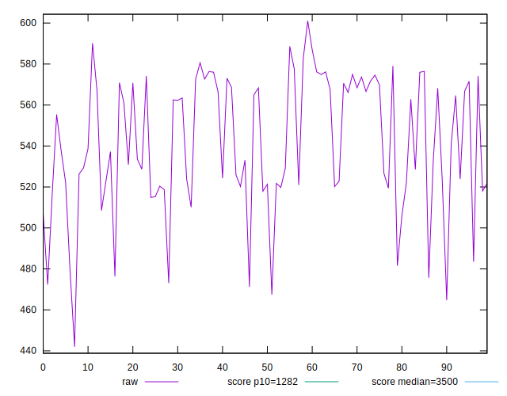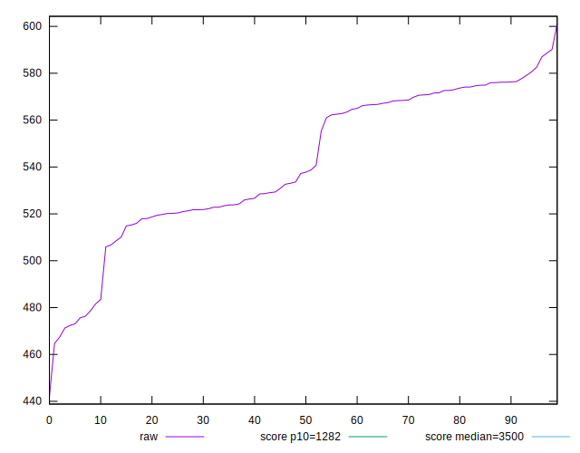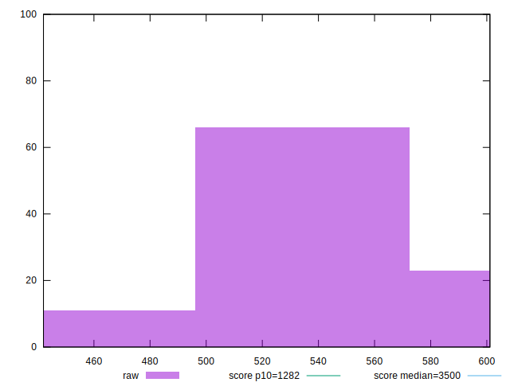
## Score


```yaml
p90min: 0.99
p90max: 0.99
p90range: 0
p90mean: 0.9899999999999988
median: 0.99
p90stdev: 1.2212453270876722e-15
mad: 0
stdevBySn: 0
lfitCenter: 0.9900943108566489
lfitStdev: 0.00023417273015205513
mfitCenter: 0.9900943108566489
mfitStdev: 0.0002934919935686625
mfitConfidence: 0.00002934919935686625
p90skewness: 1
p90eccentricity: 1
p90discretization: 94
outlandishness: 1.0004040812162023

```

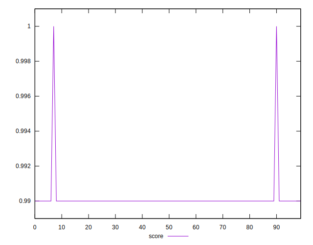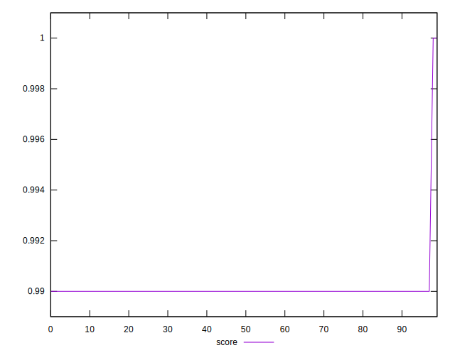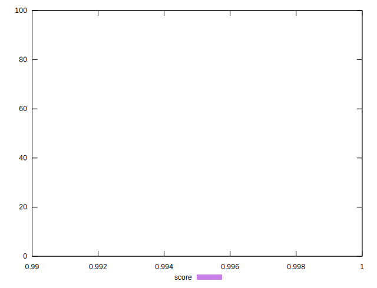
## Raw Estimate

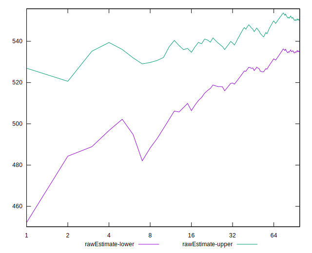
## Score Estimate

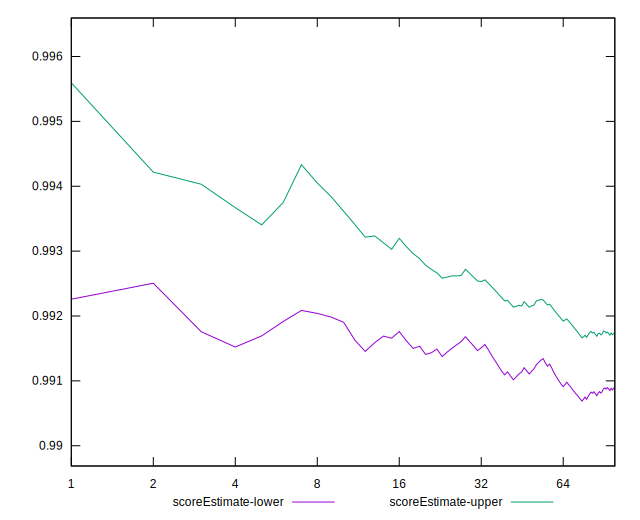
## P Score


```yaml
p90min: 0.9886488337905636
p90max: 0.9947437047229117
p90range: 0.006094870932348173
p90mean: 0.9912631774488592
median: 0.9915917076986084
p90stdev: 0.0016679923684974377
mad: 0.001627732558057926
stdevBySn: 0.002538223429699998
lfitCenter: 0.9912437875970207
lfitStdev: 0.0016999897396983903
mfitCenter: 0.9912437875970207
mfitStdev: 0.0021306211761992115
mfitConfidence: 0.00021306211761992115
p90skewness: 0.31770102436159303
p90eccentricity: 1.0000000000000002
p90discretization: 1.010752688172043
outlandishness: 1.0000581291386634

```

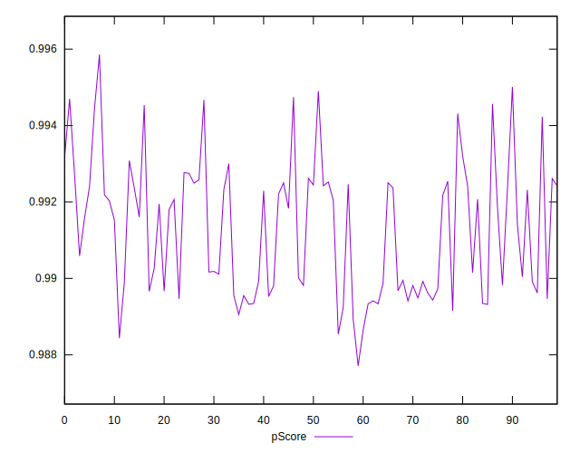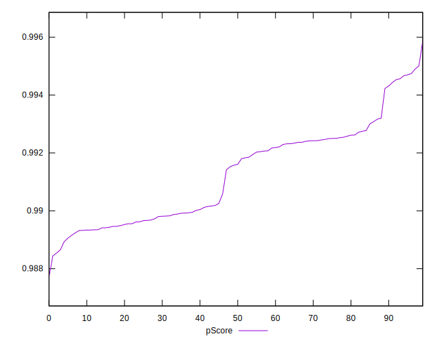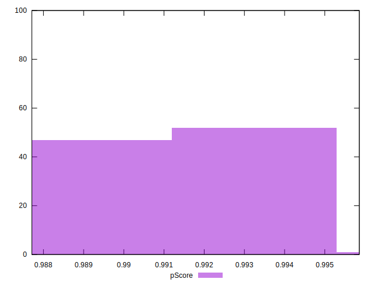
## Score Difference


```yaml
p90min: 0
p90max: 0
p90range: 0
p90mean: 0
median: 0
p90stdev: 0
mad: 0
stdevBySn: 0
lfitCenter: 0
lfitStdev: 0
mfitCenter: 0
mfitStdev: 0
mfitConfidence: 0
p90skewness: .nan
p90eccentricity: .nan
p90discretization: 94
outlandishness: .nan

```


## P Score Difference


```yaml
p90min: -0.0015616418534025733
p90max: 0.0046693789742684455
p90range: 0.006231020827671019
p90mean: 0.001130607912485346
median: 0.001470859870011998
p90stdev: 0.0016351753417863256
mad: 0.0015513814122009029
stdevBySn: 0.002538223429699998
lfitCenter: 0.0010776052166224675
lfitStdev: 0.0017330179334943527
mfitCenter: 0.0010776052166224675
mfitStdev: 0.0021720158784553404
mfitConfidence: 0.00021720158784553403
p90skewness: 0.2758594952940168
p90eccentricity: 1
p90discretization: 1.010752688172043
outlandishness: 0.9328491631518457

```

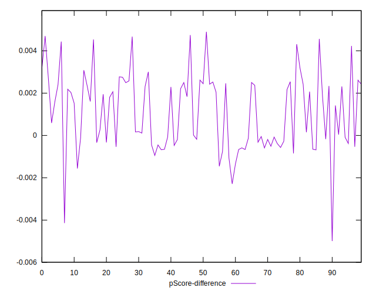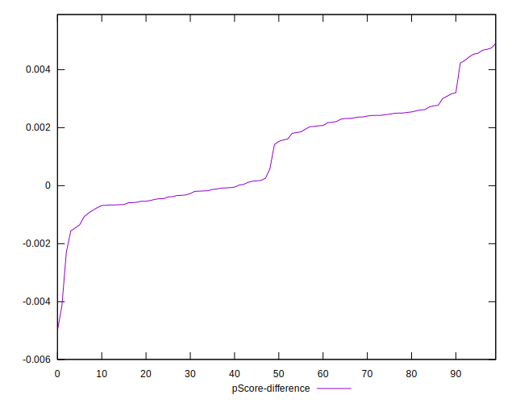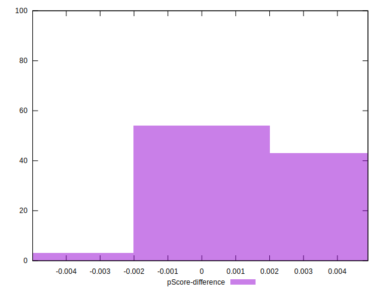