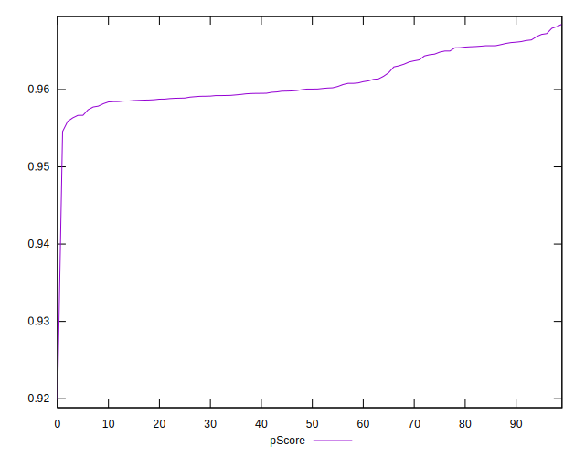

# //bootup-time/samples/astro

[→ Parent](../..)


## Raw


```yaml
p90min: 826.5200000000006
p90max: 916.6000000000003
p90range: 90.0799999999997
p90mean: 876.5796595744686
median: 887.0760000000002
p90stdev: 24.868279162013888
mad: 12.410000000000139
stdevBySn: 21.23305039999987
lfitCenter: 880.0023810953355
lfitStdev: 23.876424976588783
mfitCenter: 880.0023810953355
mfitStdev: 29.9246610018231
mfitConfidence: 2.99246610018231
p90skewness: -0.5828231261080308
p90eccentricity: 0.9999999999999992
p90discretization: 1
outlandishness: 1.0047975934404576

```


## Score


```yaml
p90min: 0.96
p90max: 0.97
p90range: 0.010000000000000009
p90mean: 0.9620212765957435
median: 0.96
p90stdev: 0.0040158693804631706
mad: 0
stdevBySn: 0
lfitCenter: 0.9611529292536422
lfitStdev: 0.0030755185199168597
mfitCenter: 0.9611529292536422
mfitStdev: 0.003854590844466096
mfitConfidence: 0.00038545908444660964
p90skewness: 1.4834762399137527
p90eccentricity: 1.0000000000000002
p90discretization: 47
outlandishness: 0.9993321915911866

```


## Raw Estimate


## Score Estimate


## P Score


```yaml
p90min: 0.9563356907432767
p90max: 0.9672376160976923
p90range: 0.010901925354415587
p90mean: 0.9613003509364595
median: 0.9600647712612742
p90stdev: 0.0030010850760460502
mad: 0.0015494822189979218
stdevBySn: 0.0026225379616916455
lfitCenter: 0.9608629917541631
lfitStdev: 0.002908445483111483
mfitCenter: 0.9608629917541631
mfitStdev: 0.003645195845262983
mfitConfidence: 0.0003645195845262983
p90skewness: 0.551618419262869
p90eccentricity: 0.9999999999999996
p90discretization: 1
outlandishness: 0.9993138538478478

```


## Score Difference


```yaml
p90min: 0
p90max: 0
p90range: 0
p90mean: 0
median: 0
p90stdev: 0
mad: 0
stdevBySn: 0
lfitCenter: 5.166535369026208e-19
lfitStdev: 1.2890316797319448e-18
mfitCenter: 5.166535369026208e-19
mfitStdev: 1.6155616292812394e-18
mfitConfidence: 1.6155616292812395e-19
p90skewness: .nan
p90eccentricity: .nan
p90discretization: 94
outlandishness: .inf

```


## P Score Difference


```yaml
p90min: -0.004466202278121556
p90max: 0.0045812246570111625
p90range: 0.009047426935132719
p90mean: -0.0007879148697121091
median: -0.0008577573623494983
p90stdev: 0.00225084393798128
mad: 0.0012369001167643612
stdevBySn: 0.0021219350507730105
lfitCenter: -0.0008089983617826084
lfitStdev: 0.001620584566946645
mfitCenter: -0.0008089983617826084
mfitStdev: 0.0020311015505133285
mfitConfidence: 0.00020311015505133286
p90skewness: 0.47586088835826273
p90eccentricity: 1
p90discretization: 1
outlandishness: 0.8572239363084885

```

