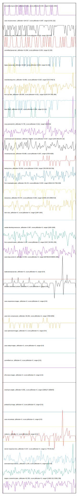

# //correlation/astro-cached

[→ Parent](../..)

[0. score, p90stdev=NaN, score:p90stdev=NaN, range=[NaN:NaN]](../../meta/score/samples/astro-cached)  
[1. cumulative-layout-shift, p90stdev=0.521, score:p90stdev=0.309, range=[0.113:1.604]](../../cumulative-layout-shift/samples/astro-cached/)  
[2. uses-rel-preconnect, p90stdev=104.517, score:p90stdev=0.087, range=[0:301.222]](../../uses-rel-preconnect/samples/astro-cached/)  
[3. unused-css-rules, p90stdev=73.612, score:p90stdev=0.039, range=[300:450]](../../unused-css-rules/samples/astro-cached/)  
[4. unminified-javascript, p90stdev=41.856, score:p90stdev=0.033, range=[0:150]](../../unminified-javascript/samples/astro-cached/)  
[5. legacy-javascript, p90stdev=36.667, score:p90stdev=0.029, range=[0:150]](../../legacy-javascript/samples/astro-cached/)  
[6. total-blocking-time, p90stdev=19.082, score:p90stdev=0.024, range=[313.5:462.5]](../../total-blocking-time/samples/astro-cached/)  
[7. first-cpu-idle, p90stdev=166.095, score:p90stdev=0.021, range=[6154.074:7591.964]](../../first-cpu-idle/samples/astro-cached/)  
[8. uses-http2, p90stdev=20.237, score:p90stdev=0.016, range=[0:110]](../../uses-http2/samples/astro-cached/)  
[9. max-potential-fid, p90stdev=5.745, score:p90stdev=0.012, range=[315:424]](../../max-potential-fid/samples/astro-cached/)  
[10. mainthread-work-breakdown, p90stdev=39.763, score:p90stdev=0.007, range=[1876.596:2071.82]](../../mainthread-work-breakdown/samples/astro-cached/)  
[11. unused-javascript, p90stdev=50.688, score:p90stdev=0.007, range=[3750:4200]](../../unused-javascript/samples/astro-cached/)  
[12. bootup-time, p90stdev=26.054, score:p90stdev=0.004, range=[765.636:918.536]](../../bootup-time/samples/astro-cached/)  
[13. first-meaningful-paint, p90stdev=46.176, score:p90stdev=0.003, range=[5610.214:7591.964]](../../first-meaningful-paint/samples/astro-cached/)  
[14. interactive, p90stdev=34.472, score:p90stdev=0.003, range=[14255.123:14959.513]](../../interactive/samples/astro-cached/)  
[15. dom-size, p90stdev=0, score:p90stdev=0, range=[1287:1287]](../../dom-size/samples/astro-cached/)  
[16. render-blocking-resources, p90stdev=2.097, score:p90stdev=0, range=[1620:1693]](../../render-blocking-resources/samples/astro-cached/)  
[17. first-contentful-paint, p90stdev=1.427, score:p90stdev=0, range=[2417.49:2541.255]](../../first-contentful-paint/samples/astro-cached/)  
[18. uses-long-cache-ttl, p90stdev=0.546, score:p90stdev=0, range=[967499.68:968041.689]](../../uses-long-cache-ttl/samples/astro-cached/)  
[19. uses-passive-event-listeners, p90stdev=NaN, score:p90stdev=0, range=[NaN:NaN]](../../uses-passive-event-listeners/samples/astro-cached/)  
[20. no-document-write, p90stdev=NaN, score:p90stdev=0, range=[NaN:NaN]](../../no-document-write/samples/astro-cached/)  
[21. duplicated-javascript, p90stdev=0, score:p90stdev=0, range=[0:0]](../../duplicated-javascript/samples/astro-cached/)  
[22. efficient-animated-content, p90stdev=0, score:p90stdev=0, range=[0:0]](../../efficient-animated-content/samples/astro-cached/)  
[23. uses-responsive-images, p90stdev=0, score:p90stdev=0, range=[0:0]](../../uses-responsive-images/samples/astro-cached/)  
[24. uses-text-compression, p90stdev=49.262, score:p90stdev=0, range=[7950:8250]](../../uses-text-compression/samples/astro-cached/)  
[25. uses-optimized-images, p90stdev=0, score:p90stdev=0, range=[0:0]](../../uses-optimized-images/samples/astro-cached/)  
[26. uses-webp-images, p90stdev=0, score:p90stdev=0, range=[0:0]](../../uses-webp-images/samples/astro-cached/)  
[27. unminified-css, p90stdev=0, score:p90stdev=0, range=[0:0]](../../unminified-css/samples/astro-cached/)  
[28. offscreen-images, p90stdev=0, score:p90stdev=0, range=[0:0]](../../offscreen-images/samples/astro-cached/)  
[29. total-byte-weight, p90stdev=0.891, score:p90stdev=0, range=[1695127:1696643]](../../total-byte-weight/samples/astro-cached/)  
[30. preload-lcp-image, p90stdev=0, score:p90stdev=0, range=[0:0]](../../preload-lcp-image/samples/astro-cached/)  
[31. unsized-images, p90stdev=NaN, score:p90stdev=0, range=[NaN:NaN]](../../unsized-images/samples/astro-cached/)  
[32. third-party-summary, p90stdev=NaN, score:p90stdev=0, range=[NaN:NaN]](../../third-party-summary/samples/astro-cached/)  
[33. font-display, p90stdev=NaN, score:p90stdev=0, range=[NaN:NaN]](../../font-display/samples/astro-cached/)  
[34. uses-rel-preload, p90stdev=0, score:p90stdev=0, range=[0:0]](../../uses-rel-preload/samples/astro-cached/)  
[35. redirects, p90stdev=0, score:p90stdev=0, range=[0:0]](../../redirects/samples/astro-cached/)  
[36. server-response-time, p90stdev=0.427, score:p90stdev=0, range=[1.776:55.621]](../../server-response-time/samples/astro-cached/)  
[37. estimated-input-latency, p90stdev=1.378, score:p90stdev=0, range=[13.6:36]](../../estimated-input-latency/samples/astro-cached/)  
[38. largest-contentful-paint, p90stdev=81.555, score:p90stdev=0, range=[11963.312:15381.359]](../../largest-contentful-paint/samples/astro-cached/)  
[39. timing-budget, p90stdev=NaN, score:p90stdev=NaN, range=[NaN:NaN]](../../timing-budget/samples/astro-cached/)  
[40. metrics, p90stdev=NaN, score:p90stdev=NaN, range=[NaN:NaN]](../../metrics/samples/astro-cached/)  
[41. screenshot-thumbnails, p90stdev=NaN, score:p90stdev=NaN, range=[NaN:NaN]](../../screenshot-thumbnails/samples/astro-cached/)  
[42. speed-index, p90stdev=NaN, score:p90stdev=NaN, range=[NaN:NaN]](../../speed-index/samples/astro-cached/)  
