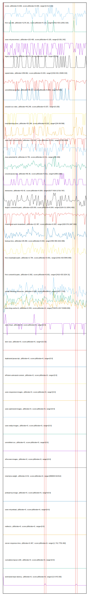

# //correlation/astro-inner-cached

[→ Parent](../..)

[0. score, p90stdev=0.009, score:p90stdev=0.009, range=[0.51:0.62]](../../meta/score/samples/astro-inner-cached)  
[1. first-cpu-idle, p90stdev=1176.161, score:p90stdev=0.131, range=[2416.433:11552.315]](../../first-cpu-idle/samples/astro-inner-cached/)  
[2. uses-rel-preconnect, p90stdev=125.495, score:p90stdev=0.105, range=[0:301.242]](../../uses-rel-preconnect/samples/astro-inner-cached/)  
[3. legacy-javascript, p90stdev=62.479, score:p90stdev=0.05, range=[0:150]](../../legacy-javascript/samples/astro-inner-cached/)  
[4. speed-index, p90stdev=258.862, score:p90stdev=0.043, range=[2418.401:15948.315]](../../speed-index/samples/astro-inner-cached/)  
[5. unminified-javascript, p90stdev=48.217, score:p90stdev=0.039, range=[0:150]](../../unminified-javascript/samples/astro-inner-cached/)  
[6. unused-css-rules, p90stdev=46.249, score:p90stdev=0.037, range=[0:150]](../../unused-css-rules/samples/astro-inner-cached/)  
[7. total-blocking-time, p90stdev=35.349, score:p90stdev=0.022, range=[154.99:569]](../../total-blocking-time/samples/astro-inner-cached/)  
[8. uses-text-compression, p90stdev=110.642, score:p90stdev=0.015, range=[3750:4200]](../../uses-text-compression/samples/astro-inner-cached/)  
[9. max-potential-fid, p90stdev=6.755, score:p90stdev=0.011, range=[354:406]](../../max-potential-fid/samples/astro-inner-cached/)  
[10. unused-javascript, p90stdev=80.36, score:p90stdev=0.011, range=[1950:2250]](../../unused-javascript/samples/astro-inner-cached/)  
[11. interactive, p90stdev=43.42, score:p90stdev=0.004, range=[9177.819:11716.767]](../../interactive/samples/astro-inner-cached/)  
[12. largest-contentful-paint, p90stdev=225.933, score:p90stdev=0.004, range=[3154.31:10541.802]](../../largest-contentful-paint/samples/astro-inner-cached/)  
[13. mainthread-work-breakdown, p90stdev=22.387, score:p90stdev=0.003, range=[928.576:1667.904]](../../mainthread-work-breakdown/samples/astro-inner-cached/)  
[14. bootup-time, p90stdev=28.269, score:p90stdev=0.002, range=[458.496:1010.096]](../../bootup-time/samples/astro-inner-cached/)  
[15. first-meaningful-paint, p90stdev=2.794, score:p90stdev=0.001, range=[2416.433:5849.983]](../../first-meaningful-paint/samples/astro-inner-cached/)  
[16. first-contentful-paint, p90stdev=2.692, score:p90stdev=0.001, range=[2416.433:3154.31]](../../first-contentful-paint/samples/astro-inner-cached/)  
[17. render-blocking-resources, p90stdev=3.068, score:p90stdev=0, range=[1617:1701]](../../render-blocking-resources/samples/astro-inner-cached/)  
[18. uses-long-cache-ttl, p90stdev=0.353, score:p90stdev=0, range=[715276.125:715409.084]](../../uses-long-cache-ttl/samples/astro-inner-cached/)  
[19. uses-passive-event-listeners, p90stdev=NaN, score:p90stdev=0, range=[NaN:NaN]](../../uses-passive-event-listeners/samples/astro-inner-cached/)  
[20. uses-http2, p90stdev=0, score:p90stdev=0, range=[0:0]](../../uses-http2/samples/astro-inner-cached/)  
[21. no-document-write, p90stdev=NaN, score:p90stdev=0, range=[NaN:NaN]](../../no-document-write/samples/astro-inner-cached/)  
[22. dom-size, p90stdev=0, score:p90stdev=0, range=[32:32]](../../dom-size/samples/astro-inner-cached/)  
[23. duplicated-javascript, p90stdev=0, score:p90stdev=0, range=[0:0]](../../duplicated-javascript/samples/astro-inner-cached/)  
[24. efficient-animated-content, p90stdev=0, score:p90stdev=0, range=[0:0]](../../efficient-animated-content/samples/astro-inner-cached/)  
[25. uses-responsive-images, p90stdev=0, score:p90stdev=0, range=[0:0]](../../uses-responsive-images/samples/astro-inner-cached/)  
[26. uses-optimized-images, p90stdev=0, score:p90stdev=0, range=[0:0]](../../uses-optimized-images/samples/astro-inner-cached/)  
[27. uses-webp-images, p90stdev=0, score:p90stdev=0, range=[0:0]](../../uses-webp-images/samples/astro-inner-cached/)  
[28. unminified-css, p90stdev=0, score:p90stdev=0, range=[0:0]](../../unminified-css/samples/astro-inner-cached/)  
[29. offscreen-images, p90stdev=0, score:p90stdev=0, range=[0:0]](../../offscreen-images/samples/astro-inner-cached/)  
[30. total-byte-weight, p90stdev=0.52, score:p90stdev=0, range=[899003:914412]](../../total-byte-weight/samples/astro-inner-cached/)  
[31. preload-lcp-image, p90stdev=0, score:p90stdev=0, range=[0:0]](../../preload-lcp-image/samples/astro-inner-cached/)  
[32. third-party-summary, p90stdev=NaN, score:p90stdev=0, range=[NaN:NaN]](../../third-party-summary/samples/astro-inner-cached/)  
[33. font-display, p90stdev=NaN, score:p90stdev=0, range=[NaN:NaN]](../../font-display/samples/astro-inner-cached/)  
[34. uses-rel-preload, p90stdev=0, score:p90stdev=0, range=[0:0]](../../uses-rel-preload/samples/astro-inner-cached/)  
[35. redirects, p90stdev=0, score:p90stdev=0, range=[0:0]](../../redirects/samples/astro-inner-cached/)  
[36. server-response-time, p90stdev=0.467, score:p90stdev=0, range=[1.741:7753.482]](../../server-response-time/samples/astro-inner-cached/)  
[37. cumulative-layout-shift, p90stdev=0, score:p90stdev=0, range=[0:0]](../../cumulative-layout-shift/samples/astro-inner-cached/)  
[38. estimated-input-latency, p90stdev=0, score:p90stdev=0, range=[12.8:45.333]](../../estimated-input-latency/samples/astro-inner-cached/)  
