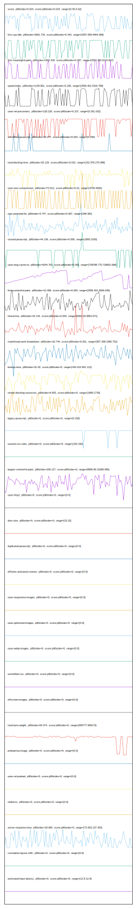

# //correlation/astro-inner

[→ Parent](../..)

[0. score, p90stdev=0.024, score:p90stdev=0.024, range=[0.55:0.62]](../../meta/score/samples/astro-inner)  
[1. first-cpu-idle, p90stdev=3061.734, score:p90stdev=0.343, range=[2557.659:9464.589]](../../first-cpu-idle/samples/astro-inner/)  
[2. first-meaningful-paint, p90stdev=1403.418, score:p90stdev=0.297, range=[2557.392:6124.667]](../../first-meaningful-paint/samples/astro-inner/)  
[3. speed-index, p90stdev=1139.801, score:p90stdev=0.156, range=[2556.401:5316.789]](../../speed-index/samples/astro-inner/)  
[4. uses-rel-preconnect, p90stdev=128.228, score:p90stdev=0.107, range=[0:301.032]](../../uses-rel-preconnect/samples/astro-inner/)  
[5. unminified-javascript, p90stdev=30.277, score:p90stdev=0.024, range=[0:150]](../../unminified-javascript/samples/astro-inner/)  
[6. total-blocking-time, p90stdev=25.129, score:p90stdev=0.015, range=[152.976:270.998]](../../total-blocking-time/samples/astro-inner/)  
[7. uses-text-compression, p90stdev=73.612, score:p90stdev=0.01, range=[3750:4050]](../../uses-text-compression/samples/astro-inner/)  
[8. max-potential-fid, p90stdev=3.747, score:p90stdev=0.007, range=[348:381]](../../max-potential-fid/samples/astro-inner/)  
[9. unused-javascript, p90stdev=44.136, score:p90stdev=0.006, range=[1800:2100]](../../unused-javascript/samples/astro-inner/)  
[10. uses-long-cache-ttl, p90stdev=4204.763, score:p90stdev=0.005, range=[709788.775:728652.698]](../../uses-long-cache-ttl/samples/astro-inner/)  
[11. first-contentful-paint, p90stdev=12.499, score:p90stdev=0.004, range=[2556.401:2609.045]](../../first-contentful-paint/samples/astro-inner/)  
[12. interactive, p90stdev=44.144, score:p90stdev=0.004, range=[9481.04:9953.671]](../../interactive/samples/astro-inner/)  
[13. mainthread-work-breakdown, p90stdev=16.744, score:p90stdev=0.001, range=[957.308:1080.752]](../../mainthread-work-breakdown/samples/astro-inner/)  
[14. bootup-time, p90stdev=31.02, score:p90stdev=0, range=[442.012:601.112]](../../bootup-time/samples/astro-inner/)  
[15. render-blocking-resources, p90stdev=9.825, score:p90stdev=0, range=[1680:1718]](../../render-blocking-resources/samples/astro-inner/)  
[16. legacy-javascript, p90stdev=0, score:p90stdev=0, range=[0:150]](../../legacy-javascript/samples/astro-inner/)  
[17. unused-css-rules, p90stdev=0, score:p90stdev=0, range=[150:150]](../../unused-css-rules/samples/astro-inner/)  
[18. largest-contentful-paint, p90stdev=236.127, score:p90stdev=0, range=[8899.86:10289.085]](../../largest-contentful-paint/samples/astro-inner/)  
[19. uses-passive-event-listeners, p90stdev=NaN, score:p90stdev=0, range=[NaN:NaN]](../../uses-passive-event-listeners/samples/astro-inner/)  
[20. uses-http2, p90stdev=0, score:p90stdev=0, range=[0:0]](../../uses-http2/samples/astro-inner/)  
[21. no-document-write, p90stdev=NaN, score:p90stdev=0, range=[NaN:NaN]](../../no-document-write/samples/astro-inner/)  
[22. dom-size, p90stdev=0, score:p90stdev=0, range=[32:32]](../../dom-size/samples/astro-inner/)  
[23. duplicated-javascript, p90stdev=0, score:p90stdev=0, range=[0:0]](../../duplicated-javascript/samples/astro-inner/)  
[24. efficient-animated-content, p90stdev=0, score:p90stdev=0, range=[0:0]](../../efficient-animated-content/samples/astro-inner/)  
[25. uses-responsive-images, p90stdev=0, score:p90stdev=0, range=[0:0]](../../uses-responsive-images/samples/astro-inner/)  
[26. uses-optimized-images, p90stdev=0, score:p90stdev=0, range=[0:0]](../../uses-optimized-images/samples/astro-inner/)  
[27. uses-webp-images, p90stdev=0, score:p90stdev=0, range=[0:0]](../../uses-webp-images/samples/astro-inner/)  
[28. unminified-css, p90stdev=0, score:p90stdev=0, range=[0:0]](../../unminified-css/samples/astro-inner/)  
[29. offscreen-images, p90stdev=0, score:p90stdev=0, range=[0:0]](../../offscreen-images/samples/astro-inner/)  
[30. total-byte-weight, p90stdev=64.574, score:p90stdev=0, range=[905777:906173]](../../total-byte-weight/samples/astro-inner/)  
[31. preload-lcp-image, p90stdev=0, score:p90stdev=0, range=[0:0]](../../preload-lcp-image/samples/astro-inner/)  
[32. third-party-summary, p90stdev=NaN, score:p90stdev=0, range=[NaN:NaN]](../../third-party-summary/samples/astro-inner/)  
[33. font-display, p90stdev=NaN, score:p90stdev=0, range=[NaN:NaN]](../../font-display/samples/astro-inner/)  
[34. uses-rel-preload, p90stdev=0, score:p90stdev=0, range=[0:0]](../../uses-rel-preload/samples/astro-inner/)  
[35. redirects, p90stdev=0, score:p90stdev=0, range=[0:0]](../../redirects/samples/astro-inner/)  
[36. server-response-time, p90stdev=18.965, score:p90stdev=0, range=[73.653:137.453]](../../server-response-time/samples/astro-inner/)  
[37. cumulative-layout-shift, p90stdev=0, score:p90stdev=0, range=[0:0]](../../cumulative-layout-shift/samples/astro-inner/)  
[38. estimated-input-latency, p90stdev=0, score:p90stdev=0, range=[12.8:12.8]](../../estimated-input-latency/samples/astro-inner/)  
