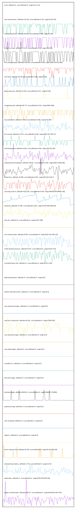

# //correlation/astro

[→ Parent](../..)

[0. score, p90stdev=0, score:p90stdev=0, range=[0.31:0.31]](../../meta/score/samples/astro)  
[1. uses-rel-preconnect, p90stdev=121.081, score:p90stdev=0.101, range=[0:303.224]](../../uses-rel-preconnect/samples/astro/)  
[2. unminified-javascript, p90stdev=69.922, score:p90stdev=0.056, range=[0:150]](../../unminified-javascript/samples/astro/)  
[3. unused-css-rules, p90stdev=72.514, score:p90stdev=0.039, range=[300:600]](../../unused-css-rules/samples/astro/)  
[4. first-meaningful-paint, p90stdev=242.359, score:p90stdev=0.035, range=[4566.079:5703.983]](../../first-meaningful-paint/samples/astro/)  
[5. uses-http2, p90stdev=35.034, score:p90stdev=0.028, range=[0:120]](../../uses-http2/samples/astro/)  
[6. legacy-javascript, p90stdev=21.646, score:p90stdev=0.017, range=[0:150]](../../legacy-javascript/samples/astro/)  
[7. unused-javascript, p90stdev=86.774, score:p90stdev=0.012, range=[3900:4350]](../../unused-javascript/samples/astro/)  
[8. max-potential-fid, p90stdev=4.568, score:p90stdev=0.009, range=[313:384]](../../max-potential-fid/samples/astro/)  
[9. first-cpu-idle, p90stdev=74.024, score:p90stdev=0.009, range=[6862.432:7485.74]](../../first-cpu-idle/samples/astro/)  
[10. total-blocking-time, p90stdev=6.653, score:p90stdev=0.009, range=[324:651.353]](../../total-blocking-time/samples/astro/)  
[11. mainthread-work-breakdown, p90stdev=29.841, score:p90stdev=0.006, range=[1952.9:2836.936]](../../mainthread-work-breakdown/samples/astro/)  
[12. bootup-time, p90stdev=24.868, score:p90stdev=0.004, range=[815.644:1164.7]](../../bootup-time/samples/astro/)  
[13. uses-long-cache-ttl, p90stdev=4213.539, score:p90stdev=0.004, range=[962430.056:988051.392]](../../uses-long-cache-ttl/samples/astro/)  
[14. interactive, p90stdev=71.696, score:p90stdev=0.001, range=[14704.848:15620.69]](../../interactive/samples/astro/)  
[15. dom-size, p90stdev=0, score:p90stdev=0, range=[1287:1288]](../../dom-size/samples/astro/)  
[16. first-contentful-paint, p90stdev=8.605, score:p90stdev=0, range=[2532.461:2563.132]](../../first-contentful-paint/samples/astro/)  
[17. render-blocking-resources, p90stdev=8.074, score:p90stdev=0, range=[1679:1713]](../../render-blocking-resources/samples/astro/)  
[18. cumulative-layout-shift, p90stdev=0, score:p90stdev=0, range=[0.113:1.504]](../../cumulative-layout-shift/samples/astro/)  
[19. uses-passive-event-listeners, p90stdev=NaN, score:p90stdev=0, range=[NaN:NaN]](../../uses-passive-event-listeners/samples/astro/)  
[20. no-document-write, p90stdev=NaN, score:p90stdev=0, range=[NaN:NaN]](../../no-document-write/samples/astro/)  
[21. duplicated-javascript, p90stdev=0, score:p90stdev=0, range=[0:0]](../../duplicated-javascript/samples/astro/)  
[22. efficient-animated-content, p90stdev=0, score:p90stdev=0, range=[0:0]](../../efficient-animated-content/samples/astro/)  
[23. uses-responsive-images, p90stdev=0, score:p90stdev=0, range=[0:0]](../../uses-responsive-images/samples/astro/)  
[24. uses-text-compression, p90stdev=81.867, score:p90stdev=0, range=[7950:8700]](../../uses-text-compression/samples/astro/)  
[25. uses-optimized-images, p90stdev=0, score:p90stdev=0, range=[0:0]](../../uses-optimized-images/samples/astro/)  
[26. uses-webp-images, p90stdev=0, score:p90stdev=0, range=[0:0]](../../uses-webp-images/samples/astro/)  
[27. unminified-css, p90stdev=0, score:p90stdev=0, range=[0:0]](../../unminified-css/samples/astro/)  
[28. offscreen-images, p90stdev=0, score:p90stdev=0, range=[0:0]](../../offscreen-images/samples/astro/)  
[29. total-byte-weight, p90stdev=3026.611, score:p90stdev=0, range=[1696267:1742089]](../../total-byte-weight/samples/astro/)  
[30. preload-lcp-image, p90stdev=0, score:p90stdev=0, range=[0:0]](../../preload-lcp-image/samples/astro/)  
[31. unsized-images, p90stdev=NaN, score:p90stdev=0, range=[NaN:NaN]](../../unsized-images/samples/astro/)  
[32. third-party-summary, p90stdev=NaN, score:p90stdev=0, range=[NaN:NaN]](../../third-party-summary/samples/astro/)  
[33. font-display, p90stdev=NaN, score:p90stdev=0, range=[NaN:NaN]](../../font-display/samples/astro/)  
[34. uses-rel-preload, p90stdev=0, score:p90stdev=0, range=[0:0]](../../uses-rel-preload/samples/astro/)  
[35. redirects, p90stdev=0, score:p90stdev=0, range=[0:0]](../../redirects/samples/astro/)  
[36. server-response-time, p90stdev=87.926, score:p90stdev=0, range=[51.813:948.109]](../../server-response-time/samples/astro/)  
[37. estimated-input-latency, p90stdev=1.476, score:p90stdev=0, range=[14:34]](../../estimated-input-latency/samples/astro/)  
[38. speed-index, p90stdev=0, score:p90stdev=0, range=[9705.205:9705.205]](../../speed-index/samples/astro/)  
[39. largest-contentful-paint, p90stdev=259.417, score:p90stdev=0, range=[9449.959:13917.807]](../../largest-contentful-paint/samples/astro/)  
[40. timing-budget, p90stdev=NaN, score:p90stdev=NaN, range=[NaN:NaN]](../../timing-budget/samples/astro/)  
[41. metrics, p90stdev=NaN, score:p90stdev=NaN, range=[NaN:NaN]](../../metrics/samples/astro/)  
[42. screenshot-thumbnails, p90stdev=NaN, score:p90stdev=NaN, range=[NaN:NaN]](../../screenshot-thumbnails/samples/astro/)  
