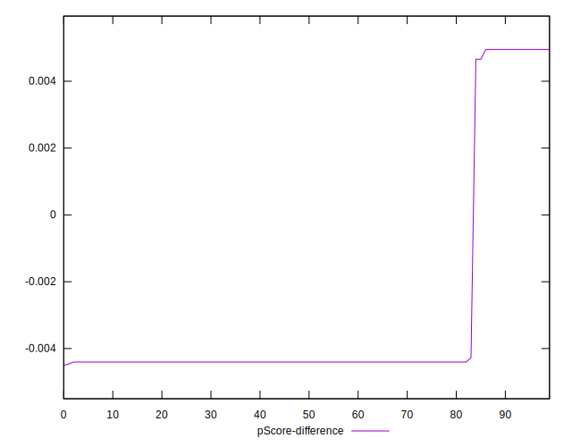

# //cumulative-layout-shift/samples/astro-cached

[→ Parent](../..)


## Raw


```yaml
p90min: 0.113388671875
p90max: 1.580688705444336
p90range: 1.467300033569336
p90mean: 0.3313253134869517
median: 0.113388671875
p90stdev: 0.5209964269349566
mad: 0
stdevBySn: 0
lfitCenter: 0.258780125447567
lfitStdev: 0.32828393737644584
mfitCenter: 0.258780125447567
mfitStdev: 0.41144290018150725
mfitConfidence: 0.041144290018150724
p90skewness: 1.9726010701718297
p90eccentricity: 0.9999999999999991
p90discretization: 18.8
outlandishness: 1.1986258036552622

```


## Score


```yaml
p90min: 0
p90max: 0.87
p90range: 0.87
p90mean: 0.7405319148936164
median: 0.87
p90stdev: 0.30948951455540036
mad: 0
stdevBySn: 0
lfitCenter: 0.7837573325953753
lfitStdev: 0.19473068779969502
mfitCenter: 0.7837573325953753
mfitStdev: 0.24405872423411104
mfitConfidence: 0.024405872423411103
p90skewness: -1.9721703710608312
p90eccentricity: 0.9999999999999988
p90discretization: 31.333333333333332
outlandishness: 0.9511026853348665

```


## Raw Estimate


## Score Estimate


## P Score


```yaml
p90min: 0.004950208675793599
p90max: 0.8655959825000461
p90range: 0.8606457738242526
p90mean: 0.7374212774469175
median: 0.8655959825000461
p90stdev: 0.30639148380636466
mad: 0
stdevBySn: 0
lfitCenter: 0.7802107386289631
lfitStdev: 0.1927917261880859
mfitCenter: 0.7802107386289631
mfitStdev: 0.241628596232124
mfitConfidence: 0.0241628596232124
p90skewness: -1.9721274654983085
p90eccentricity: 1.0000000000000016
p90discretization: 18.8
outlandishness: 0.9514207142936801

```


## Score Difference


```yaml
p90min: 0
p90max: 0
p90range: 0
p90mean: 0
median: 0
p90stdev: 0
mad: 0
stdevBySn: 0
lfitCenter: 0
lfitStdev: 0
mfitCenter: 0
mfitStdev: 0
mfitConfidence: 0
p90skewness: .nan
p90eccentricity: .nan
p90discretization: 94
outlandishness: .nan

```


## P Score Difference


```yaml
p90min: -0.004404017499953894
p90max: 0.004950208675793599
p90range: 0.009354226175747493
p90mean: -0.0031151356338158178
median: -0.004404017499953894
p90stdev: 0.0032135231299943072
mad: 0
stdevBySn: 0
lfitCenter: -0.003547434468879349
lfitStdev: 0.0019491426744109443
mfitCenter: -0.003547434468879349
mfitStdev: 0.0024428880719423174
mfitConfidence: 0.00024428880719423176
p90skewness: 2.0960872095749954
p90eccentricity: 1.0000000000000022
p90discretization: 23.5
outlandishness: 0.8746779878598581

```

