# //cumulative-layout-shift/samples/astro

[→ Parent](../..)


## Raw


```yaml
p90min: 0.113388671875
p90max: 0.11342529296875001
p90range: 0.00003662109375000833
p90mean: 0.11339739860372337
median: 0.113388671875
p90stdev: 0.000014581141483641688
mad: 0
stdevBySn: 0
lfitCenter: 0.11986724233201375
lfitStdev: 0.016148470760640753
mfitCenter: 0.11986724233201375
mfitStdev: 0.020239106720702494
mfitConfidence: 0.0020239106720702496
p90skewness: 1.1828769020053551
p90eccentricity: 0.9999999999999988
p90discretization: 31.333333333333332
outlandishness: 1.2603530633735576

```

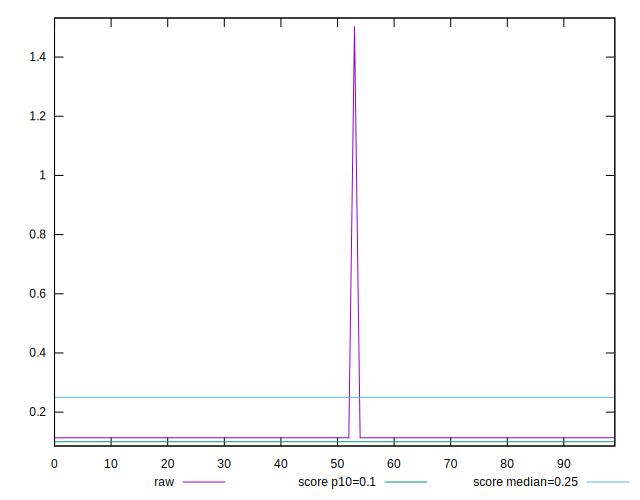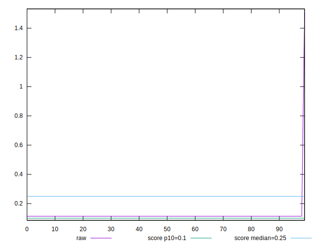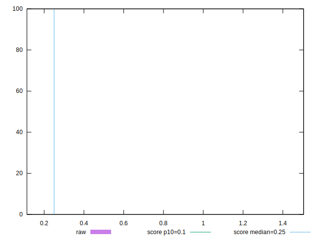
## Score


```yaml
p90min: 0.87
p90max: 0.87
p90range: 0
p90mean: 0.8700000000000002
median: 0.87
p90stdev: 2.220446049250313e-16
mad: 0
stdevBySn: 0
lfitCenter: 0.8659979028368082
lfitStdev: 0.00998508605911641
mfitCenter: 0.8659979028368082
mfitStdev: 0.012514449532795083
mfitConfidence: 0.0012514449532795083
p90skewness: -1
p90eccentricity: 1
p90discretization: 94
outlandishness: 0.9803275994186815

```

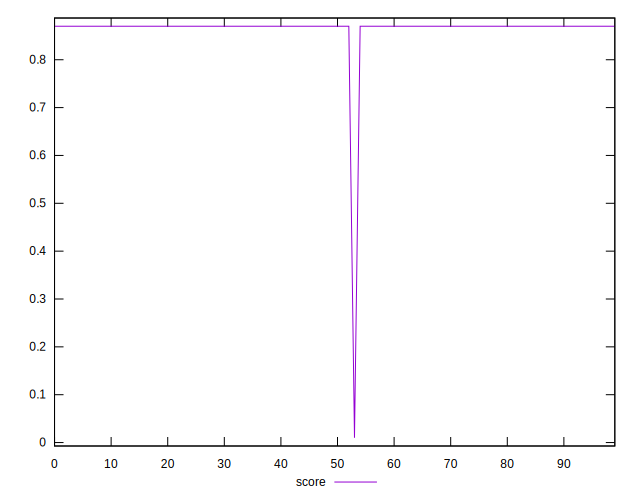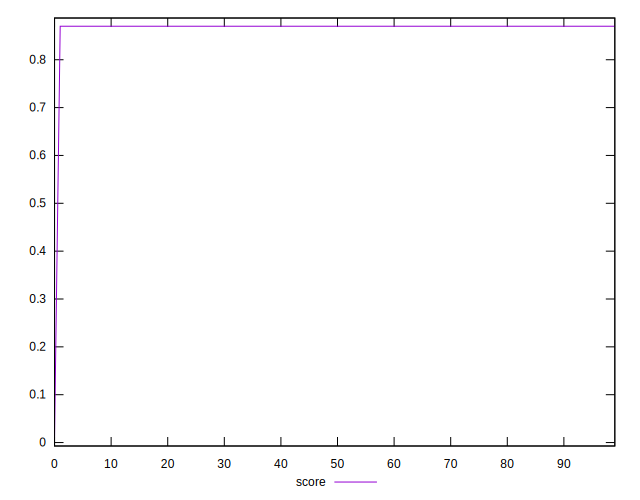
## Raw Estimate

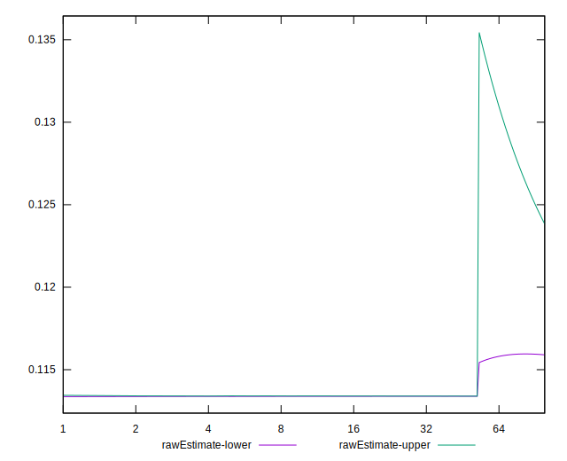
## Score Estimate

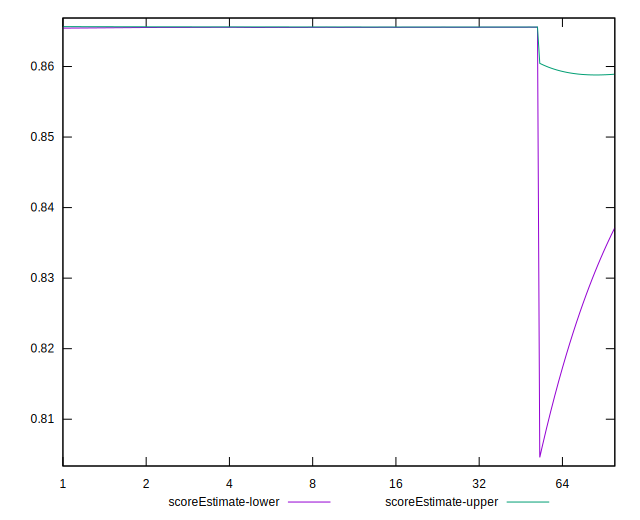
## P Score


```yaml
p90min: 0.8654981956894828
p90max: 0.8655959825000461
p90range: 0.00009778681056327176
p90mean: 0.8655726803093339
median: 0.8655959825000461
p90stdev: 0.00003893484822385215
mad: 0
stdevBySn: 0
lfitCenter: 0.8615796136398929
lfitStdev: 0.009979770948546464
mfitCenter: 0.8615796136398929
mfitStdev: 0.012507788029569672
mfitConfidence: 0.001250778802956967
p90skewness: -1.1828959802835999
p90eccentricity: 1.0000000000000016
p90discretization: 31.333333333333332
outlandishness: 0.9802363010235939

```

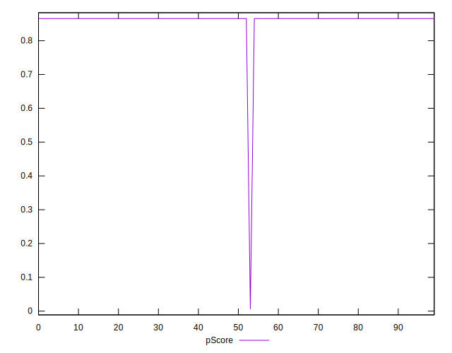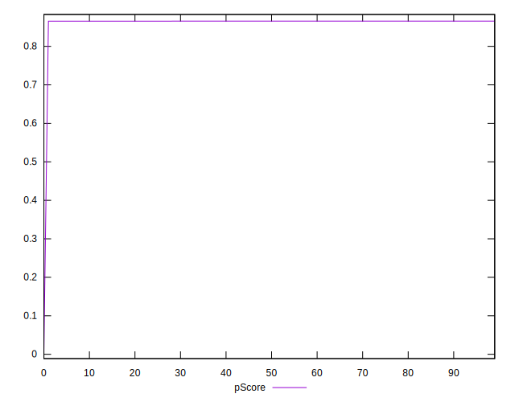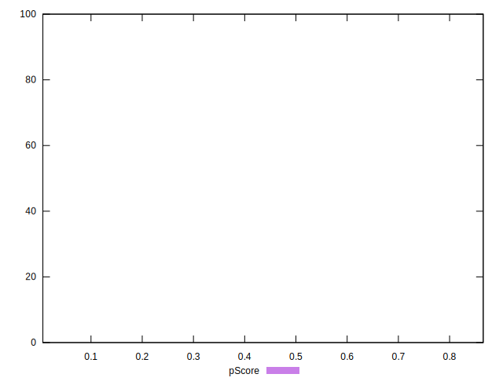
## Score Difference


```yaml
p90min: 0
p90max: 0
p90range: 0
p90mean: 0
median: 0
p90stdev: 0
mad: 0
stdevBySn: 0
lfitCenter: 0
lfitStdev: 0
mfitCenter: 0
mfitStdev: 0
mfitConfidence: 0
p90skewness: .nan
p90eccentricity: .nan
p90discretization: 94
outlandishness: .nan

```


## P Score Difference


```yaml
p90min: -0.004501804310517166
p90max: -0.004404017499953894
p90range: 0.00009778681056327176
p90mean: -0.004426279405446754
median: -0.004404017499953894
p90stdev: 0.00003823082379943597
mad: 0
stdevBySn: 0
lfitCenter: -0.0044178344242830755
lfitStdev: 0.000033053425011857004
mfitCenter: -0.0044178344242830755
mfitStdev: 0.00004142632489574307
mfitConfidence: 0.0000041426324895743065
p90skewness: -1.2500254236321797
p90eccentricity: 0.9999999999999987
p90discretization: 31.333333333333332
outlandishness: 0.9987280439673416

```

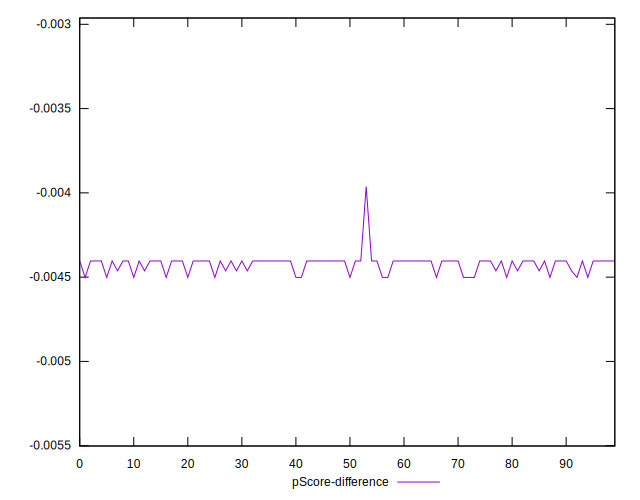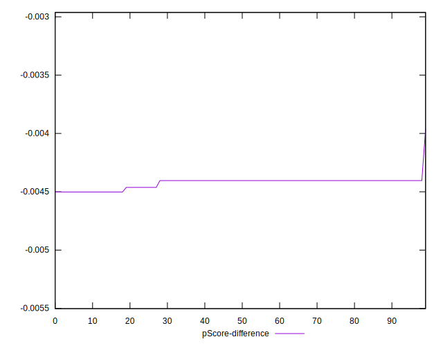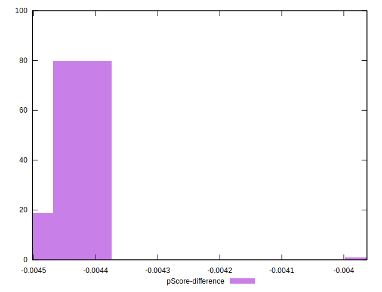