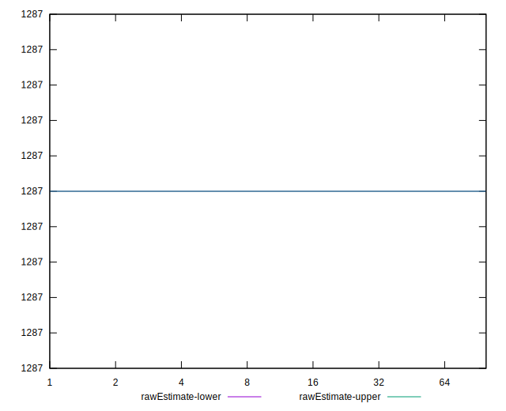

# //dom-size/samples/astro-cached

[→ Parent](../..)


## Raw


```yaml
p90min: 1287
p90max: 1287
p90range: 0
p90mean: 1287
median: 1287
p90stdev: 0
mad: 0
stdevBySn: 0
lfitCenter: 1287
lfitStdev: 0
mfitCenter: 1287
mfitStdev: 0
mfitConfidence: 0
p90skewness: .nan
p90eccentricity: .nan
p90discretization: 94
outlandishness: 1

```


## Score


```yaml
p90min: 0.58
p90max: 0.58
p90range: 0
p90mean: 0.5799999999999988
median: 0.58
p90stdev: 1.1102230246251565e-15
mad: 0
stdevBySn: 0
lfitCenter: 0.5799999999999987
lfitStdev: 0
mfitCenter: 0.5799999999999987
mfitStdev: 0
mfitConfidence: 0
p90skewness: 1
p90eccentricity: 1
p90discretization: 94
outlandishness: 0.9999999999999996

```


## Raw Estimate


## Score Estimate


## P Score


```yaml
p90min: 0.579536319721314
p90max: 0.579536319721314
p90range: 0
p90mean: 0.5795363197213136
median: 0.579536319721314
p90stdev: 4.440892098500626e-16
mad: 0
stdevBySn: 0
lfitCenter: 0.5795363197213136
lfitStdev: 0
mfitCenter: 0.5795363197213136
mfitStdev: 0
mfitConfidence: 0
p90skewness: 1
p90eccentricity: 1
p90discretization: 94
outlandishness: 1

```


## Score Difference


```yaml
p90min: 0
p90max: 0
p90range: 0
p90mean: 0
median: 0
p90stdev: 0
mad: 0
stdevBySn: 0
lfitCenter: 0
lfitStdev: 0
mfitCenter: 0
mfitStdev: 0
mfitConfidence: 0
p90skewness: .nan
p90eccentricity: .nan
p90discretization: 94
outlandishness: .nan

```


## P Score Difference


```yaml
p90min: -0.00046368027868592954
p90max: -0.00046368027868592954
p90range: 0
p90mean: -0.00046368027868592954
median: -0.00046368027868592954
p90stdev: 0
mad: 0
stdevBySn: 0
lfitCenter: -0.00046368027868592954
lfitStdev: 0
mfitCenter: -0.00046368027868592954
mfitStdev: 0
mfitConfidence: 0
p90skewness: .nan
p90eccentricity: .nan
p90discretization: 94
outlandishness: 1

```

