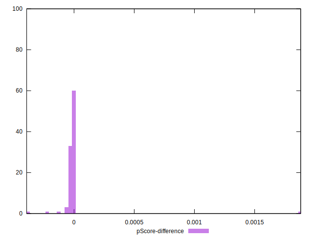

# //estimated-input-latency/samples/astro-cached

[→ Parent](../..)


## Raw


```yaml
p90min: 14
p90max: 21.200000000000003
p90range: 7.200000000000003
p90mean: 16.671205673758866
median: 16.6
p90stdev: 1.3775567547453869
mad: 1.1999999999999993
stdevBySn: 1.6696400000000027
lfitCenter: 16.75025496177618
lfitStdev: 1.3525048666539727
mfitCenter: 16.75025496177618
mfitStdev: 1.6951134718711347
mfitConfidence: 0.16951134718711347
p90skewness: 0.4246487649133635
p90eccentricity: 0.9999999999999997
p90discretization: 3.2413793103448274
outlandishness: 1.0284795516568856

```


## Score


```yaml
p90min: 1
p90max: 1
p90range: 0
p90mean: 1
median: 1
p90stdev: 0
mad: 0
stdevBySn: 0
lfitCenter: 0.9999534639864746
lfitStdev: 0.00011610565185013966
mfitCenter: 0.9999534639864746
mfitStdev: 0.00014551685503243686
mfitConfidence: 0.000014551685503243686
p90skewness: .nan
p90eccentricity: .nan
p90discretization: 94
outlandishness: 0.9998000099999999

```


## Raw Estimate


## Score Estimate


## P Score


```yaml
p90min: 0.999868516676541
p90max: 0.9999981301812194
p90range: 0.00012961350467843857
p90mean: 0.999982891760311
median: 0.9999880351195085
p90stdev: 0.0000174895491973553
mad: 0.000007482522165647154
stdevBySn: 0.00001081318496187187
lfitCenter: 0.9999444970504655
lfitStdev: 0.00010124222475772388
mfitCenter: 0.9999444970504655
mfitStdev: 0.0001268883117098091
mfitConfidence: 0.000012688831170980911
p90skewness: -3.480333135699152
p90eccentricity: 0.9999999999999994
p90discretization: 3.2413793103448274
outlandishness: 0.9998274304674113

```


## Score Difference


```yaml
p90min: 0
p90max: 0
p90range: 0
p90mean: 0
median: 0
p90stdev: 0
mad: 0
stdevBySn: 0
lfitCenter: 0
lfitStdev: 0
mfitCenter: 0
mfitStdev: 0
mfitConfidence: 0
p90skewness: .nan
p90eccentricity: .nan
p90discretization: 94
outlandishness: .nan

```


## P Score Difference


```yaml
p90min: -0.00006306789655829981
p90max: -0.000001676979485276675
p90range: 0.00006139091707302313
p90mean: -0.000015727321135928383
median: -0.000011964880491488472
p90stdev: 0.000012936152187482739
mad: 0.000007482522165647154
stdevBySn: 0.00001081318496187187
lfitCenter: -0.000008674714455333393
lfitStdev: 0.00002466504109772027
mfitCenter: -0.000008674714455333393
mfitStdev: 0.00003091304473634666
mfitConfidence: 0.000003091304473634666
p90skewness: -1.5514824183182114
p90eccentricity: 1.0000000000000002
p90discretization: 3.2413793103448274
outlandishness: 0.04660523145266653

```

