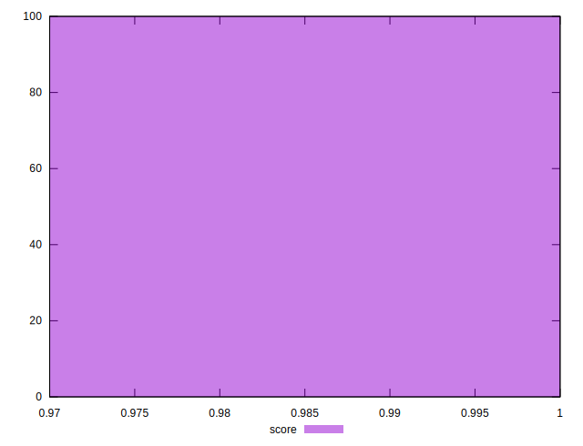

# //estimated-input-latency/samples/astro-inner-cached

[→ Parent](../..)


## Raw


```yaml
p90min: 12.8
p90max: 12.8
p90range: 0
p90mean: 12.799999999999976
median: 12.8
p90stdev: 2.4868995751603507e-14
mad: 0
stdevBySn: 0
lfitCenter: 12.990057735127085
lfitStdev: 0.4695740403835228
mfitCenter: 12.990057735127085
mfitStdev: 0.5885237839212264
mfitConfidence: 0.05885237839212264
p90skewness: 1
p90eccentricity: 1
p90discretization: 94
outlandishness: 1.0643361111111116

```


## Score


```yaml
p90min: 1
p90max: 1
p90range: 0
p90mean: 1
median: 1
p90stdev: 0
mad: 0
stdevBySn: 0
lfitCenter: 0.9998603919594237
lfitStdev: 0.000348316955550419
mfitCenter: 0.9998603919594237
mfitStdev: 0.0004365505650973106
mfitConfidence: 0.00004365505650973106
p90skewness: .nan
p90eccentricity: .nan
p90discretization: 94
outlandishness: 0.9994000900000001

```


## Raw Estimate


## Score Estimate


## P Score


```yaml
p90min: 0.9999993380488856
p90max: 0.9999993380488856
p90range: 0
p90mean: 0.9999993380488849
median: 0.9999993380488856
p90stdev: 7.771561172376096e-16
mad: 0
stdevBySn: 0
lfitCenter: 0.9998532977846271
lfitStdev: 0.00036403683475310804
mfitCenter: 0.9998532977846271
mfitStdev: 0.0004562525119587576
mfitConfidence: 0.00004562525119587576
p90skewness: 1
p90eccentricity: 1
p90discretization: 94
outlandishness: 0.9993724733318395

```


## Score Difference


```yaml
p90min: 0
p90max: 0
p90range: 0
p90mean: 0
median: 0
p90stdev: 0
mad: 0
stdevBySn: 0
lfitCenter: 0
lfitStdev: 0
mfitCenter: 0
mfitStdev: 0
mfitConfidence: 0
p90skewness: .nan
p90eccentricity: .nan
p90discretization: 94
outlandishness: .nan

```


## P Score Difference


```yaml
p90min: -6.619511143668433e-7
p90max: -6.619511143668433e-7
p90range: 0
p90mean: -6.619511143668433e-7
median: -6.619511143668433e-7
p90stdev: 0
mad: 0
stdevBySn: 0
lfitCenter: -0.000007094174796449829
lfitStdev: 0.000015892040705560473
mfitCenter: -0.000007094174796449829
mfitStdev: 0.000019917719307114393
mfitConfidence: 0.0000019917719307114392
p90skewness: .nan
p90eccentricity: .nan
p90discretization: 94
outlandishness: 478.1281373882917

```

