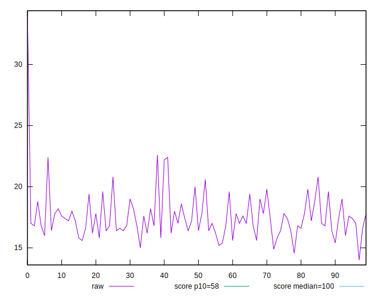
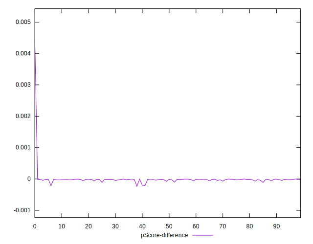

# //estimated-input-latency/samples/astro

[→ Parent](../..)


## Raw


```yaml
p90min: 15
p90max: 22.400000000000002
p90range: 7.400000000000002
p90mean: 17.43617021276595
median: 17
p90stdev: 1.4763274635182684
mad: 0.8000000000000007
stdevBySn: 1.4311199999999993
lfitCenter: 17.4044446625625
lfitStdev: 1.2300050612660656
mfitCenter: 17.4044446625625
mfitStdev: 1.541582733805584
mfitConfidence: 0.1541582733805584
p90skewness: 1.1190569953205345
p90eccentricity: 0.9999999999999999
p90discretization: 3.032258064516129
outlandishness: 1.0205481712397586

```


## Score


```yaml
p90min: 1
p90max: 1
p90range: 0
p90mean: 1
median: 1
p90stdev: 0
mad: 0
stdevBySn: 0
lfitCenter: 0.9999534639864746
lfitStdev: 0.00011610565185013966
mfitCenter: 0.9999534639864746
mfitStdev: 0.00014551685503243686
mfitConfidence: 0.000014551685503243686
p90skewness: .nan
p90eccentricity: .nan
p90discretization: 94
outlandishness: 0.9998000100000003

```


## Raw Estimate


## Score Estimate


## P Score


```yaml
p90min: 0.9997840365345585
p90max: 0.9999959602767624
p90range: 0.0002119237422039122
p90mean: 0.9999718133993513
median: 0.9999846798886523
p90stdev: 0.0000345602886325415
mad: 0.0000072037420644210926
stdevBySn: 0.000010625387974068024
lfitCenter: 0.9999490906501609
lfitStdev: 0.00007669418685712571
mfitCenter: 0.9999490906501609
mfitStdev: 0.00009612190873467424
mfitConfidence: 0.000009612190873467424
p90skewness: -3.426491732322277
p90eccentricity: 0.9999999999999984
p90discretization: 3.357142857142857
outlandishness: 0.9998827518356879

```


## Score Difference


```yaml
p90min: 0
p90max: 0
p90range: 0
p90mean: 0
median: 0
p90stdev: 0
mad: 0
stdevBySn: 0
lfitCenter: 0
lfitStdev: 0
mfitCenter: 0
mfitStdev: 0
mfitConfidence: 0
p90skewness: .nan
p90eccentricity: .nan
p90discretization: 94
outlandishness: .nan

```


## P Score Difference


```yaml
p90min: -0.00019940913804816773
p90max: -0.0000036980119977325643
p90range: 0.00019571112605043517
p90mean: -0.000025928457527636467
median: -0.000015320111347749688
p90stdev: 0.00002864587304270076
mad: 0.0000072037420644210926
stdevBySn: 0.000010625387974068024
lfitCenter: -0.000004004628222060381
lfitStdev: 0.000051724490769433415
mfitCenter: -0.000004004628222060381
mfitStdev: 0.00006482703559200772
mfitConfidence: 0.000006482703559200772
p90skewness: -3.251062478085532
p90eccentricity: 1.000000000000001
p90discretization: 3.357142857142857
outlandishness: 0.25875390588876496

```

