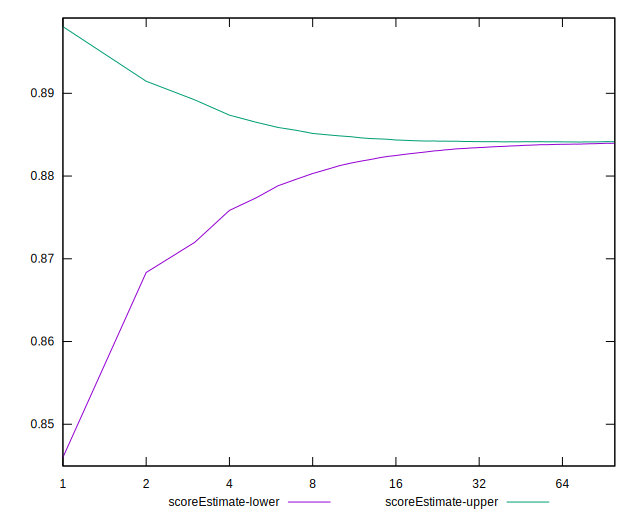
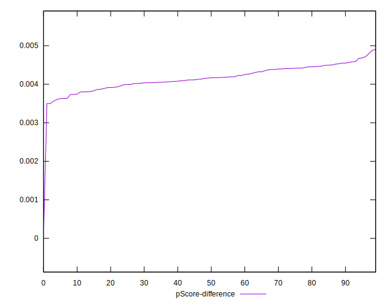

# //first-contentful-paint/samples/astro-cached

[→ Parent](../..)


## Raw


```yaml
p90min: 2418.455
p90max: 2424.463
p90range: 6.008000000000266
p90mean: 2421.308070212766
median: 2421.337
p90stdev: 1.4270100352142003
mad: 1.2404999999998836
stdevBySn: 1.7510349499998787
lfitCenter: 2421.842773225654
lfitStdev: 2.0101586027166976
mfitCenter: 2421.842773225654
mfitStdev: 2.5193601975662965
mfitConfidence: 0.25193601975662966
p90skewness: 0.15416212327850579
p90eccentricity: 0.9999999999999997
p90discretization: 1.010752688172043
outlandishness: 1.0009594766552712

```


## Score


```yaml
p90min: 0.88
p90max: 0.88
p90range: 0
p90mean: 0.8799999999999998
median: 0.88
p90stdev: 2.220446049250313e-16
mad: 0
stdevBySn: 0
lfitCenter: 0.879906927972949
lfitStdev: 0.00023221130370041715
mfitCenter: 0.879906927972949
mfitStdev: 0.0002910337100650464
mfitConfidence: 0.00002910337100650464
p90skewness: 1
p90eccentricity: 1
p90discretization: 94
outlandishness: 0.9995455061983466

```


## Raw Estimate


## Score Estimate


## P Score


```yaml
p90min: 0.883562547733922
p90max: 0.8847161436067641
p90range: 0.0011535958728421392
p90mean: 0.8841688364520459
median: 0.8841634315234659
p90stdev: 0.00027399177230728807
mad: 0.00023805352875477803
stdevBySn: 0.00033652167355623845
lfitCenter: 0.8840614884240644
lfitStdev: 0.0003941258956320667
mfitCenter: 0.8840614884240644
mfitStdev: 0.0004939635573748498
mfitConfidence: 0.000049396355737484974
p90skewness: -0.15625149025490262
p90eccentricity: 0.9999999999999996
p90discretization: 1.010752688172043
outlandishness: 0.9994726919082257

```


## Score Difference


```yaml
p90min: 0
p90max: 0
p90range: 0
p90mean: 0
median: 0
p90stdev: 0
mad: 0
stdevBySn: 0
lfitCenter: 0
lfitStdev: 0
mfitCenter: 0
mfitStdev: 0
mfitConfidence: 0
p90skewness: .nan
p90eccentricity: .nan
p90discretization: 94
outlandishness: .nan

```


## P Score Difference


```yaml
p90min: 0.0035625477339219502
p90max: 0.004716143606764089
p90range: 0.0011535958728421392
p90mean: 0.004168836452045821
median: 0.004163431523465877
p90stdev: 0.00027399177230728807
mad: 0.00023805352875477803
stdevBySn: 0.00033652167355623845
lfitCenter: 0.004154560451115361
lfitStdev: 0.000253799348923474
mfitCenter: 0.004154560451115361
mfitStdev: 0.0003180903123673355
mfitConfidence: 0.00003180903123673355
p90skewness: -0.15625149026244323
p90eccentricity: 1
p90discretization: 1.010752688172043
outlandishness: 0.984161688973729

```

