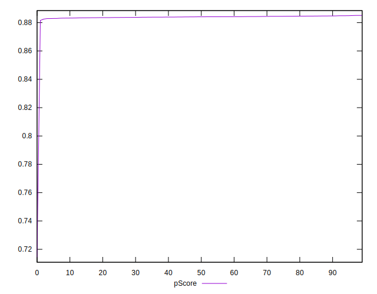

# //first-contentful-paint/samples/astro-inner-cached

[→ Parent](../..)


## Raw


```yaml
p90min: 2416.865
p90max: 2428.044
p90range: 11.179000000000087
p90mean: 2421.9240531914893
median: 2421.4995499999995
p90stdev: 2.691546333596017
mad: 2.2024999999998727
stdevBySn: 3.0349284799998757
lfitCenter: 2425.280177985984
lfitStdev: 8.888236521226576
mfitCenter: 2425.280177985984
mfitStdev: 11.139752499066502
mfitConfidence: 1.1139752499066502
p90skewness: 0.29047537032905896
p90eccentricity: 1
p90discretization: 1.010752688172043
outlandishness: 1.0060938897662624

```


## Score


```yaml
p90min: 0.88
p90max: 0.89
p90range: 0.010000000000000009
p90mean: 0.8801063829787233
median: 0.88
p90stdev: 0.0010259202937226563
mad: 0
stdevBySn: 0
lfitCenter: 0.8794026353734842
lfitStdev: 0.0019760561179411715
mfitCenter: 0.8794026353734842
mfitStdev: 0.002476619071236535
mfitConfidence: 0.0002476619071236535
p90skewness: 9.539955591520082
p90eccentricity: 0.9999999999999989
p90discretization: 47
outlandishness: 0.9968066149104448

```


## Raw Estimate


## Score Estimate


## P Score


```yaml
p90min: 0.882872447085301
p90max: 0.8850205523166164
p90range: 0.002148105231315367
p90mean: 0.8840501657245133
median: 0.8841322212736524
p90stdev: 0.0005171413636488777
mad: 0.00042290167048625316
stdevBySn: 0.0005826504212148644
lfitCenter: 0.8832702432711811
lfitStdev: 0.002022979705780911
mfitCenter: 0.8832702432711811
mfitStdev: 0.0025354290673088235
mfitConfidence: 0.0002535429067308824
p90skewness: -0.29437783534055717
p90eccentricity: 0.9999999999999999
p90discretization: 1.010752688172043
outlandishness: 0.9961433854069912

```


## Score Difference


```yaml
p90min: 0
p90max: 0
p90range: 0
p90mean: 0
median: 0
p90stdev: 0
mad: 0
stdevBySn: 0
lfitCenter: 0
lfitStdev: 0
mfitCenter: 0
mfitStdev: 0
mfitConfidence: 0
p90skewness: .nan
p90eccentricity: .nan
p90discretization: 94
outlandishness: .nan

```


## P Score Difference


```yaml
p90min: -0.004896804712235414
p90max: 0.004878158331743765
p90range: 0.009774963043979179
p90mean: 0.003877005414412805
median: 0.004073850761763365
p90stdev: 0.0010709552741660045
mad: 0.00041168468502550404
stdevBySn: 0.0005742313179776171
lfitCenter: 0.003838241670158518
lfitStdev: 0.000692524509001754
mfitCenter: 0.003838241670158518
mfitStdev: 0.0008679507584427426
mfitConfidence: 0.00008679507584427426
p90skewness: -5.9347012120476235
p90eccentricity: 1
p90discretization: 1.010752688172043
outlandishness: 0.8833156038185854

```

