# //first-contentful-paint/samples/astro-inner

[→ Parent](../..)


## Raw


```yaml
p90min: 2557.806
p90max: 2602.432
p90range: 44.62599999999975
p90mean: 2575.4247861702124
median: 2573.5175
p90stdev: 12.499161426898207
mad: 9.046100000000251
stdevBySn: 14.34775318999991
lfitCenter: 2574.9931307989127
lfitStdev: 10.404883753431456
mfitCenter: 2574.9931307989127
mfitStdev: 13.040587918422004
mfitConfidence: 1.3040587918422004
p90skewness: 0.46754567651808143
p90eccentricity: 1.0000000000000002
p90discretization: 1
outlandishness: 1.0003112706055357

```

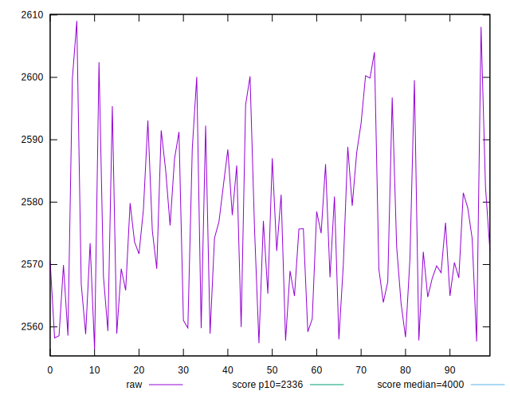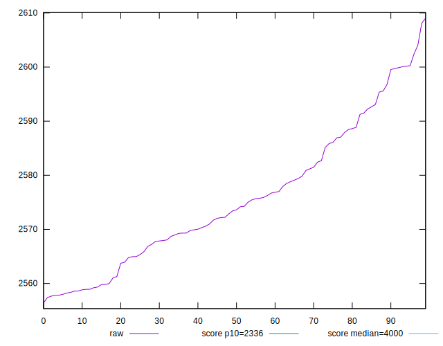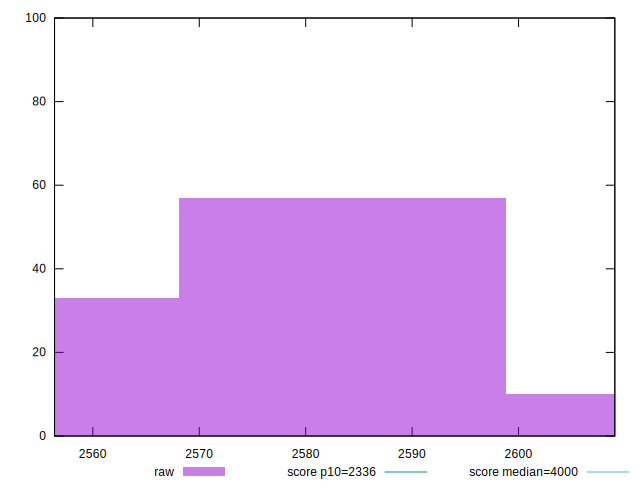
## Score


```yaml
p90min: 0.85
p90max: 0.86
p90range: 0.010000000000000009
p90mean: 0.8524468085106381
median: 0.85
p90stdev: 0.004298978159824845
mad: 0
stdevBySn: 0
lfitCenter: 0.8517466650554877
lfitStdev: 0.003613508134263044
mfitCenter: 0.8517466650554877
mfitStdev: 0.004528860834533562
mfitConfidence: 0.0004528860834533562
p90skewness: 1.1878131939457293
p90eccentricity: 1.0000000000000002
p90discretization: 47
outlandishness: 1.0003594482440379

```

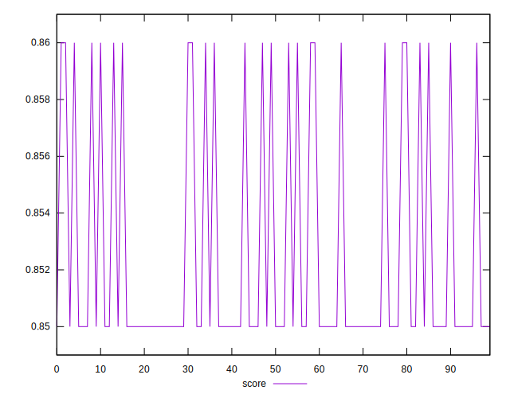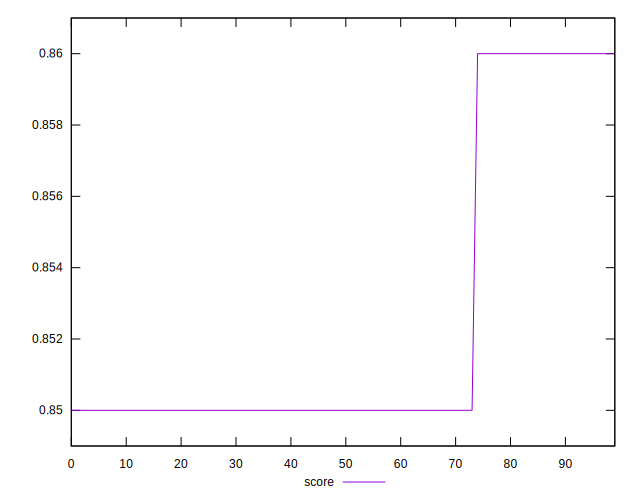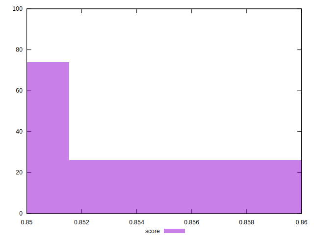
## Raw Estimate

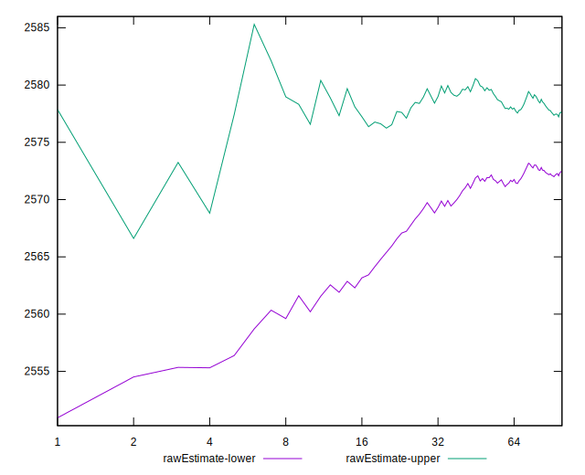
## Score Estimate

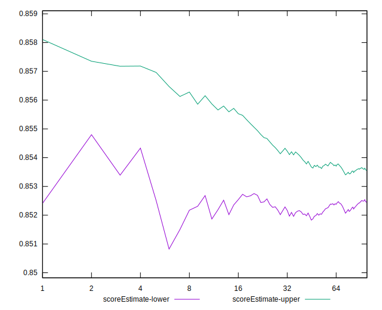
## P Score


```yaml
p90min: 0.8471304350738025
p90max: 0.8566561751807902
p90range: 0.009525740106987701
p90mean: 0.8529150332774431
median: 0.8533305083563791
p90stdev: 0.0026653777498595733
mad: 0.0019287500501590782
stdevBySn: 0.0030571870190448836
lfitCenter: 0.8530091939744172
lfitStdev: 0.002217584242334608
mfitCenter: 0.8530091939744172
mfitStdev: 0.002779329684402726
mfitConfidence: 0.0002779329684402726
p90skewness: -0.4788625489990852
p90eccentricity: 1.0000000000000004
p90discretization: 1
outlandishness: 0.9997954972071275

```

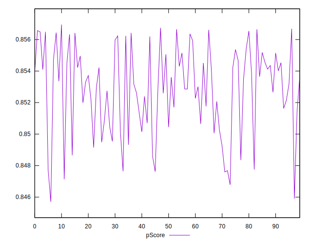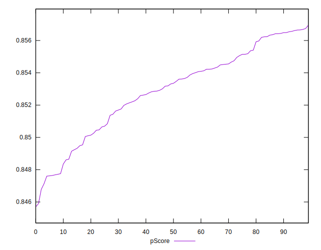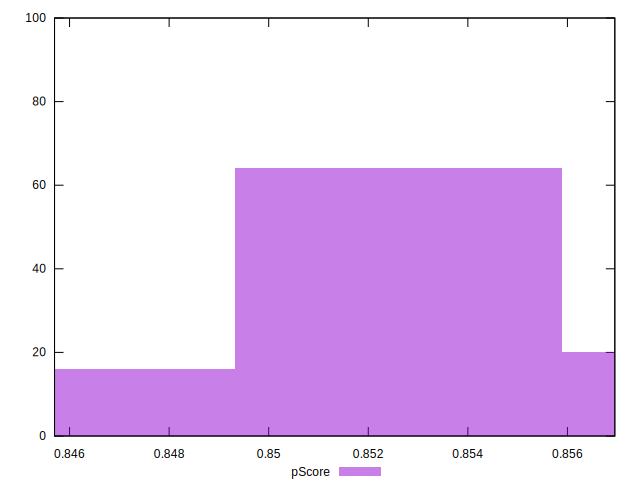
## Score Difference


```yaml
p90min: 0
p90max: 0
p90range: 0
p90mean: 0
median: 0
p90stdev: 0
mad: 0
stdevBySn: 0
lfitCenter: 0
lfitStdev: 0
mfitCenter: 0
mfitStdev: 0
mfitConfidence: 0
p90skewness: .nan
p90eccentricity: .nan
p90discretization: 94
outlandishness: .nan

```


## P Score Difference


```yaml
p90min: -0.004817038391064066
p90max: 0.004550571420482097
p90range: 0.009367609811546163
p90mean: 0.000245296406729598
median: 0.0005559889442640631
p90stdev: 0.0030940905027093558
mad: 0.003074024992461344
stdevBySn: 0.003958323992128981
lfitCenter: 0.00031271833475349405
lfitStdev: 0.0029983944285638187
mfitCenter: 0.00031271833475349405
mfitStdev: 0.003757930130348454
mfitConfidence: 0.00037579301303484536
p90skewness: -0.1336116065977225
p90eccentricity: 1
p90discretization: 1
outlandishness: 0.8625616242080685

```

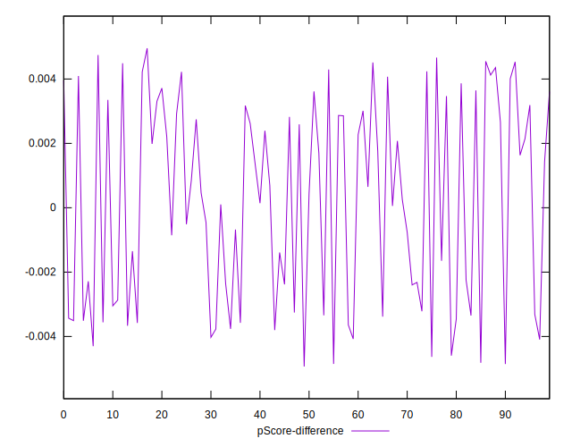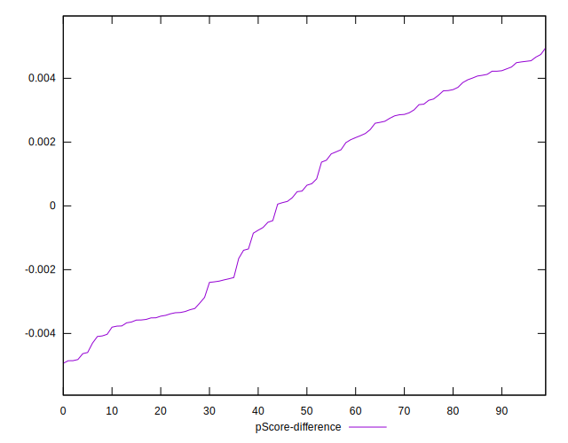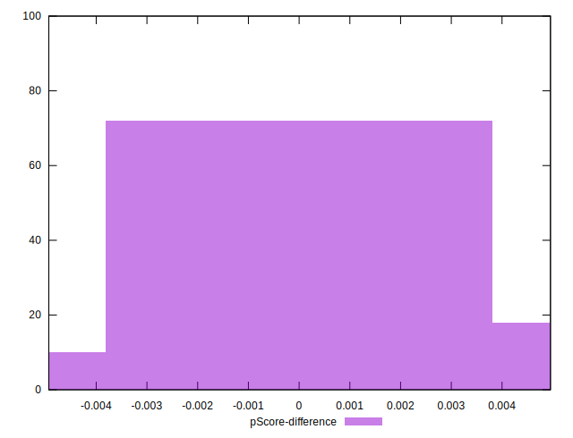