# //first-contentful-paint/samples/astro

[→ Parent](../..)


## Raw


```yaml
p90min: 2533.124
p90max: 2559.916
p90range: 26.79200000000037
p90mean: 2547.137287234043
median: 2549.7834999999995
p90stdev: 8.604817906541125
mad: 8.20450000000028
stdevBySn: 10.563752649999877
lfitCenter: 2547.2633101166775
lfitStdev: 9.22817424589944
mfitCenter: 2547.2633101166775
mfitStdev: 11.565801255634575
mfitConfidence: 1.1565801255634576
p90skewness: -0.0781672626920935
p90eccentricity: 1.0000000000000002
p90discretization: 1
outlandishness: 0.9999920874197409

```

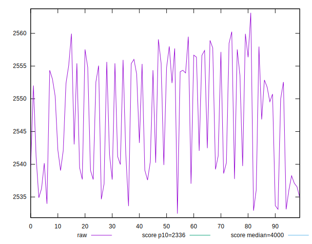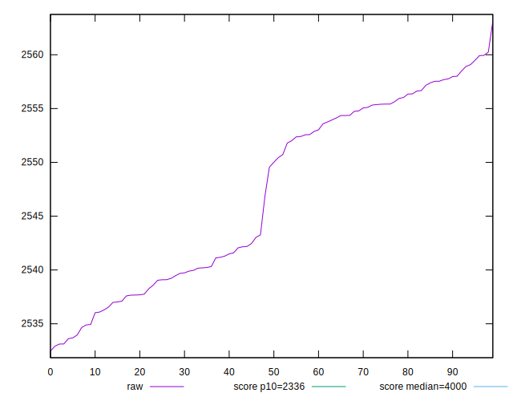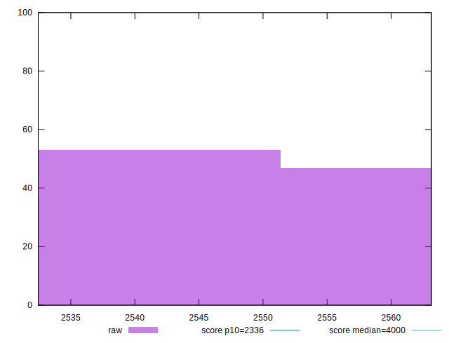
## Score


```yaml
p90min: 0.86
p90max: 0.86
p90range: 0
p90mean: 0.8599999999999995
median: 0.86
p90stdev: 4.440892098500626e-16
mad: 0
stdevBySn: 0
lfitCenter: 0.8599999999999995
lfitStdev: 0
mfitCenter: 0.8599999999999995
mfitStdev: 0
mfitConfidence: 0
p90skewness: 1
p90eccentricity: 1
p90discretization: 94
outlandishness: 1

```

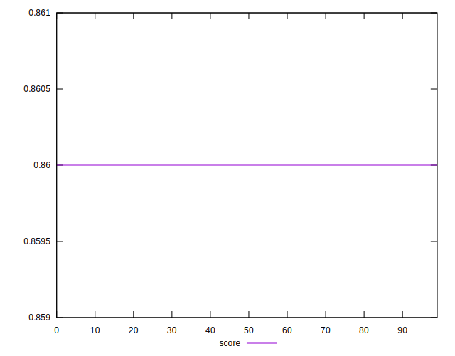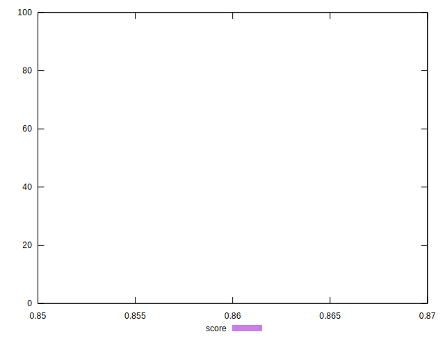
## Raw Estimate

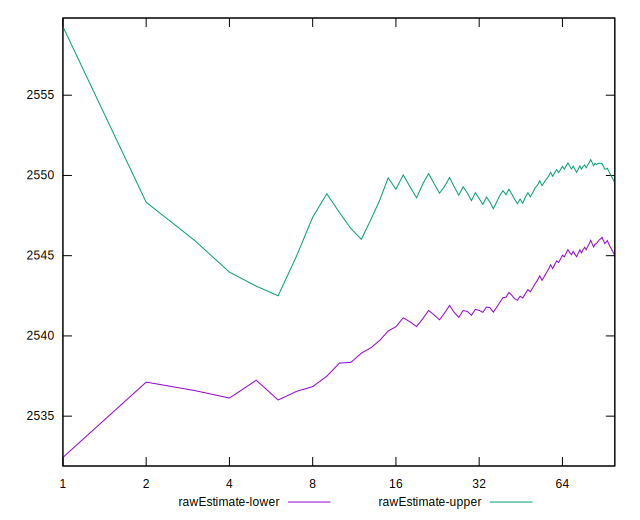
## Score Estimate

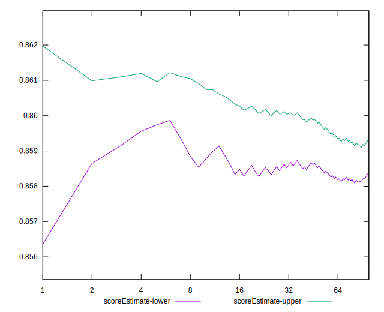
## P Score


```yaml
p90min: 0.8562113548897048
p90max: 0.8618172302370732
p90range: 0.00560587534736845
p90mean: 0.8588918798011964
median: 0.85834227437721
p90stdev: 0.001800775805196296
mad: 0.0017243400274351561
stdevBySn: 0.0022007300837675312
lfitCenter: 0.8588662380139003
lfitStdev: 0.0019313945876719347
mfitCenter: 0.8588662380139003
mfitStdev: 0.0024206441438996322
mfitConfidence: 0.0002420644143899632
p90skewness: 0.07529600778968425
p90eccentricity: 1.0000000000000002
p90discretization: 1
outlandishness: 1.0000037732751133

```

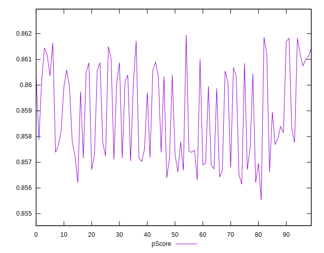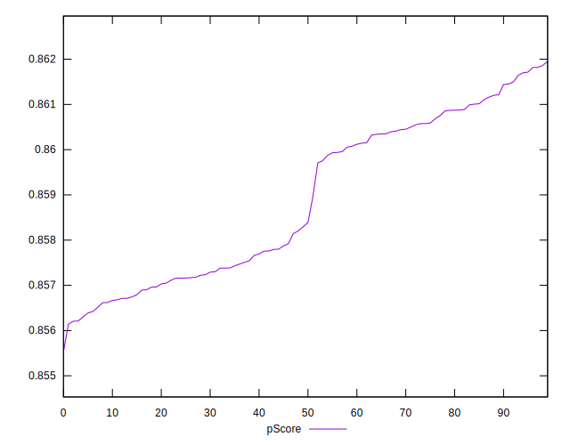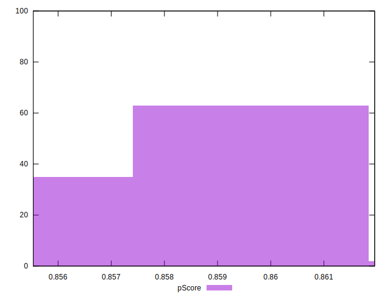
## Score Difference


```yaml
p90min: 0
p90max: 0
p90range: 0
p90mean: 0
median: 0
p90stdev: 0
mad: 0
stdevBySn: 0
lfitCenter: 0
lfitStdev: 0
mfitCenter: 0
mfitStdev: 0
mfitConfidence: 0
p90skewness: .nan
p90eccentricity: .nan
p90discretization: 94
outlandishness: .nan

```


## P Score Difference


```yaml
p90min: -0.003788645110295197
p90max: 0.001817230237073253
p90range: 0.00560587534736845
p90mean: -0.0011081201988038148
median: -0.0016577256227899295
p90stdev: 0.0018007758051962965
mad: 0.0017243400274352116
stdevBySn: 0.0022007300837675312
lfitCenter: -0.0011337619860999463
lfitStdev: 0.001931394587671923
mfitCenter: -0.0011337619860999463
mfitStdev: 0.0024206441438996175
mfitConfidence: 0.00024206441438996175
p90skewness: 0.07529600779063847
p90eccentricity: 0.9999999999999999
p90discretization: 1
outlandishness: 0.9970775167270981

```

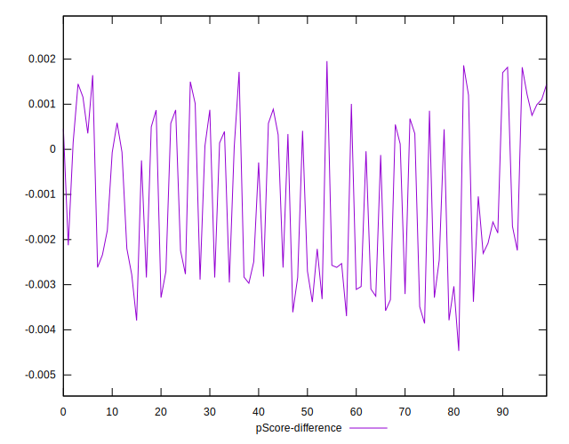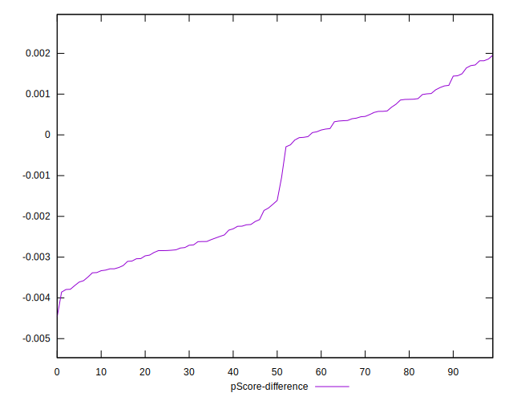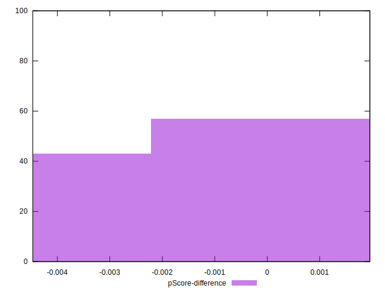