# //first-cpu-idle/samples/astro-cached

[→ Parent](../..)


## Raw


```yaml
p90min: 6311.381499999998
p90max: 6823.619999999999
p90range: 512.2385000000013
p90mean: 6731.903088297873
median: 6794.726000000001
p90stdev: 166.09473586990123
mad: 9.049999999999272
stdevBySn: 16.87648259999981
lfitCenter: 6756.234950931978
lfitStdev: 104.72289223104404
mfitCenter: 6756.234950931978
mfitStdev: 131.2506814658051
mfitConfidence: 13.125068146580508
p90skewness: -2.0801188772114507
p90eccentricity: 0.9999999999999997
p90discretization: 1.010752688172043
outlandishness: 0.9990375534504877

```

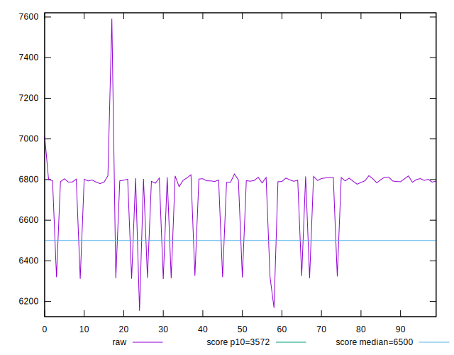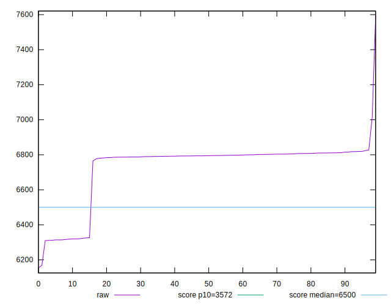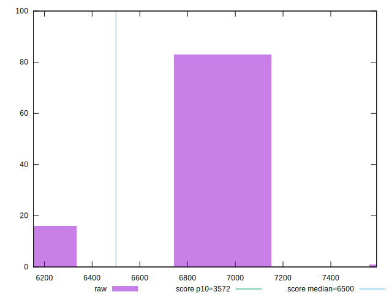
## Score


```yaml
p90min: 0.46
p90max: 0.53
p90range: 0.07
p90mean: 0.4686170212765963
median: 0.46
p90stdev: 0.021268349465803582
mad: 0
stdevBySn: 0
lfitCenter: 0.4654630774221201
lfitStdev: 0.013624639858433731
mfitCenter: 0.4654630774221201
mfitStdev: 0.017075953767589802
mfitConfidence: 0.0017075953767589803
p90skewness: 2.1050416367136005
p90eccentricity: 1
p90discretization: 23.5
outlandishness: 1.0033444488759418

```

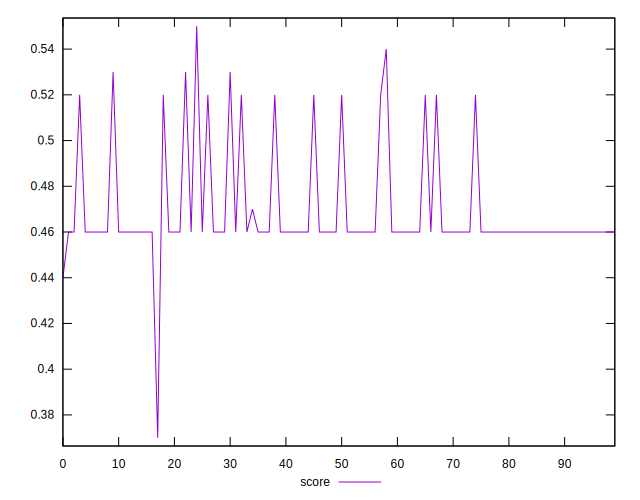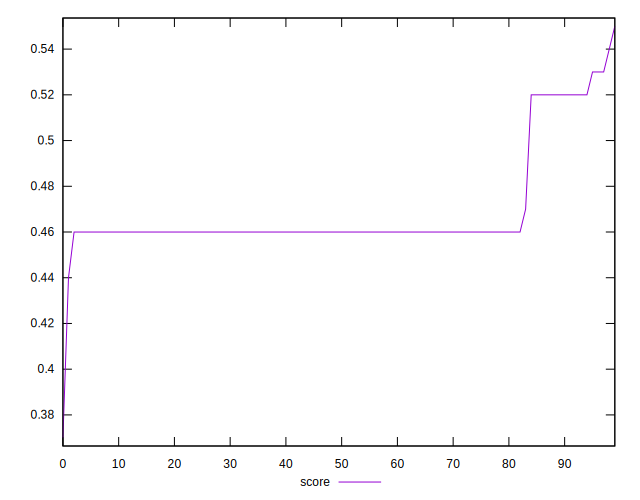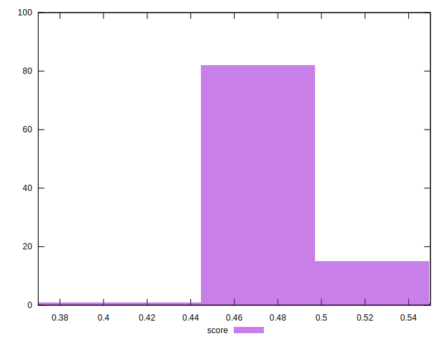
## Raw Estimate

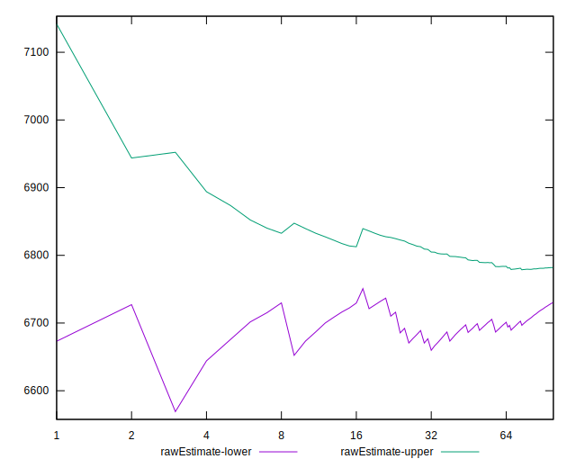
## Score Estimate

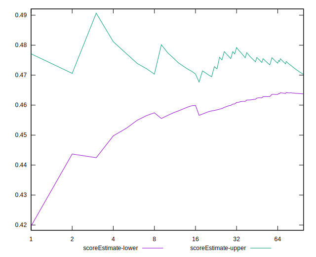
## P Score


```yaml
p90min: 0.45858090769715215
p90max: 0.5251314351693982
p90range: 0.06655052747224605
p90mean: 0.4703807622841415
median: 0.4621868381319947
p90stdev: 0.0216093139016049
mad: 0.001131422801843196
stdevBySn: 0.0021103724527861425
lfitCenter: 0.467278113068664
lfitStdev: 0.013634934517449435
mfitCenter: 0.467278113068664
mfitStdev: 0.017088856209286008
mfitConfidence: 0.001708885620928601
p90skewness: 2.081367570563457
p90eccentricity: 1.0000000000000002
p90discretization: 1.010752688172043
outlandishness: 1.0024356799552328

```

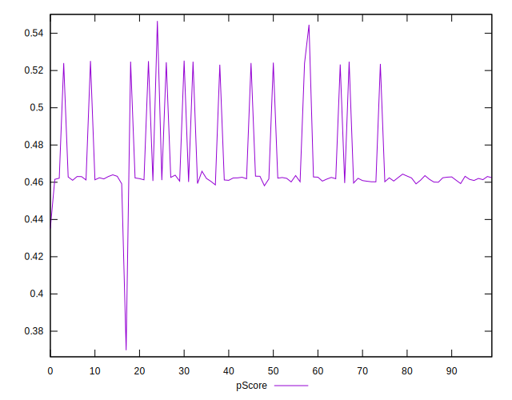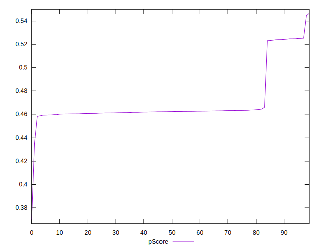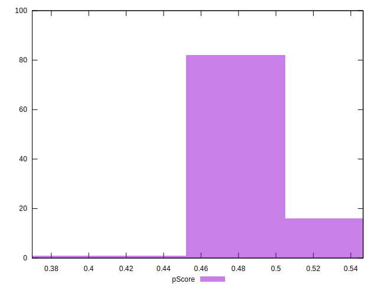
## Score Difference


```yaml
p90min: 0
p90max: 0
p90range: 0
p90mean: 0
median: 0
p90stdev: 0
mad: 0
stdevBySn: 0
lfitCenter: 2.583267684513104e-19
lfitStdev: 6.445158398659724e-19
mfitCenter: 2.583267684513104e-19
mfitStdev: 8.077808146406197e-19
mfitConfidence: 8.077808146406197e-20
p90skewness: .nan
p90eccentricity: .nan
p90discretization: 94
outlandishness: .inf

```

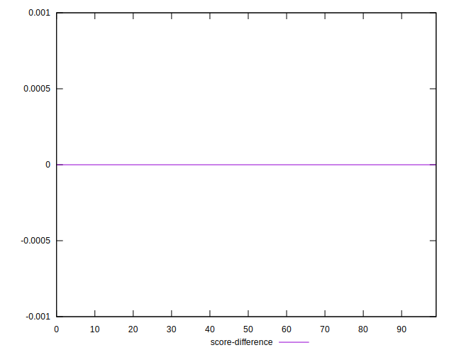
## P Score Difference


```yaml
p90min: -0.004717374484560111
p90max: 0.004582715176084551
p90range: 0.009300089660644661
p90mean: 0.0016567095151976514
median: 0.0019935568286148786
p90stdev: 0.0017670652771628575
mad: 0.0011627177758319895
stdevBySn: 0.0017012755415253997
lfitCenter: 0.0017037467396756423
lfitStdev: 0.0014268358839585264
mfitCenter: 0.0017037467396756423
mfitStdev: 0.0017882735867937166
mfitConfidence: 0.00017882735867937166
p90skewness: -1.065754498659754
p90eccentricity: 0.9999999999999992
p90discretization: 1.010752688172043
outlandishness: 0.8790162786701408

```

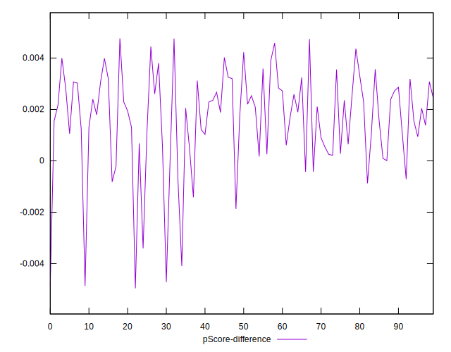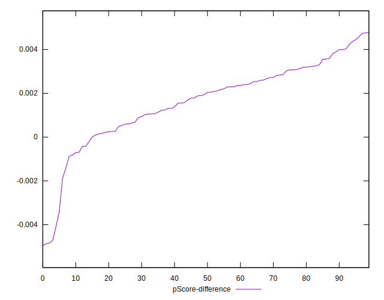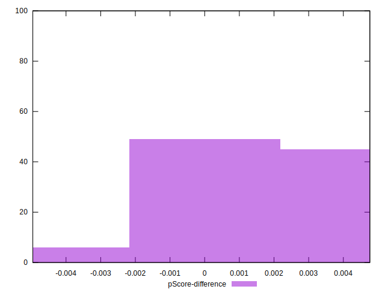