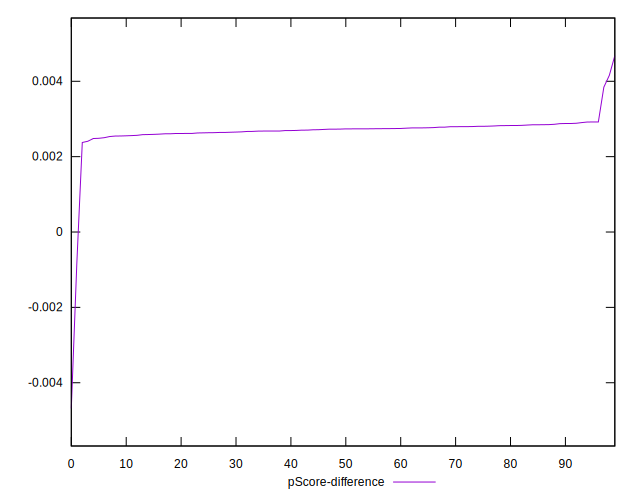

# //first-cpu-idle/samples/astro-inner-cached

[→ Parent](../..)


## Raw


```yaml
p90min: 2416.865
p90max: 9121.098
p90range: 6704.233
p90mean: 2635.533903191489
median: 2421.5951499999996
p90stdev: 1176.1614536522256
mad: 2.2744999999997617
stdevBySn: 3.1699606149999435
lfitCenter: 2633.2976725014796
lfitStdev: 514.1086261890813
mfitCenter: 2633.2976725014796
mfitStdev: 644.3396099669873
mfitConfidence: 64.43396099669873
p90skewness: 5.325964758342776
p90eccentricity: 1.0000000000000002
p90discretization: 1.010752688172043
outlandishness: 1.167839334024123

```


## Score


```yaml
p90min: 0.23
p90max: 0.98
p90range: 0.75
p90mean: 0.9561702127659576
median: 0.98
p90stdev: 0.13124693619912361
mad: 0
stdevBySn: 0
lfitCenter: 0.9570947324513271
lfitStdev: 0.055700196658082665
mfitCenter: 0.9570947324513271
mfitStdev: 0.06980984399307422
mfitConfidence: 0.006980984399307421
p90skewness: -5.326352581502593
p90eccentricity: 1
p90discretization: 31.333333333333332
outlandishness: 0.95396036375158

```


## Raw Estimate


## Score Estimate


## P Score


```yaml
p90min: 0.23415737745115794
p90max: 0.9829041606287774
p90range: 0.7487467831776194
p90mean: 0.9588391883616999
median: 0.9827260656177015
p90stdev: 0.13147725126733445
mad: 0.00008592455997374904
stdevBySn: 0.00011951741825536151
lfitCenter: 0.9597752024264488
lfitStdev: 0.055784185635530434
mfitCenter: 0.9597752024264488
mfitStdev: 0.0699151085659941
mfitConfidence: 0.006991510856599411
p90skewness: -5.326000576023376
p90eccentricity: 0.9999999999999992
p90discretization: 1.010752688172043
outlandishness: 0.9540486740010442

```


## Score Difference


```yaml
p90min: 0
p90max: 0
p90range: 0
p90mean: 0
median: 0
p90stdev: 0
mad: 0
stdevBySn: 0
lfitCenter: 0
lfitStdev: 0
mfitCenter: 0
mfitStdev: 0
mfitConfidence: 0
p90skewness: .nan
p90eccentricity: .nan
p90discretization: 94
outlandishness: .nan

```


## P Score Difference


```yaml
p90min: 0.0024083026084960046
p90max: 0.0029203646397433225
p90range: 0.0005120620312473179
p90mean: 0.00271792912060137
median: 0.0027342874218868607
p90stdev: 0.00010973441673117679
mad: 0.00008894418228250212
stdevBySn: 0.00011951741825536151
lfitCenter: 0.0026889972012344183
lfitStdev: 0.00018524608542105887
mfitCenter: 0.0026889972012344183
mfitStdev: 0.00023217153797418873
mfitConfidence: 0.000023217153797418873
p90skewness: -0.3119007846049073
p90eccentricity: 1.0000000000000002
p90discretization: 1.010752688172043
outlandishness: 0.9507525043513297

```

