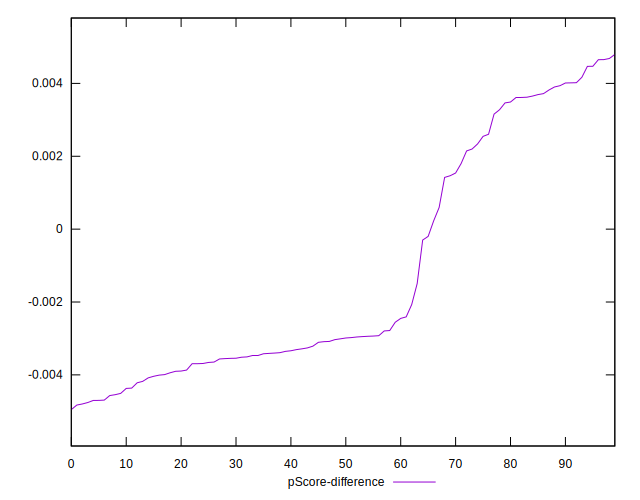

# //first-cpu-idle/samples/astro-inner

[→ Parent](../..)


## Raw


```yaml
p90min: 2558.2239999999993
p90max: 9446.199999999999
p90range: 6887.976
p90mean: 6707.301194680848
median: 9271.586
p90stdev: 3061.7344379436345
mad: 171.5716999999995
stdevBySn: 215.20091331000035
lfitCenter: 7018.784020458561
lfitStdev: 3354.0667989144436
mfitCenter: 7018.784020458561
mfitStdev: 4203.699340809958
mfitConfidence: 420.3699340809958
p90skewness: -0.4061641729307467
p90eccentricity: 1.0000000000000002
p90discretization: 1
outlandishness: 0.9875081806202952

```


## Score


```yaml
p90min: 0.21
p90max: 0.98
p90range: 0.77
p90mean: 0.5144680851063825
median: 0.22
p90stdev: 0.34292427369913325
mad: 0.010000000000000009
stdevBySn: 0.011926000000000011
lfitCenter: 0.4789411000240474
lfitStdev: 0.372786435208916
mfitCenter: 0.4789411000240474
mfitStdev: 0.4672185099169183
mfitConfidence: 0.046721850991691835
p90skewness: 0.42132530824379166
p90eccentricity: 0.9999999999999988
p90discretization: 8.545454545454545
outlandishness: 1.0188723298893534

```


## Raw Estimate


## Score Estimate


## P Score


```yaml
p90min: 0.21179918777045104
p90max: 0.9770398612927245
p90range: 0.7652406735222734
p90mean: 0.513257717388856
median: 0.2235514557110149
p90stdev: 0.34146101490133973
mad: 0.011552403112481319
stdevBySn: 0.014490352606937538
lfitCenter: 0.47753734119134644
lfitStdev: 0.37186845298744353
mfitCenter: 0.47753734119134644
mfitStdev: 0.46606798981978487
mfitConfidence: 0.04660679898197849
p90skewness: 0.42030000662019124
p90eccentricity: 1
p90discretization: 1
outlandishness: 1.0189924678137703

```


## Score Difference


```yaml
p90min: 0
p90max: 0
p90range: 0
p90mean: 0
median: 0
p90stdev: 0
mad: 0
stdevBySn: 0
lfitCenter: 1.0470608452365924e-18
lfitStdev: 2.5998395675404994e-18
mfitCenter: 1.0470608452365924e-18
mfitStdev: 3.2584156880294808e-18
mfitConfidence: 3.258415688029481e-19
p90skewness: .nan
p90eccentricity: .nan
p90discretization: 94
outlandishness: .inf

```


## P Score Difference


```yaml
p90min: -0.004758831515325523
p90max: 0.004650381813198212
p90range: 0.009409213328523736
p90mean: -0.0012624539146447677
median: -0.0029992989755980304
p90stdev: 0.0032003678356509846
mad: 0.001198386755001668
stdevBySn: 0.0018203238417539294
lfitCenter: -0.0016378859511021126
lfitStdev: 0.0030567850711288656
mfitCenter: -0.0016378859511021126
mfitStdev: 0.003831111948235802
mfitConfidence: 0.00038311119482358017
p90skewness: 0.70571125992591
p90eccentricity: 0.9999999999999994
p90discretization: 1
outlandishness: 0.8902927085611577

```

