# //first-cpu-idle/samples/astro

[→ Parent](../..)


## Raw


```yaml
p90min: 6867.275999999999
p90max: 7188.823999999999
p90range: 321.5479999999998
p90mean: 6997.579659574466
median: 7026.964
p90stdev: 74.02418394853007
mad: 10.583999999999378
stdevBySn: 18.950413999999306
lfitCenter: 7008.079612743906
lfitStdev: 57.01063668057036
mfitCenter: 7008.079612743906
mfitStdev: 71.45223700101472
mfitConfidence: 7.1452237001014725
p90skewness: -0.4493627470002967
p90eccentricity: 1
p90discretization: 1
outlandishness: 1.0013672425778857

```

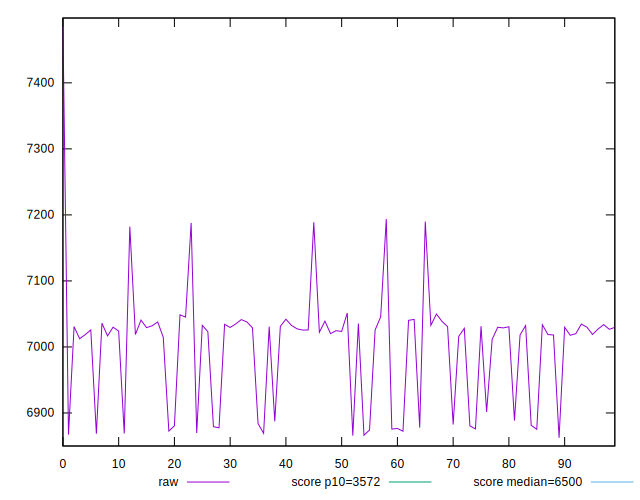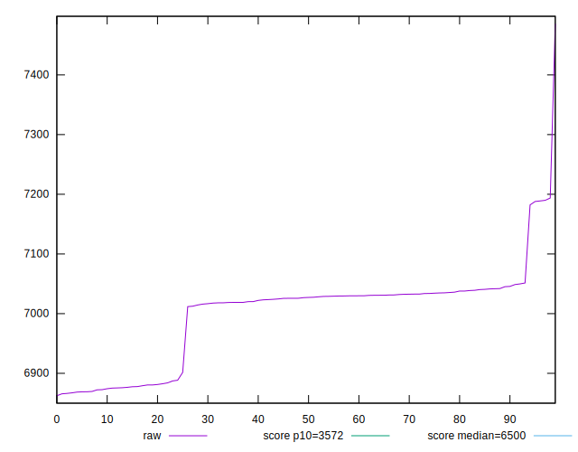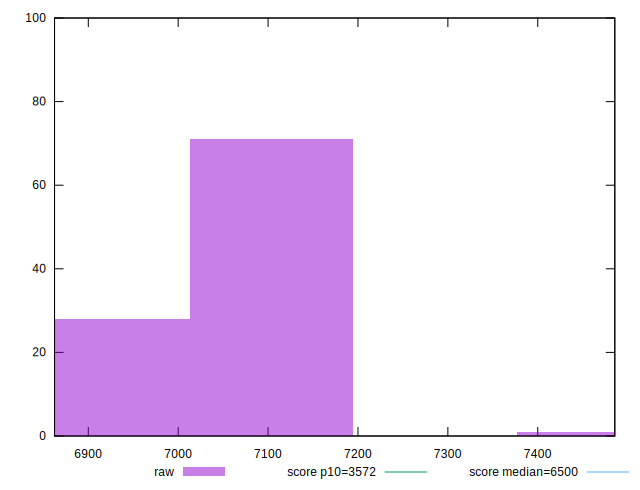
## Score


```yaml
p90min: 0.41
p90max: 0.45
p90range: 0.040000000000000036
p90mean: 0.4347872340425531
median: 0.43
p90stdev: 0.00942255368153424
mad: 0
stdevBySn: 0
lfitCenter: 0.43321380709456797
lfitStdev: 0.008037046708247932
mfitCenter: 0.43321380709456797
mfitStdev: 0.010072944271847963
mfitConfidence: 0.0010072944271847964
p90skewness: 0.5191873962386989
p90eccentricity: 0.9999999999999996
p90discretization: 18.8
outlandishness: 0.9973005763259337

```

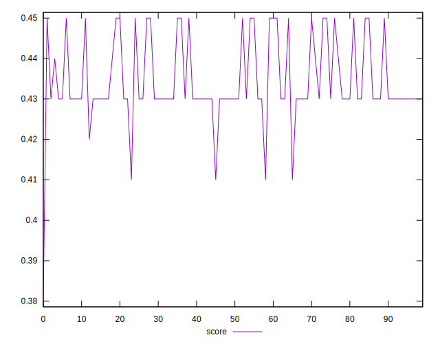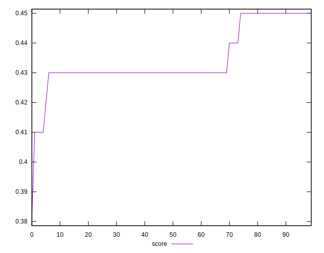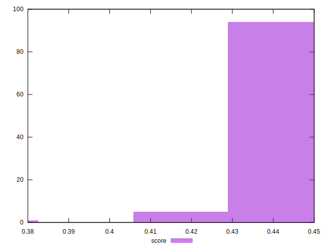
## Raw Estimate

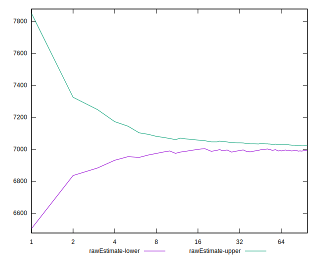
## Score Estimate

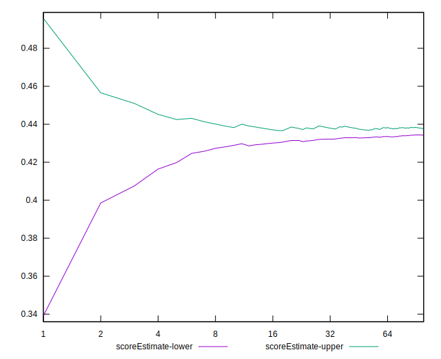
## P Score


```yaml
p90min: 0.4146431960501154
p90max: 0.453168059968665
p90range: 0.03852486391854959
p90mean: 0.4373314659060209
median: 0.43373676475019546
p90stdev: 0.008950109096158322
mad: 0.0012684173886805816
stdevBySn: 0.002270117913526238
lfitCenter: 0.436064540865598
lfitStdev: 0.006916643795407908
mfitCenter: 0.436064540865598
mfitStdev: 0.008668727460283111
mfitConfidence: 0.0008668727460283112
p90skewness: 0.489426351753132
p90eccentricity: 0.9999999999999999
p90discretization: 1
outlandishness: 0.9975441056544923

```

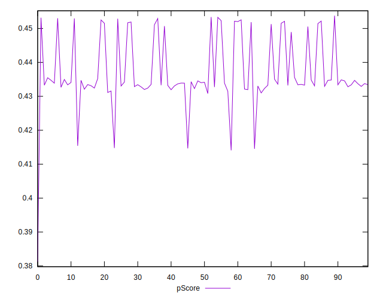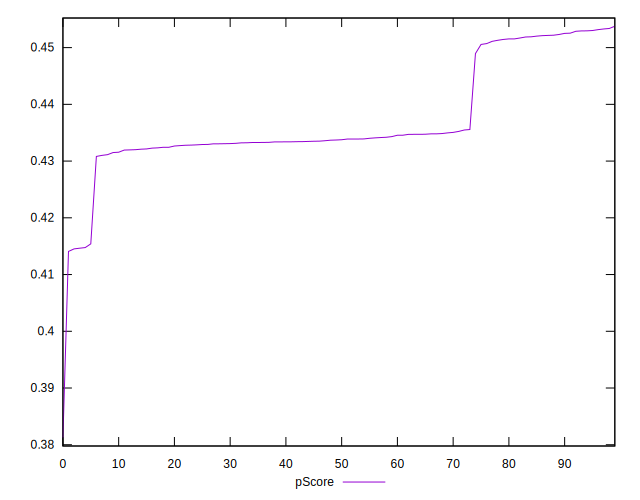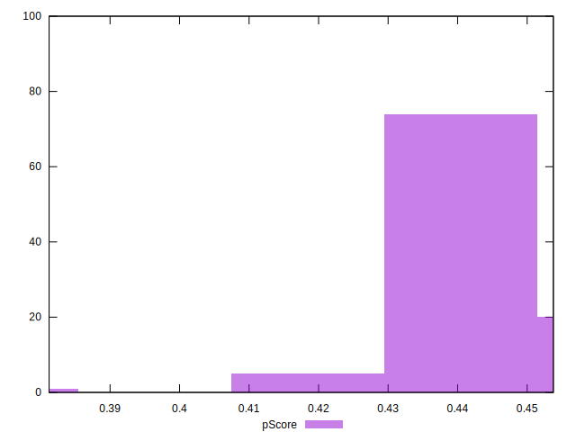
## Score Difference


```yaml
p90min: 0
p90max: 5.551115123125783e-17
p90range: 5.551115123125783e-17
p90mean: 5.905441620346577e-19
median: 0
p90stdev: 5.695001657605475e-18
mad: 0
stdevBySn: 0
lfitCenter: 1.0755152514005351e-18
lfitStdev: 2.6436841970240598e-18
mfitCenter: 1.0755152514005351e-18
mfitStdev: 3.313366782061881e-18
mfitConfidence: 3.313366782061881e-19
p90skewness: 9.5399555915199
p90eccentricity: 1.000000000000001
p90discretization: 47
outlandishness: 14.137600000000003

```

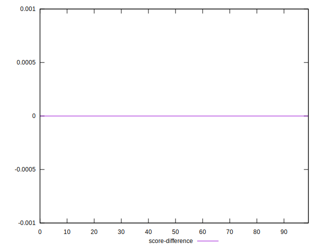
## P Score Difference


```yaml
p90min: -0.004522976130339529
p90max: 0.004798104542291237
p90range: 0.009321080672630766
p90mean: 0.002756333019502138
median: 0.003044895787466889
p90stdev: 0.001549295692924046
mad: 0.0008599198933146035
stdevBySn: 0.0012470608453441076
lfitCenter: 0.0027770788970942098
lfitStdev: 0.0011333099051673392
mfitCenter: 0.0027770788970942098
mfitStdev: 0.0014203933275351752
mfitConfidence: 0.00014203933275351753
p90skewness: -2.2177084458630496
p90eccentricity: 1
p90discretization: 1
outlandishness: 0.8857585599939888

```

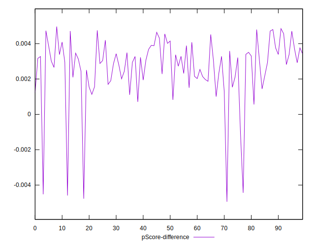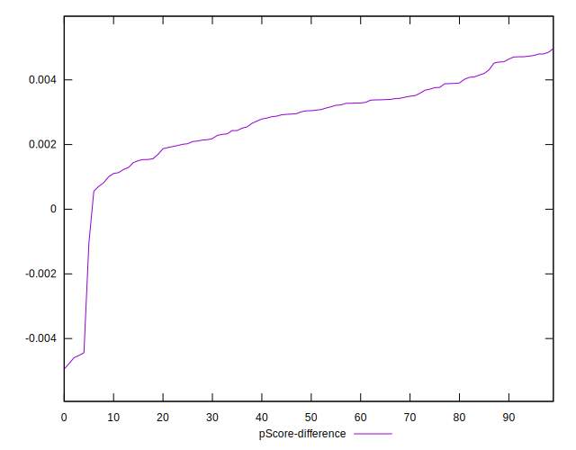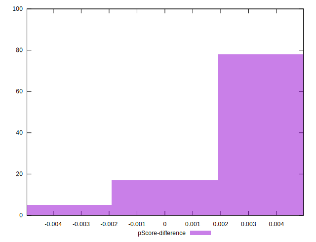