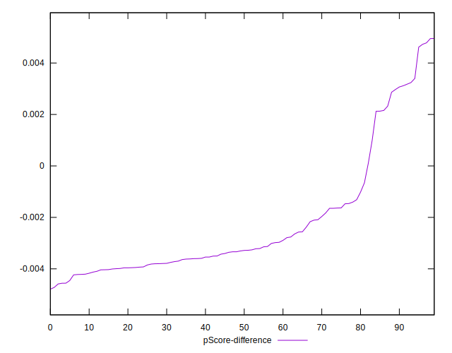

# //first-meaningful-paint/samples/astro-cached

[→ Parent](../..)


## Raw


```yaml
p90min: 6106.771499999999
p90max: 6355.604500000002
p90range: 248.83300000000327
p90mean: 6318.595868085108
median: 6335.635500000001
p90stdev: 46.17615449910623
mad: 8.464499999999589
stdevBySn: 13.487739514997976
lfitCenter: 6323.731398871474
lfitStdev: 42.53044748976407
mfitCenter: 6323.731398871474
mfitStdev: 53.3040111589126
mfitConfidence: 5.33040111589126
p90skewness: -2.609768222881812
p90eccentricity: 0.9999999999999997
p90discretization: 1
outlandishness: 0.9990558207214424

```


## Score


```yaml
p90min: 0.13
p90max: 0.16
p90range: 0.03
p90mean: 0.1405319148936172
median: 0.14
p90stdev: 0.003379229824312466
mad: 0
stdevBySn: 0
lfitCenter: 0.14051344349028774
lfitStdev: 0.0026588001626404074
mfitCenter: 0.14051344349028774
mfitStdev: 0.0033323118354870876
mfitConfidence: 0.00033323118354870875
p90skewness: 2.5564541563172214
p90eccentricity: 0.9999999999999983
p90discretization: 23.5
outlandishness: 1.0066727142800658

```


## Raw Estimate


## Score Estimate


## P Score


```yaml
p90min: 0.13494914337329167
p90max: 0.15669497805222765
p90range: 0.021745834678935982
p90mean: 0.1380441788336613
median: 0.13658344289816376
p90stdev: 0.003973620739986741
mad: 0.0006950234007720435
stdevBySn: 0.0011084788360462986
lfitCenter: 0.1378673624835828
lfitStdev: 0.0037517287173896114
mfitCenter: 0.1378673624835828
mfitStdev: 0.004702094645608396
mfitConfidence: 0.00047020946456083964
p90skewness: 2.684822208041871
p90eccentricity: 1.0000000000000002
p90discretization: 1
outlandishness: 1.0119859824516202

```


## Score Difference


```yaml
p90min: 0
p90max: 0
p90range: 0
p90mean: 0
median: 0
p90stdev: 0
mad: 0
stdevBySn: 0
lfitCenter: 0
lfitStdev: 0
mfitCenter: 0
mfitStdev: 0
mfitConfidence: 0
p90skewness: .nan
p90eccentricity: .nan
p90discretization: 94
outlandishness: .nan

```


## P Score Difference


```yaml
p90min: -0.0045594338602799045
p90max: 0.004727012608485959
p90range: 0.009286446468765863
p90mean: -0.0022732690680349697
median: -0.0032945008813781845
p90stdev: 0.002384495029857534
mad: 0.0007350085227690872
stdevBySn: 0.0011127213605039681
lfitCenter: -0.0025512635295849135
lfitStdev: 0.0017860886575893605
mfitCenter: -0.0025512635295849135
mfitStdev: 0.0022385301673081134
mfitConfidence: 0.00022385301673081133
p90skewness: 1.5476398533139837
p90eccentricity: 0.9999999999999991
p90discretization: 1
outlandishness: 0.8787397381696538

```

