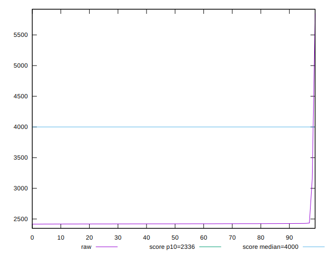
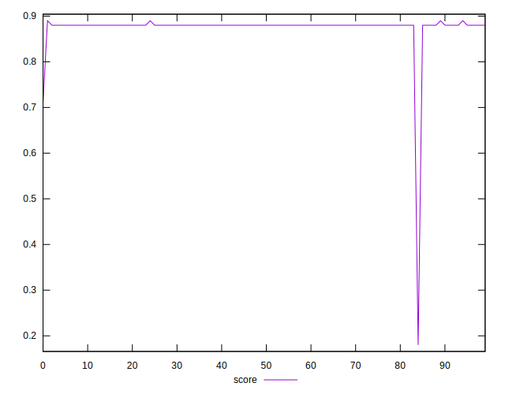

# //first-meaningful-paint/samples/astro-inner-cached

[→ Parent](../..)


## Raw


```yaml
p90min: 2416.865
p90max: 2429.9548999999997
p90range: 13.089899999999943
p90mean: 2422.043626595744
median: 2421.5951499999996
p90stdev: 2.7940440483808997
mad: 2.193499999999858
stdevBySn: 3.0629545799998907
lfitCenter: 2441.3865552065895
lfitStdev: 48.29829499640919
mfitCenter: 2441.3865552065895
mfitStdev: 60.53293598814494
mfitConfidence: 6.053293598814494
p90skewness: 0.39993132629935796
p90eccentricity: 1.0000000000000002
p90discretization: 1.010752688172043
outlandishness: 1.0346137128412745

```


## Score


```yaml
p90min: 0.88
p90max: 0.89
p90range: 0.010000000000000009
p90mean: 0.8801063829787233
median: 0.88
p90stdev: 0.0010259202937226563
mad: 0
stdevBySn: 0
lfitCenter: 0.8761240543235365
lfitStdev: 0.010109580022889166
mfitCenter: 0.8761240543235365
mfitStdev: 0.012670479577758926
mfitConfidence: 0.0012670479577758925
p90skewness: 9.539955591520082
p90eccentricity: 0.9999999999999989
p90discretization: 47
outlandishness: 0.9809881256784061

```


## Raw Estimate


## Score Estimate


## P Score


```yaml
p90min: 0.8825034289764593
p90max: 0.8850205523166164
p90range: 0.002517123340157079
p90mean: 0.8840271561317241
median: 0.8841138632215593
p90stdev: 0.0005369523500417688
mad: 0.00042121958421514893
stdevBySn: 0.0005885603188933428
lfitCenter: 0.8799725362348687
lfitStdev: 0.01011973677218345
mfitCenter: 0.8799725362348687
mfitStdev: 0.012683209175251429
mfitConfidence: 0.001268320917525143
p90skewness: -0.4047027946629986
p90eccentricity: 1.0000000000000007
p90discretization: 1.010752688172043
outlandishness: 0.9804035685044048

```


## Score Difference


```yaml
p90min: 0
p90max: 0
p90range: 0
p90mean: 0
median: 0
p90stdev: 0
mad: 0
stdevBySn: 0
lfitCenter: 0
lfitStdev: 0
mfitCenter: 0
mfitStdev: 0
mfitConfidence: 0
p90skewness: .nan
p90eccentricity: .nan
p90discretization: 94
outlandishness: .nan

```


## P Score Difference


```yaml
p90min: -0.004896804712235414
p90max: 0.004878158331743765
p90range: 0.009774963043979179
p90mean: 0.0038542525372533064
median: 0.004052915643776467
p90stdev: 0.0010766484313703536
mad: 0.0004182834613065678
stdevBySn: 0.0005778452390885258
lfitCenter: 0.0038185457866111512
lfitStdev: 0.0007019065199952055
mfitCenter: 0.0038185457866111512
mfitStdev: 0.0008797093654691169
mfitConfidence: 0.00008797093654691169
p90skewness: -5.802782779160834
p90eccentricity: 0.9999999999999994
p90discretization: 1.010752688172043
outlandishness: 0.8833139250734896

```

